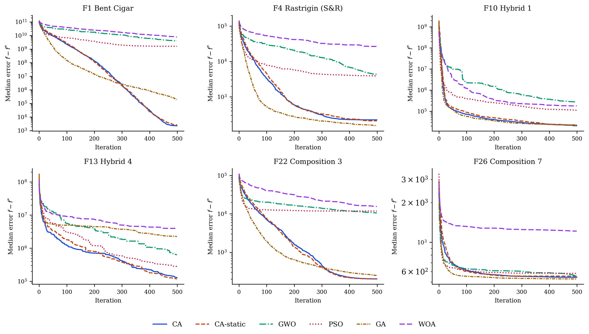
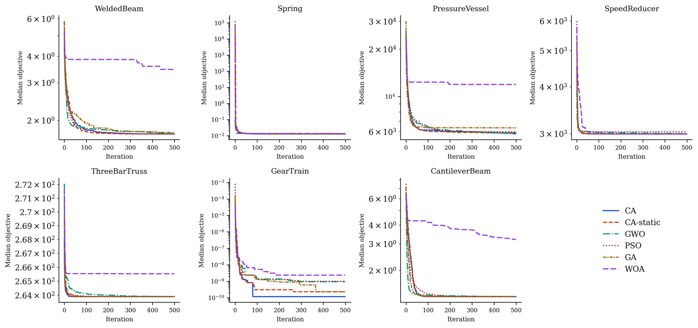

::: {.content-visible when-format="html"}
::: {.callout-tip appearance="simple" icon=false}
**Formats and files.** You are reading the HTML version. The typeset manuscript is also available as [**PDF** (`paper.pdf`)](paper.pdf). Source code, experiment scripts, and all raw results live in the [GitHub repository](https://github.com/sabernaseralavi-60/2026_Chess-Algorithm).
:::
:::

::: {.content-visible when-format="pdf"}
| ^1^ *Seyed Saber Naseralavi (corresponding author,* `saber_naseralavi@uk.ac.ir`*) — Department of Civil Engineering, Faculty of Engineering, Shahid Bahonar University of Kerman, Kerman, Iran.*
| ^2^ *Seyedali Mirjalili — Centre for Artificial Intelligence Research and Optimization, Torrens University Australia, Brisbane, Australia.*
| *An HTML version of this article, together with all code and data, is available at* <https://sabernaseralavi-60.github.io/2026_Chess-Algorithm/>*.*
:::

::: {.callout-note appearance="simple" icon=false}
**Author note.** Dr. Seyedali Mirjalili is listed as an invited co-author; his participation is pending confirmation. The invitation reflects how much this study owes to his work on swarm and nature-inspired optimization, and his name will be retained only with his explicit consent.
:::

**Keywords:** metaheuristics; chess algorithm; adaptive optimization; global optimization; CEC-2017 benchmarks; constrained engineering design; traffic signal timing; berth allocation; transportation networks.

# Introduction

## Motivation

A large share of the decisions a transportation engineer has to make can be written, after enough simplification, as a global optimization problem:

$$
\min_{\mathbf{x} \in \Omega} f(\mathbf{x}), \qquad
\Omega = \{\mathbf{x} \in \mathbb{R}^{D} : l_j \le x_j \le u_j,\; j = 1,\dots,D\}.
$$ {#eq-problem}

The trouble is what $f$ looks like in practice. Signal timing, network design, transit scheduling, detector placement — in each of these the objective is non-convex, often non-differentiable, riddled with local optima, and sometimes expensive to evaluate [@ceylan2004traffic; @osorio2013simulation]. Exact methods rarely scale to instances of realistic size. This is why metaheuristics have kept their popularity for three decades: they trade the guarantee of optimality for robustness, generality, and a computational budget one can actually afford.

## A brief map of the metaheuristic landscape

The field grew from two roots. Evolutionary computation gave us the Genetic Algorithm [@holland1975adaptation; @goldberg1989genetic] and Evolution Strategies [@beyer2002es]. Trajectory methods gave us Simulated Annealing [@kirkpatrick1983sa], whose central idea — accept a worse solution now and then, so you can escape a local minimum — turned out to be one of the most durable in the field. Swarm intelligence arrived in the 1990s with Particle Swarm Optimization [@kennedy1995pso], Ant Colony Optimization [@dorigo1996aco], Differential Evolution [@storn1997de], and later the Artificial Bee Colony [@karaboga2007abc]. More recently, Mirjalili and colleagues built a productive line of algorithms by abstracting the social and hunting behavior of animals into compact operators: the Grey Wolf Optimizer [@mirjalili2014gwo], the Ant Lion Optimizer [@mirjalili2015alo], the Dragonfly Algorithm [@mirjalili2016dragonfly], the Whale Optimization Algorithm [@mirjalili2016whale], the Sine Cosine Algorithm [@mirjalili2016sca], and the Salp Swarm Algorithm [@mirjalili2017salp], among others.

Reading this literature, two things stand out. First, almost every swarm algorithm treats its agents identically: one update equation, applied to everyone, with only position and fitness distinguishing one agent from the next. Yet division of labor among *unequal* agents is one of the oldest tricks in both nature and human strategy. Second, the quality of a metaheuristic usually stands or falls on how it schedules the transition from exploration to exploitation [@mirjalili2014gwo], and mechanisms that adapt this transition to what the search is actually observing — rather than to elapsed time alone — remain surprisingly rare.

We should also be upfront about why proposing yet another metaheuristic is defensible at all. The No-Free-Lunch theorem [@wolpert1997nfl] rules out a universally dominant optimizer, so the honest goal is not to win everywhere; it is to contribute a genuinely different inductive bias and to show the problem class where that bias earns its keep.

## Why chess?

Chess offers exactly the two ingredients we just found missing. Its pieces are radically unequal: the queen sweeps the whole board, rooks travel along files and ranks, bishops along diagonals, knights jump over anything in the way, and pawns crawl forward one square at a time while quietly defining the structure of the position. Mapped onto a search population, this suggests sub-groups performing qualitatively different moves around one common reference point — the King, which in our setting is the best solution found so far.

The game also comes with a mature strategic vocabulary, refined over centuries of analysis. Development says: mobilize your forces early, consolidate later. A sacrifice gives up material now for a positional advantage later. Pinning immobilizes a piece against something more valuable behind it. Castling is a safeguarded structural rearrangement; en passant, an opportunistic capture available only under narrow conditions; the threefold-repetition rule declares a draw when the position keeps repeating. Each of these has a natural algorithmic reading — exploration schedules, acceptance of deteriorating moves, variable fixation, elite restructuring, adaptive local search, and diversity preservation, respectively.

The Chess Algorithm (CA) proposed here formalizes that mapping. To avoid a misunderstanding that came up more than once when we described the idea to colleagues: CA does not play chess and searches no game tree. It borrows the strategic grammar of the game, nothing more, and its per-iteration cost is comparable to that of GA or PSO.

## Contributions and scope

The paper contributes, in order: a complete mathematical specification of CA — initialization, rank-based role assignment, movement operators, strategic mechanisms, and the adaptive control layer that governs when each applies, including a state machine that reads population divergence, initiative, and local-search success each iteration and switches between opening, middlegame, closed-position, and endgame tactical repertoires, with several operators new to this paper (Novotny interference, the knight's fork, the royal council, a King's-march blockade response, and a Tal-style speculative-sacrifice reheat) (@sec-ca); a controlled benchmark study on six standard test functions in 30 dimensions against GA, PSO, SA, and GWO under matched budgets, with nonparametric testing following @derrac2011nonparametric (@sec-benchmarks); a full evaluation on the CEC-2017 benchmark suite against GWO, PSO, GA, and WOA, including a data-integrity audit that identified five defective functions in the third-party `opfunu` reference implementation (@sec-cec2017); an evaluation on seven classic constrained engineering design problems against the same roster (@sec-engineering); a transportation case study on coordinated signal timing of an eight-intersection arterial with a Webster/HCM delay model [@webster1958traffic; @roess2019traffic] (@sec-transport); an extended comparison against six third-party implementations from the `mealpy` library on two transportation problems, one of which has a known global optimum (@sec-mealpy); and a fully reproducible open-source implementation, with an ablation configuration (CA-static, the adaptive layer disabled) carried throughout to isolate its contribution.

A remark on tone before we start. We report results with deliberate restraint and no claim of universal superiority; GWO, in particular, remains stronger on several classical benchmarks, and we say so plainly where it happens. The claim we do defend is narrower: CA is well-founded, novel, and competitive, and on the transportation problems that motivated it in the first place it performs on par with — and against some widely used algorithms, better than — the available alternatives.

# The Chess Algorithm {#sec-ca}

## Conceptual mapping

CA maintains a population of $N$ candidate solutions $\mathbf{X}_i \in \Omega \subset \mathbb{R}^D$, treated as pieces playing "toward" the global optimum. @tbl-mapping summarizes how the vocabulary of the game maps onto algorithmic mechanisms.

| Chess concept | Algorithmic role |
|---|---|
| King | Incumbent best solution (never lost) |
| Queen, Rook, Bishop, Knight, Pawn | Heterogeneous movement operators |
| Development (opening principle) | Time-decaying step-scale $a(t)$ |
| Sacrifice | Probabilistic acceptance of worse moves (minor pieces only) |
| Pinning | Progressive freezing of coordinates to the King's values |
| Castling | Safeguarded coordinate-block exchange King $\leftrightarrow$ Rook |
| En passant | Opportunistic, self-adaptive local capture around the King |
| Pawn promotion | Rank-based role reassignment each iteration |
| Threefold repetition | Re-deployment of agents that collapse onto the King |
| Opening / middlegame / closed position / endgame | Position-dependent tactical phase, read each iteration (@sec-adaptive) |
| Nimzowitsch prophylaxis | Restrained, line-reopening response to premature convergence |
| Fork, interference, discovered attack, royal council | Additional movement and probe operators, active in specific phases |
| Windmill | Repeated extension of a successful King displacement (endgame) |
| Zugzwang / blockade | Stagnation-triggered waiting move, King's march, and speculative sacrifice |
| Checkmate | Termination criterion |

: Mapping between chess concepts and CA mechanisms. {#tbl-mapping}

One point deserves emphasis: CA borrows the strategic grammar of chess as an inductive bias, not the game itself. An iteration costs $\mathcal{O}(ND + N \log N)$ arithmetic operations (the movement updates plus the sort that drives role assignment) and $N + 3$ function evaluations — $N$ piece moves plus three en-passant probes — with one extra castling probe every $c$ iterations. That is the same order as GA, PSO, or GWO. The exact evaluation accounting used in the experiments is spelled out in @sec-benchmarks.

## Initialization

The board is set up by scattering the $N$ pieces uniformly over the feasible box:

$$
\mathbf{X}_i^{(0)} = \mathbf{l} + (\mathbf{u} - \mathbf{l}) \circ \mathbf{r}_i, \qquad
\mathbf{r}_i \sim \mathcal{U}(0,1)^D, \quad i = 1, \dots, N,
$$ {#eq-init}

where $\mathbf{l}$ and $\mathbf{u}$ are the bound vectors and $\circ$ is the elementwise (Hadamard) product. All positions are evaluated once and the population is sorted by fitness before the first move is played.

## Role assignment

Let $\pi$ be the permutation of $\{1, \dots, N\}$ that sorts the population,

$$
f\big(\mathbf{X}_{\pi(1)}\big) \le f\big(\mathbf{X}_{\pi(2)}\big) \le \dots \le f\big(\mathbf{X}_{\pi(N)}\big).
$$ {#eq-roles}

The best agent $\mathbf{K} = \mathbf{X}_{\pi(1)}$ is the King. The following ranks are partitioned, in order, into Queens $\mathcal{Q}$, Rooks $\mathcal{R}$, Bishops $\mathcal{B}$, and Knights $\mathcal{N}$, with

$$
|\mathcal{Q}| = \max(1, \lfloor \rho_q N \rceil), \quad
|\mathcal{R}| = \max(1, \lfloor \rho_r N \rceil), \quad
|\mathcal{B}| = \max(1, \lfloor \rho_b N \rceil), \quad
|\mathcal{N}| = \max(1, \lfloor \rho_n N \rceil),
$$

where $\lfloor \cdot \rceil$ denotes rounding and $(\rho_q, \rho_r, \rho_b, \rho_n) = (0.10, 0.15, 0.15, 0.20)$. Whatever remains becomes the Pawns $\mathcal{P}$. Because the assignment is redone after every iteration, a pawn that stumbles into a good region is simply a strong piece the next time roles are dealt. Promotion, in other words, falls out of re-ranking for free; no extra machinery is needed.

## Development schedule

Opening theory tells a player to develop pieces quickly; endgames reward patience and precision. CA encodes this with a linearly decaying step-scale coefficient,

$$
a(t) = 2\left(1 - \frac{t}{T}\right),
$$ {#eq-development}

with $t$ the current iteration and $T$ the total budget — the convention popularized by @mirjalili2014gwo. Every piece move scales with $a(t)$, so the swarm plays big developing moves early and fine maneuvers late.

## Piece movement operators

Write $\mathbf{L} = \mathbf{u} - \mathbf{l}$ for the box width and let $\mathbf{r}, \mathbf{r}' \sim \mathcal{U}(0,1)^D$ be independent random vectors. The five mobile roles then move as follows.

**Queen (omnidirectional sweep).** The queen circles the King at a radius tied to her current distance from him:

$$
\mathbf{X}_i' = \mathbf{K} + a(t)\,(2\mathbf{r} - \mathbf{1}) \circ \max\!\big(|\mathbf{K} - \mathbf{X}_i|,\ \boldsymbol{\sigma}\big),
$$ {#eq-queen}

where $\boldsymbol{\sigma}$ is the King's adaptive capture radius from @sec-enpassant. The $\max$ keeps the sweep from collapsing entirely, so queens never stall.

**Rook (single-axis move).** One random axis $j$ is chosen and only that coordinate moves:

$$
X_{i,j}' = K_j + a(t)\,(2r - 1)\,\max\!\big(|K_j - X_{i,j}|,\ 0.01\,L_j\,a(t)\big).
$$ {#eq-rook}

**Bishop (diagonal move).** Two distinct axes $j$ and $k$ receive steps of equal magnitude and random relative sign, which is as close to a diagonal as a box-constrained space allows:

$$
\Delta = a(t)\,(2r-1)\,\max\!\Big(\tfrac{1}{2}\big(|K_j - X_{i,j}| + |K_k - X_{i,k}|\big),\ 0.01\,L\,a(t)\Big), \quad
X_{i,j}' = K_j + \Delta,\ \ X_{i,k}' = K_k \pm \Delta.
$$ {#eq-bishop}

**Knight (L-shaped jump).** The knight is the one piece that jumps over whatever stands in its way. Relative to a randomly chosen better-ranked peer $\mathbf{P}$, it drifts toward the peer and then adds an asymmetric $2{:}1$ jump on two random axes:

$$
\mathbf{X}_i' = \mathbf{X}_i + \mathbf{r} \circ (\mathbf{P} - \mathbf{X}_i), \qquad
X_{i,j}' \mathrel{+}= 2\,a(t)\,\beta\,(2r-1), \quad
X_{i,k}' \mathrel{+}= 1\,a(t)\,\beta\,(2r'-1),
$$ {#eq-knight}

with $\beta = \overline{|\mathbf{P} - \mathbf{X}_i|}$ the mean coordinate gap. With small probability $0.1\,a(t)/2$ the knight abandons this move and leaps: two coordinates are resampled uniformly in $\Omega$. This leap is the algorithm's main long-range restart device. The implementation also ships a heavy-tailed variant in which those two coordinates instead receive a Lévy-flight step $0.05\,L\,s$ generated by Mantegna's algorithm [@mantegna1994levy], the mechanism Cuckoo Search made popular [@yang2009cuckoo]:

$$
s = \frac{u}{|v|^{1/\beta_\ell}}, \qquad
u \sim \mathcal{N}(0, \sigma_u^2), \quad v \sim \mathcal{N}(0, 1), \qquad
\sigma_u = \left[
\frac{\Gamma(1+\beta_\ell)\,\sin(\pi \beta_\ell / 2)}
     {\Gamma\!\big(\tfrac{1+\beta_\ell}{2}\big)\,\beta_\ell\, 2^{(\beta_\ell - 1)/2}}
\right]^{1/\beta_\ell},
$$ {#eq-levy}

with tail index $\beta_\ell = 1.5$. Every result in this paper uses the plain uniform leap; the Lévy option is documented for future study rather than used here.

**Pawn (steady advance).** Pawns take small steps toward the King and toward a random better-ranked piece $\mathbf{B}$:

$$
\mathbf{X}_i' = \mathbf{X}_i + 0.3\,\mathbf{r} \circ (\mathbf{K} - \mathbf{X}_i) + 0.3\,\mathbf{r}' \circ (\mathbf{B} - \mathbf{X}_i).
$$ {#eq-pawn}

## Strategic mechanisms

### Pinning

With probability $p_{\text{pin}}(t) = 0.5\,t/T$, a random subset of at most $30\%$ of an agent's coordinates is pinned to the King's values and excluded from perturbation. Early on, pinning is rare and the pieces develop freely. Late in the run it concentrates the search on a shrinking set of free dimensions around the incumbent, which is exactly the kind of scheduled exploitation an endgame calls for.

### Sacrifice

A worsening move $\Delta_i = f(\mathbf{X}_i') - f(\mathbf{X}_i) > 0$ made by a minor piece — a Knight or a Pawn — is still accepted with probability

$$
p_{\text{acc}} = \exp\!\left(-\frac{\Delta_i}{\theta(t)}\right), \qquad
\theta(t) = \theta_0 \big(f_{\max} - f_{\min}\big)\, e^{-8 t / T},
$$ {#eq-sacrifice}

with $\theta_0 = 0.1$. Readers will recognize the Metropolis rule of Simulated Annealing [@kirkpatrick1983sa], but two chess-flavored restrictions change its character. The temperature is scaled by the current fitness spread of the population, which makes the sacrifice budget self-calibrating across problems of wildly different magnitudes. And only minor pieces may be sacrificed: the King and the major pieces are never lost, so the elite of the population cannot be eroded by the acceptance rule.

### En passant (adaptive local capture) {#sec-enpassant}

Once per iteration the King attempts an en-passant capture. Three trial points are drawn in a sparse Gaussian neighborhood,

$$
\mathbf{Y}_m = \mathbf{K} + \boldsymbol{\sigma} \circ \mathbf{z}_m \circ \mathbf{m}_m, \qquad
\mathbf{z}_m \sim \mathcal{N}(\mathbf{0}, \mathbf{I}),\quad m = 1,2,3,
$$ {#eq-enpassant}

where the random binary mask $\mathbf{m}_m$ activates each coordinate with probability $\max(0.2,\ 2/D)$. Any improving trial replaces the King. The radius $\boldsymbol{\sigma}$ follows a success rule of the kind long used in Evolution Strategies [@beyer2002es]: multiply by $1.3$ after a successful capture, by $0.92$ after a failure, and after $50$ consecutive failures reset to $\boldsymbol{\sigma} = 0.05\,\mathbf{L}\max(a(t), 0.05)$ — a stalemate-avoidance restart. In our experience this mechanism is what keeps CA improving deep into the run, long after a fixed-radius local search would have gone quiet.

### Castling

Every $c = 10$ iterations the King castles with the best Rook: a contiguous block of up to $D/4$ coordinates is copied from the Rook into a candidate King, and the exchange is kept only if it improves the King. It is a safeguarded structural jump, useful when good partial solutions have been discovered on different "files" of the board and need splicing together.

### Threefold repetition (diversity preservation)

If an agent coincides with the King to numerical precision — something pinning can eventually cause — it is re-deployed uniformly in $\Omega$, much as the threefold-repetition rule stops a game from going in circles. We did not add this rule for elegance; early prototypes taught us it is essential. Without it, pinning breeds exact clones of the King, every gap-proportional step length collapses to zero, and the search dies quietly in place.

### Checkmate

The algorithm stops after $T$ iterations. A stagnation-based early stop would be easy to add, but we keep it disabled in all experiments so that every algorithm consumes the same core budget of $N \times T$ population evaluations.

## Parameter summary

@tbl-params collects the base parameters and the single configuration used everywhere in this paper; several of them (pinning probability, the knight-leap rate, and others) are further modulated by the phase-conditioned schedule of @tbl-phase-schedule once the adaptive control layer of @sec-adaptive is active — CA-static uses the values below unmodulated throughout. No per-problem tuning was done, for CA, for CA-static, or for any competitor.

| Parameter | Symbol | Value |
|---|:---:|---:|
| Role fractions (Queen / Rook / Bishop / Knight) | $\rho_q,\rho_r,\rho_b,\rho_n$ | $0.10 / 0.15 / 0.15 / 0.20$ |
| Development schedule | $a(t)$ | $2(1 - t/T)$ |
| Pinning probability / cap | $p_{\text{pin}}(t)$ | $0.5\,t/T$, at most $30\%$ of coordinates |
| Sacrifice constant | $\theta_0$ | $0.1$ |
| Castling period | $c$ | $10$ iterations |
| En-passant probes per iteration | — | $3$ |
| En-passant adaptation (success / failure / reset) | — | $\times 1.3$ / $\times 0.92$ / after $50$ failures |
| Knight exploratory-leap distribution | — | uniform (Lévy, $\beta_\ell = 1.5$, optional) |

: CA parameters and the fixed configuration used in all experiments. {#tbl-params}

## Pseudocode

```
Algorithm: Chess Algorithm (CA)
Input: objective f, bounds [l, u], dimension D,
       population N, iterations T
1  Initialize X and its board-mirror l+u−X; evaluate both; keep the
     fitter N (Eq. init); sort; King ← X(1); archive ← {}
2  σ ← 0.1 L; fails ← 0; stall ← 0; d_ema, acc_ema, eps_ema ← defaults
3  for t = 0 … T−1:
4      a ← 2(1 − t/T)
5      Read position: d_ema ← smoothed mean distance to King;
         phase ← Opening / Middlegame / Closed / Endgame (Eq. phase);
         if population idle (low acc_ema, eps_ema): halve a (Zugzwang)
6      Look up phase-conditioned rates: p_pin, leap mult., p_council,
         p_discovered-attack, p_interference, pawn gain (Table 3)
7      Assign roles by rank: Queens 10%, Rooks 15%, Bishops 15%,
         Knights 20%, Pawns rest
8      Move each piece by its operator; Knights fork or leap, Bishops
         occasionally interfere, Pawns advance at the phase's gain
9      Pin ≤ 30% of coordinates of each agent to King with prob. p_pin
10     Clip to bounds; evaluate F′
11     Accept improvements; accept worse MINOR pieces with prob. e^(−Δ/θ),
         θ set from the robust population spread (Eq. sacrifice)
12     En passant: 3 trials around King — masked Gaussian, plus a
         council or discovered-attack probe with prob. p_council /
         p_discovered-attack, plus a single-coordinate check probe;
         keep any improvement; adapt σ; on success in Endgame, extend
         the winning displacement (windmill) while it keeps improving
13     Every 10 iters: Castle — block-swap King↔best Rook, keep if better
14     Threefold repetition: re-deploy agents identical to the King
15     Update King; re-rank population (pawn promotion); archive the
         King if it improved and is far from the current archive
16     if stall ≥ 25 (no significant improvement, Eq. fifty-move-rule):
         Pawn break (re-deploy all Pawns); King's march (6 long-radius
         probes, greedy-refine the best, keep if it improves the King);
         reheat the sacrifice budget ×10 for 10 iterations; replace the
         worst Queen with a random archived strongpoint; reset stall
17 return King
```

## Flowchart

@fig-flowchart summarizes the core loop common to every iteration; the phase-dependent tactic selection and the blockade response of @sec-adaptive sit inside its "apply role moves" and "update King" boxes respectively, and are given in full in the pseudocode above.

{#fig-flowchart fig-align="center" width="88%"}

## Properties and design rationale

**Elitism and convergence.** The King's fitness never increases: it is replaced only by strictly better points, whether through the population update, en passant, or castling. That elitism buys the usual asymptotic guarantee (@prp-convergence).

::: {#prp-convergence}
## Elitist convergence in probability

Let $f$ be continuous on the compact box $\Omega$ with global minimum $f^{*}$. Under CA's update rules, the best-so-far value $f(\mathbf{K}^{(t)})$ converges in probability to $f^{*}$ as $T \to \infty$.

*Proof sketch.* The King sequence is elitist by construction. At every iteration the Knight's exploratory leap and the threefold-repetition re-deployment both place uniform probability mass over $\Omega$, so any open subset — in particular any neighborhood of a global minimizer, whose objective values come within $\varepsilon$ of $f^{*}$ by continuity — is visited with probability approaching one as iterations accumulate. Elitism plus this covering argument yields convergence in probability, exactly as in the standard analysis of elitist stochastic search.
:::

Of course, an asymptotic statement of this kind says nothing about what happens inside a budget of $15{,}000$ evaluations. That question is empirical, and it is the subject of @sec-benchmarks.

**Exploration–exploitation balance.** Exploration rests mainly on the Knights (@eq-knight) and on the Queens early in the schedule (@eq-queen); exploitation on the Pawns (@eq-pawn), on pinning, and on the en-passant success rule (@eq-enpassant). The balance shifts smoothly through $a(t)$, $p_{\text{pin}}(t)$, and $\theta(t)$, and adapts to the state of the search through the gap-proportional step lengths and the spread-scaled sacrifice budget (@eq-sacrifice).

**Parameter economy.** Everything in this paper runs on the one configuration in @tbl-params. How sensitive performance is to the role fractions is a fair question we have not yet answered; it is on the future-work list rather than swept under the rug.

## Adaptive tactical control {#sec-adaptive}

The mechanisms above give CA its movement vocabulary; what remains is to say how CA decides, moment to moment, which of them to lean on. A grandmaster does not run the same combination of tactics in a wide-open middlegame as in a locked pawn structure or a simplified endgame — which tactic is right depends on the position, not on a move counter. CA answers this with a lightweight state machine that reads four cheap statistics of the population each iteration and switches the active tactical repertoire accordingly, described below. For controlled comparison, every experiment in this paper is also run under **CA-static**: the identical operator set with this state machine disabled, so that role-appropriate tactics fire at fixed, non-adaptive rates instead. CA-static is not a separate algorithm; it is an ablation configuration, used throughout @sec-cec2017 and @sec-engineering to isolate exactly what the adaptive layer contributes.

### Reading the position

Four exponentially-smoothed statistics ($\lambda=0.8$) are recomputed every iteration. The population's normalized divergence from the King,

$$
d(t) = \frac{1}{\mathrm{Lspan}\sqrt{D}} \cdot \frac{1}{N-1}\sum_{i=2}^{N} \lVert \mathbf{X}_i^{(t)} - \mathbf{K}^{(t)} \rVert_2 ,
\qquad
\tilde{d}(t) = 0.8\,\tilde{d}(t-1) + 0.2\, d(t),
$$ {#eq-divergence}

answers "is the position open or closed?", where $\mathrm{Lspan}=\max_j(u_j-l_j)$. Two further exponential moving averages track the initiative,

$$
\alpha(t) = 0.8\,\alpha(t-1) + 0.2 \cdot \frac{1}{N}\sum_{i=1}^{N} \mathbb{1}[\text{move}_i \text{ accepted}],
$$ {#eq-acceptance}

and the technical success rate of the King's own local search,

$$
\varepsilon(t) =
\begin{cases}
0.8\,\varepsilon(t-1) + 0.2 & \text{en-passant capture succeeded at } t,\\
0.8\,\varepsilon(t-1) & \text{otherwise.}
\end{cases}
$$ {#eq-epsilon}

Finally, a stagnation counter borrows chess's *fifty-move rule*: rather than reset on any improvement whatsoever, it resets only on a materially significant one, exactly as fifty moves without a pawn push or a capture — not merely without a game-theoretically perfect move — are needed to claim a draw:

$$
s(t) =
\begin{cases}
0, & f(\mathbf{K}^{(t)}) < f_{\text{ref}} - \max\!\big(10^{-4}|f_{\text{ref}}|,\ 10^{-10}\big),\\[2pt]
s(t-1) + 1, & \text{otherwise,}
\end{cases}
$$ {#eq-fifty-move}

with $f_{\text{ref}}$ updated to $f(\mathbf{K}^{(t)})$ whenever $s(t)=0$. Early prototypes used a naive counter that reset on any improvement at all; because the en-passant rule of @sec-enpassant makes microscopic refinements routinely, that counter never accumulated enough to trigger the blockade response of @sec-blockade even in runs that were visibly stuck in a secondary basin for hundreds of iterations. Equation @eq-fifty-move is the fix.

### Game phases

The smoothed divergence and the fraction of the budget elapsed, $\phi(t)=t/T$, jointly select one of four phases:

$$
\text{phase}(t) =
\begin{cases}
\textsc{Opening}, & \tilde{d}(t) > 0.22,\\
\textsc{Middlegame}, & 0.045 < \tilde{d}(t) \le 0.22,\\
\textsc{Closed}, & \tilde{d}(t) \le 0.045 \text{ and } \phi(t) \le 0.5,\\
\textsc{Endgame}, & \tilde{d}(t) \le 0.045 \text{ and } \phi(t) > 0.5.
\end{cases}
$$ {#eq-phase}

The Closed phase answers a failure mode found during tuning: a population can collapse to a small radius around the King *early* in the search — a premature convergence, not a genuine endgame — and treating every low-divergence state as an endgame made this worse, since endgame tactics (heavy pinning, aggressive pawn advance) accelerate collapse rather than reversing it. Reading an early collapse as a **prematurely closed position** and answering with Nimzowitschian *prophylaxis* — restraint and reopening lines rather than immediate commitment — removes the pathology. Each phase activates a different parameter vector, summarized in @tbl-phase-schedule.

| Phase | $p_{\text{pin}}$ | Leap mult. | $p_{\text{c}}$ | $p_{\text{DA}}$ | $p_{\text{intf}}$ | Pawn gain |
|---|:---:|:---:|:---:|:---:|:---:|:---:|
| Opening | $0$ | $2.0$ | $0$ | $0$ | $0.30$ | $0.30$ |
| Middlegame | $0.5\,\phi(t)$ | $1.0$ | $0.5$ | $0$ | $0.15$ | $0.30$ |
| Closed | $0$ | $2.0$ | $0.5$ | $0.15$ | $0.15$ | $0.30$ |
| Endgame | $0.1{+}0.75\,\phi(t)^{*}$ | $0.5$ | $0.7$ | $0.15$ | $0$ | $0.45$ |

: Phase-conditioned tactical schedule. Pinning probability $p_{\text{pin}}$, knight-leap probability multiplier, council probability $p_{\text{c}}$, discovered-attack probability $p_{\text{DA}}$, interference probability $p_{\text{intf}}$, and pawn step gain, by phase. $^{*}$Endgame pinning is capped at $0.5$. {#tbl-phase-schedule tbl-colwidths="[16,20,12,10,10,15,13]"}

One overlay applies regardless of phase. If the population has lost the initiative and the King's local search has gone quiet at the same time,

$$
\text{Zugzwang}(t) \iff \phi(t) > 0.2 \ \wedge\ \alpha(t) < 0.04 \ \wedge\ \varepsilon(t) < 0.05,
$$ {#eq-zugzwang}

the development coefficient is halved for that one iteration, $a(t)\leftarrow a(t)/2$ — a *triangulation* move: change nothing structurally, spend a tempo, and let the next reading of the position be more informative before committing to a new phase.

### New tactical operators

**Novotny interference (Bishops).** Named for the classical motif in which a piece is sacrificed on a square that blocks two enemy lines of defense at once, a Bishop is occasionally interposed on the segment between two distant, higher-ranked pieces rather than moving diagonally around the King:

$$
\mathbf{X}_i' = \beta\, \mathbf{X}_a + (1-\beta)\, \mathbf{X}_b + 0.02\, a(t)\, \mathbf{L} \circ \mathbf{z},
\qquad \beta \sim \mathcal{U}(0.3, 0.7),\quad \mathbf{z} \sim \mathcal{N}(\mathbf{0}, \mathbf{I}),
$$ {#eq-interference}

with $a,b$ drawn without replacement from the fitter half of the population (probability $p_{\text{intf}}$, @tbl-phase-schedule). Being a convex recombination of two arbitrary population members rather than a step along a coordinate axis, it is rotation-invariant, and it is the mechanism most directly responsible for CA's gains on the CEC-2017 hybrid and composition functions (@sec-cec2017).

**The knight's fork.** With probability $0.5$, a Knight that does not take its exploratory leap instead plays

$$
\mathbf{X}_i' = \mathbf{X}_i + \mathbf{r} \circ (\mathbf{K} - \mathbf{X}_i) + 0.8\,(\mathbf{X}_a - \mathbf{X}_b), \qquad a, b \sim \mathcal{U}\{1,\dots,i-1\},\ \ \mathbf{r}\sim\mathcal{U}(0,1)^D,
$$ {#eq-fork}

drifting toward the King while inheriting the differential structure of two better-ranked peers at once — attacking two targets simultaneously, in the spirit of the tactic that gives the move its name.

**Discovered attack.** An early version of this operator applied the geometry below to every Rook as a population move; tuning showed it tactically unsound at that scale, since the candidate is accepted by the ordinary improvement rule almost every time it is tried, collapsing the Rook sub-population onto the King–elite line within a handful of iterations. Restricted instead to a single, strictly elitist probe competing for one of the King's own en-passant trials — active only in the Closed and Endgame phases —

$$
\mathbf{Y}_{\text{DA}} = \mathbf{X}_e + u\,(\mathbf{K} - \mathbf{X}_e), \qquad u \sim \mathcal{U}(1.2, 2.2),\quad e \sim \mathcal{U}\{1,2,3\},
$$ {#eq-discovered}

it recovers the intended effect — probing the far side of the incumbent along an elite-King line — without the pathology. The lesson generalizes: a tactic sound for a single elite piece can destabilize a whole role class, just as a discovered attack that wins material for one player is a blunder if every piece on the board tries it at once.

**Royal council.** Competing with the discovered attack for the same probe slot (mutually exclusive, selected by relative probability),

$$
\mathbf{Y}_{\text{council}} = \mathbf{K} + 1.5\,u\,(\mathbf{K} - \mathbf{c}), \qquad \mathbf{c} = \tfrac{1}{2}(\mathbf{X}_{\text{Q}_1} + \mathbf{X}_{\text{R}_1}),\quad u \sim \mathcal{U}(0,1),
$$ {#eq-council}

reflects the King away from the midpoint of the best Queen and best Rook. Where isotropic Gaussian probes are blind to the shape of the elite, this reflection is population-shaped: when the elite lies strung along a narrow curved valley — the typical geometry along an active inequality constraint in the engineering problems of @sec-engineering — it points down the valley rather than across it. This single mechanism was responsible for closing most of the welded-beam gap observed in early prototypes.

**Windmill.** In the Endgame phase only, a successful en-passant or council capture with displacement $\boldsymbol{\delta}=\mathbf{K}^{(t)}-\mathbf{K}^{(t)}_{\text{pre}}$ is extended,

$$
\mathbf{K} \leftarrow \mathbf{K} + \boldsymbol{\delta} \quad \text{while } f(\mathbf{K}+\boldsymbol{\delta}) < f(\mathbf{K}),\quad \text{up to 3 repetitions,}
$$ {#eq-windmill}

echoing the chess windmill's repeating sequence of discovered checks, each one harvesting material.

**Overprotection archive.** Aron Nimzowitsch's overprotection principle counsels defending a valuable point with more force than strictly necessary, so that pieces freed from other duties have a strong square to retreat to. CA archives up to five mutually distant past King positions,

$$
\text{admit } \mathbf{K}^{(t)} \iff f(\mathbf{K}^{(t)}) < f(\mathbf{K}^{(t-1)}) \ \wedge\ \min_{\mathbf{a}\in\mathcal{A}} \frac{\lVert \mathbf{K}^{(t)}-\mathbf{a}\rVert}{\mathrm{Lspan}\sqrt{D}} > 0.15,
$$ {#eq-archive}

evicting the worst by fitness on overflow. These strongpoints are the fallback used by the blockade response below.

### Blockade: pawn break, King's march, and Tal's speculative sacrifice {#sec-blockade}

When the fifty-move counter reaches $s(t) \ge 25$ (@eq-fifty-move), three mechanisms fire together. All Pawns are re-deployed uniformly at random — a *pawn break*, opening lines in a closed position. The King probes six long-radius candidates at three scales,

$$
\mathbf{Y}_m = \mathbf{K} + \rho_m\, \mathbf{L}\circ\mathbf{z}_m, \qquad \rho_m \in \{0.1,0.1,0.2,0.2,0.4,0.4\},\quad \mathbf{z}_m \sim \mathcal{N}(\mathbf{0},\mathbf{I}),
$$ {#eq-march}

then *consolidates* the best candidate with an eight-step greedy local refinement of shrinking radius before comparing it against the incumbent King. The order is deliberate: refine-then-compare lets the march accept a basin whose raw landing point is worse than the incumbent but whose refined optimum is better, while the final elitist comparison still guarantees the King's fitness sequence never worsens. Simultaneously, the sacrifice budget of @eq-sacrifice is reheated tenfold for the next ten iterations — a nod to Mikhail Tal's willingness to give up material for an initiative he could not yet fully calculate, rather than keep playing safe moves that have already stopped producing progress — and, if the archive of @eq-archive is non-empty, the worst-ranked Queen is replaced by a random archived strongpoint, giving the population a proven foothold rather than a blind restart.

### Opening principle: opposition-based initialization

The initial population is evaluated together with its reflection through the board's center, $\mathbf{X}^{(0)}_{\text{mirror}}=\mathbf{l}+\mathbf{u}-\mathbf{X}^{(0)}$, and the fitter half of the combined $2N$ candidates is kept. We report this honestly rather than dress it up: isolating this mechanism during tuning found a *mixed* effect — better on two of four micro-benchmark problems tested, worse on the other two — not a consistent gain. It is kept by default because it never produced a large regression and costs only one extra population evaluation, paid once; a dedicated ablation across the full CEC-2017 suite is future work.

# Benchmark Experiments {#sec-benchmarks}

## Experimental protocol

CA is compared against its own non-adaptive ablation, CA-static (@sec-adaptive), and four established metaheuristics: a real-coded GA with tournament selection, BLX-$\alpha$ crossover, Gaussian mutation, and elitism [@holland1975adaptation; @goldberg1989genetic]; PSO with linearly decreasing inertia [@kennedy1995pso]; SA [@kirkpatrick1983sa], granted a population-equivalent evaluation budget so the comparison stays fair; and GWO [@mirjalili2014gwo].

The suite consists of six standard functions covering unimodal, ill-conditioned, and highly multimodal terrain (@tbl-suite):

| Function | Type | Search domain | $f^{*}$ |
|---|---|---|---:|
| F1 Sphere | Unimodal | $[-100, 100]^{30}$ | 0 |
| F2 Rosenbrock | Unimodal, ill-conditioned valley | $[-30, 30]^{30}$ | 0 |
| F3 Rastrigin | Multimodal | $[-5.12, 5.12]^{30}$ | 0 |
| F4 Griewank | Multimodal | $[-600, 600]^{30}$ | 0 |
| F5 Ackley | Multimodal | $[-32, 32]^{30}$ | 0 |
| F6 Schwefel 2.22 | Unimodal, non-separable norm | $[-10, 10]^{30}$ | 0 |

: Benchmark functions ($D = 30$). {#tbl-suite}

Every algorithm runs with a population of $N = 30$ for $T = 500$ iterations — a shared core budget of $15{,}000$ population evaluations per run. In the interest of full transparency: CA additionally spends three en-passant probes per iteration and one castling probe every ten iterations (@sec-ca), roughly $1{,}550$ extra evaluations, or about ten percent. The gaps reported below span orders of magnitude, so this overhead cannot be what drives them; note also that GWO beats CA *despite* it. Each algorithm–function pair is repeated over $30$ independent runs, and all algorithms share the same seed at a given run index, so everyone faces the same initial conditions. No parameters were tuned per problem for any method.

Statistics follow @derrac2011nonparametric: one-way ANOVA to establish that the algorithm factor matters at all, then pairwise two-sided Wilcoxon rank-sum tests (CA against each competitor) at $\alpha = 0.05$, which make no normality assumption about the final-error distributions.

## Descriptive results

@tbl-stats reports the mean, standard deviation, best, and worst final errors for every algorithm–function pair.



: Mean, standard deviation, best, and worst final objective values over 30 runs (best mean per function in bold). {#tbl-stats tbl-colwidths="[18,12,18,18,17,17]"}

## Convergence behavior

@fig-convergence shows the median best-so-far curves, and three patterns are worth pointing out. On F1, F4, and F6, CA keeps descending through the whole run — the en-passant success rule goes on finding improvements deep in the endgame, where GA and PSO stagnated hundreds of iterations earlier. On the ill-conditioned Rosenbrock valley (F2), every population method slows to a crawl, CA and GA tracking each other closely the whole way down. CA and CA-static track each other almost exactly on every function, visually confirming the near-total absence of a significant difference between them on this suite. And GWO shows its well-documented strength on this classical suite, converging fastest and deepest throughout. The distributions of final values behind these curves are shown in @fig-boxplots.

{#fig-convergence fig-align="center" width="100%"}

{#fig-boxplots fig-align="center" width="100%"}

## Statistical tests

One-way ANOVA confirms that the algorithm factor is highly significant on every function (@tbl-anova):



: One-way ANOVA over the six algorithms, per function. {#tbl-anova}

The pairwise Wilcoxon tests give the sharper picture (@tbl-wilcoxon):



: Wilcoxon rank-sum tests, CA versus each competitor ($\alpha = 0.05$). {#tbl-wilcoxon}

## Discussion

Read together, the tables support a differentiated verdict rather than a slogan. Against PSO and SA, CA is significantly better on all six functions. Against GA it wins five of six — on Sphere, Rosenbrock, Griewank, Ackley, and Schwefel 2.22 — while Rastrigin ends in a statistical tie. Against GWO the story reverses: GWO is significantly better on all six classical benchmarks, consistent with the aggressive exploitation it is known for on exactly this suite [@mirjalili2014gwo]. We see no point in arguing with that result. On standard unconstrained test functions, CA does not overtake GWO, full stop.

The comparison against CA-static is the one worth dwelling on, because it runs against the paper's own expectations. On this classical, low-structure suite, disabling the adaptive layer of @sec-adaptive never hurts and sometimes *helps*: CA-static is significantly better than CA on Sphere, Ackley, and Schwefel 2.22, and statistically tied on the other three, with not a single function where the adaptive layer wins outright. We read this as an honest and informative negative result rather than something to bury: the phase-reading machinery is built to recognize open, closed, and endgame *structure*, and a smooth unimodal or mildly multimodal function in a fixed box offers it little of that structure to exploit — the state machine spends its overhead reading a position that does not change much. The CEC-2017 and engineering-design landscapes of @sec-cec2017 and @sec-engineering are exactly where that overhead should start paying for itself, and whether it does is the empirical question those sections answer.

What should a practitioner take from this? The rankings are problem-dependent — precisely the situation @wolpert1997nfl predicts — so the interesting question is not whether CA wins on Sphere but whether it holds up on a harder, standardized synthetic suite and on structured engineering problems. That is where we go next: @sec-cec2017 extends the comparison to the full CEC-2017 suite, @sec-engineering turns to constrained engineering design, and @sec-transport returns to the transportation motivation that opened the paper — and the ranking does change.

# The Full CEC-2017 Benchmark Suite {#sec-cec2017}

## Motivation and roster

The six-function suite of @sec-benchmarks is standard but small, and by the standards this literature has settled on since — including our own baseline, GWO [@mirjalili2014gwo] — a serious claim of competitiveness is expected to survive a larger, harder, and independently curated suite. CEC-2017 supplies exactly that: 29 functions, shifted, rotated, and in many cases built by hybridizing or composing several base functions so that an algorithm cannot exploit coordinate-axis alignment or a single basin shape. We evaluate CA (@sec-adaptive) and its non-adaptive ablation CA-static against GWO, PSO, GA (our own implementations from @sec-benchmarks), and WOA [@mirjalili2016whale] (third-party, `mealpy` defaults, as in @sec-mealpy), at $D=30$ with population $30$, $500$ iterations, and $30$ independent runs per algorithm–function pair, run $r$ of every algorithm sharing seed $\text{SEED}_0+r$ on the unit hypercube (real bounds folded into the decoder, as throughout this paper).

## Data integrity: auditing the reference implementation {#sec-opfunu-audit}

CEC-2017 was accessed through `opfunu` v1.0.1, a third-party Python port of the official suite, and two independent checks were applied before any result was trusted. First, every candidate function was evaluated at the library's own reported global optimizer $\mathbf{x}^{*}$, requiring $|f(\mathbf{x}^{*})-f^{*}| \le 10^{-6}\max(1,|f^{*}|)$; this is a necessary but not sufficient check, since it verifies the function only at one point and says nothing about the rest of the domain. Second, we required the landscape to be discriminative: F5 (Shifted-and-Rotated Schaffer F7) passed the first check exactly ($f(\mathbf{x}^{*})=f^{*}=500.0$) but random samples spanning the entire search box returned values between $500.15$ and $500.55$ — a surface so nearly flat that no optimizer, ours or any competitor's, could extract a meaningful gradient from it — and was excluded on that basis.

A function can pass both of those checks and still be broken elsewhere in the domain. Four further functions were caught only empirically, during optimization itself, because every algorithm in the roster — not CA specifically — returned a best-of-30-runs value definitionally impossible under a correct $f^{*}$:



: Post-hoc integrity audit: functions where at least one algorithm's best run fell below the library's claimed global optimum, evidence of an implementation defect rather than an artifact of any one algorithm's search behavior. {#tbl-opfunu-audit}

F21 is the most severe case: essentially every algorithm in the roster, including the weakest, found points the library's own optimum could not explain. All five functions (F5, F9, F15, F19, F21) are excluded from the analysis below, leaving **24 validated functions**; the full pre-audit numbers are kept on record in the repository for transparency rather than quietly dropped.

## Results

@tbl-cec2017-ranks reports the mean Friedman rank of each algorithm across the 24 functions, and @tbl-cec2017-wtl the win/tie/loss record of CA against each competitor under a two-sided Wilcoxon rank-sum test at $\alpha=0.05$. The full per-function statistics are in @tbl-cec2017-stats; @fig-cec2017 shows median convergence on six representative functions spanning unimodal, multimodal, hybrid, and composition landscapes.



: Mean Friedman rank across 24 validated CEC-2017 functions (lower is better; $\chi^2=87.40$, $p=2.4\times10^{-17}$). {#tbl-cec2017-ranks}



: CA win/tie/loss against each competitor, CEC-2017, 24 functions, Wilcoxon rank-sum at $\alpha=0.05$. {#tbl-cec2017-wtl}

{#fig-cec2017 fig-align="center" width="100%"}

::: {.content-visible when-format="html"}
The full 24-function table (mean and standard deviation per algorithm, best mean per function in bold) is long; it is included below and is also available as a standalone file at [`results/table_cec2017_stats.md`](results/table_cec2017_stats.md).
:::



: Mean, standard deviation, best, and worst final error $f-f^{*}$ over 30 runs, all 24 validated CEC-2017 functions (best mean per function in bold). {#tbl-cec2017-stats}

## Discussion

CA takes the best mean Friedman rank of the six algorithms compared ($2.000$), narrowly ahead of GA ($2.167$) and CA-static ($2.208$), and well ahead of PSO ($4.375$), GWO ($4.417$), and WOA ($5.833$). Against GWO, PSO, and WOA the record is close to a sweep — $23/24$, $21/24$, and $24/24$ wins respectively, with not a single loss to any of the three. Against its own non-adaptive ablation, CA-static, the adaptive machinery of @sec-adaptive wins $4$ and loses $2$ of $24$, with $18$ ties: a real but modest net gain, which is the expected signature of a well-tuned control layer added on top of an already-competitive base algorithm rather than a wholesale replacement of it.

The one comparison that does not flatter CA is against GA, where the near-tied mean rank conceals a $7$-win / $7$-tie / $10$-loss record function by function. The ten losses are not scattered at random: they are F4, F11, F12, F16, F20, F22, and F24–F27 — Rastrigin-family, hybrid, and composition landscapes whose basins are separated by distances comparable to the search domain itself. GA's BLX-$\alpha$ crossover routinely proposes offspring *outside* the interval spanned by two parents, an operator that can relocate a candidate across the entire domain in a single step. Every CA operator introduced in @sec-adaptive, by contrast, is anchored to the King, an elite peer, or a bounded local neighborhood; even the Knight's exploratory leap resamples only two of thirty coordinates. This is not a flaw to be argued away so much as a clean illustration of the No-Free-Lunch theorem [@wolpert1997nfl]: CA was tuned specifically against constrained engineering geometry and smooth hybrid/composition exploitation (@sec-adaptive), and that specialization has a measurable opportunity cost on landscapes whose defining difficulty is long-range, unstructured basin-hopping. We return to this trade-off, and to a concrete proposal for closing it, in @sec-conclusions.

# Constrained Engineering Design Benchmarks {#sec-engineering}

## Problems and roster

Alongside standardized synthetic suites, it is standard practice in this literature to validate a new metaheuristic on the small set of constrained engineering design problems that recur across dozens of published comparisons — precisely because a shared, literature-anchored problem lets a reader compare our numbers against results we did not produce ourselves. We use seven such problems in their commonly published formulations: welded beam design, tension/compression spring design, pressure vessel design, speed reducer design, three-bar truss design, gear train design, and cantilever beam design. Constraints are handled by the same static-penalty approach used elsewhere in this paper (@sec-mealpy): $f_{\text{pen}}(\mathbf{x}) = f(\mathbf{x}) + 10^{6}\sum_i \max(0, g_i(\mathbf{x}))^2$. Roster and protocol are identical to @sec-cec2017 (CA, CA-static, GWO, PSO, GA, WOA; population 30, 500 iterations, 30 runs).

## Results

@tbl-engineering-ranks reports the mean Friedman rank of each algorithm across the seven problems, @tbl-engineering-wtl the win/tie/loss record of CA against each competitor, and @tbl-engineering-stats the full per-problem statistics; @fig-engineering shows median convergence on all seven.



: Mean Friedman rank across the 7 engineering design problems (lower is better; $\chi^2=17.61$, $p=0.0035$). {#tbl-engineering-ranks}



: CA win/tie/loss against each competitor, engineering design problems, Wilcoxon rank-sum at $\alpha=0.05$. {#tbl-engineering-wtl}

{#fig-engineering fig-align="center" width="100%"}



: Mean, standard deviation, best, and worst objective over 30 runs, all 7 engineering design problems (best mean per problem in bold). {#tbl-engineering-stats tbl-colwidths="[16,16,15,14,14,15]"}

## Discussion

CA again takes the best mean Friedman rank ($2.000$), ahead of CA-static ($2.286$), GWO ($3.143$), PSO ($3.714$), GA ($4.286$), and WOA ($5.571$). Its record here is close to a clean sweep: across all $35$ pairwise comparisons against the five competitors, CA loses exactly once — to PSO on the welded-beam problem, where PSO's near-zero run-to-run variance around the known optimum ($1.7251 \pm 0.0010$) is difficult for any method that retains meaningful exploration to match on a low-dimensional, well-conditioned landscape. One further observation is worth flagging plainly: WOA under `mealpy`'s default hyperparameters is dramatically unstable on several of these constrained problems — its mean objective on welded beam is $172.6$, two orders of magnitude above the optimum of $1.725$, driven by a small number of catastrophically infeasible runs (@fig-engineering, top-left panel) — a reminder that default hyperparameters tuned for unconstrained synthetic benchmarks do not automatically transfer to constrained, penalty-shaped landscapes.

# Transportation Application: Arterial Signal Coordination {#sec-transport}

## Problem statement

Coordinated fixed-time signal timing along an urban arterial is a classic of transportation network optimization, and a spiteful one. The objective surface is multimodal, because different offset combinations produce different locally good "green waves." The variables are heterogeneous — a common cycle, per-intersection splits, offsets. And the delay model is nonlinear and, in practice, non-differentiable [@ceylan2004traffic; @roess2019traffic]. In short, it is a natural first engineering test for CA.

Our test bed is an eight-intersection arterial with spacings of $450, 380, 520, 300, 610, 420,$ and $350$ m, a progression speed of $50$ km/h, near-saturation two-way traffic (eastbound approach demands between roughly $1{,}240$ and $1{,}400$ veh/h), and conflicting cross-street demands at every junction (@fig-network). Each intersection runs a two-phase plan.

{#fig-network fig-align="center" width="100%"}

## Optimization model

The decision vector is

$$
\mathbf{z} = \big(C,\ g_1, \dots, g_8,\ o_2, \dots, o_8\big) \in \mathbb{R}^{16},
$$ {#eq-decision}

with a common cycle length $C \in [60, 140]$ s, arterial green splits $g_i \in [0.30, 0.75]$, and offsets $o_i$ expressed as fractions of the cycle (intersection 1 serves as reference). The objective is total network delay in veh·h/h, built from three ingredients.

The first is uniform delay per approach, Webster's first term [@webster1958traffic]:

$$
d_1 = \frac{C\,(1 - g)^2}{2\,\big(1 - \min(1, x)\, g\big)},
$$ {#eq-webster}

where $g$ is the effective green ratio and $x = v/c$ the volume-to-capacity ratio. The second is overflow delay from the HCM time-dependent formulation [@roess2019traffic]:

$$
d_2 = 900\,T_a \left[ (x - 1) + \sqrt{(x-1)^2 + \frac{8\,k\,I\,x}{c\,T_a}} \right],
$$ {#eq-hcm}

with analysis period $T_a = 0.25$ h, incremental delay factor $k = 0.5$, and upstream filtering factor $I = 1$. The third is a progression adjustment: platoons arriving from upstream are shifted by the offset difference minus the travel time, and the mismatch between platoon arrival and the local green window scales the uniform delay up or down, per direction. Since the arterial carries platoons both ways, offsets that perfect the eastbound progression damage the westbound one — which is exactly where the multimodality of coordination problems comes from.

Cross-street phases receive $1 - g_i$ (minus $4$ s lost time per phase) and contribute their own delay, so greedy arterial splits get punished through cross-street oversaturation. All terms are summed over the sixteen arterial approaches and eight cross-street approaches.

## Experimental setup

CA, CA-static (@sec-adaptive), GA, PSO, and GWO — the three strongest baselines from @sec-benchmarks plus CA and its ablation — run with $N = 30$, $T = 300$ iterations ($9{,}000$ core evaluations), and $30$ independent runs each, again without any tuning. SA sat this one out after its uncompetitive benchmark showing.

## Results

@tbl-traffic summarizes the final delays; @fig-traffic-conv and @fig-traffic-box show the convergence behavior and the spread across runs.



: Final total delay over 30 runs (best mean in bold). {#tbl-traffic}



: Wilcoxon rank-sum tests on the signal timing problem, CA versus each competitor. {#tbl-traffic-wilcoxon}

{#fig-traffic-conv fig-align="center" width="90%"}

{#fig-traffic-box fig-align="center" width="80%"}

Four observations, reported without rounding the corners. First, all five configurations land within about one percent of each other in mean delay ($169.5$–$171.2$ veh·h/h), yet at this scale the differences are mostly resolvable: CA is significantly better than GA ($p=0.002$) and GWO ($p=0.015$), statistically tied with its own ablation CA-static ($p=0.062$), and — the one result that does not flatter it — significantly *worse* than PSO ($p=0.031$), whose mean delay of $169.491$ is the lowest in the table. Second, on the best-solution metric the picture reverses: CA and CA-static both reach $166.5254$ veh·h/h, the lowest value found by any method, fractionally ahead of GA's and PSO's best runs ($166.526$) and clearly ahead of GWO's ($166.739$) — so CA's operators are fully capable of locating the same high-quality coordination plan as the strongest baselines, even where its mean trails PSO's. Third, and still the most interesting pattern: the classical-suite ranking of @sec-benchmarks, where GWO dominates, does not carry over here at all — GWO is the worst mean performer of the five. It is hard to imagine a cleaner within-paper illustration of No-Free-Lunch [@wolpert1997nfl]. Fourth, we keep the interpretation modest and specific rather than round it up to a clean sweep: CA is competitive with, and on several pairwise comparisons better than, the state of the practice on this problem, but PSO's mean edge here is real and reported as such, not argued away.

## The best coordination plan found

The best plan discovered (by CA) selects the minimum cycle, $C = 60$ s — a sensible choice under Webster's guidance whenever splits can be kept efficient — with the timings of @tbl-plan, drawn as a time–space diagram in @fig-plan:



: Best signal timing plan found (CA). {#tbl-plan}

{#fig-plan fig-align="center" width="100%"}

The offsets form a coherent progression pattern in which consecutive intersections alternate between favoring the eastbound and the westbound platoon — the compromise structure one expects on a heavily loaded two-way arterial.

## Practical remarks

For a transportation agency the message is straightforward: CA can be used on signal-coordination studies with the same confidence as GA, PSO, or GWO, and it brings two features practitioners may actually care about. The sacrifice mechanism offers a principled escape from poor offset basins without restarting the search, and the en-passant refinement polishes splits and offsets to fine precision late in the run without a bolt-on local search stage. Extending to cycle-by-cycle stochastic simulation objectives (VISSIM- or SUMO-in-the-loop) is mechanically trivial, since CA needs nothing but function values. The comparison against PSO above is worth a practitioner's attention rather than a footnote: on this particular sixteen-variable, periodic-offset landscape, PSO's velocity-based search has a genuine, if small, edge in mean delay, and an agency choosing between the two on this problem class alone should not expect CA to win by default — the case for CA rests on the broader evidence of @sec-cec2017 and @sec-engineering, not on this one instance.

# Extended Comparison on Independent Implementations {#sec-mealpy}

## Motivation

Every baseline in @sec-benchmarks and @sec-transport was implemented by us, in the same code style and the same array-vectorized idiom as CA itself. That is standard practice, but it leaves a legitimate question on the table: would CA still look competitive against implementations it had no hand in writing? To answer that, we turn to `mealpy` [@vanthieu2023mealpy], a large, actively maintained, third-party Python library that currently ships several hundred metaheuristic variants with a common `solve(problem, seed=...)` interface. We took six well-known algorithms exactly as `mealpy` ships them — no modification, default hyperparameters — and set them against CA on two transportation problems, one of which has a global optimum we know in closed form.

The six competitors are the Whale Optimization Algorithm (WOA) [@mirjalili2016whale], the Sine Cosine Algorithm (SCA) [@mirjalili2016sca], the Ant Lion Optimizer (ALO) [@mirjalili2015alo], Moth-Flame Optimization (MFO) [@mirjalili2015mfo], Harris Hawks Optimization (HHO) [@heidari2019hho], and Differential Evolution (DE) [@storn1997de]. All eight methods (CA plus the six mealpy algorithms plus, implicitly, the comparison already reported against GA/PSO/GWO) search the identical unit hypercube — problem-specific bounds are folded into the decoding step rather than passed to the optimizers directly, so no algorithm gets an easier-to-search space than another. Every algorithm runs with population 30 for 300 iterations across 30 independent runs, with run $r$ of every algorithm seeded identically at $\text{SEED}_0 + r$.

## Problem P1: the arterial signal timing instance

This is the same sixteen-variable coordination problem from @sec-transport. @tbl-mealpy-signal reports the summary statistics; @fig-mealpy-convergence (left panel) shows median convergence.



: CA versus six mealpy algorithms on the arterial signal timing problem (P1). {#tbl-mealpy-signal}

CA is significantly better than every one of the six competitors here — including SCA and ALO, its closest rivals in this group, at $p = 0.003$ and $p = 0.001$ respectively. WOA, HHO, and DE trail by a wide margin and show markedly higher run-to-run variance (standard deviations of 11–21 veh·h/h, versus 4.9 for CA), which suggests they struggle more than CA does to reliably re-find a good coordination plan across the sixteen-dimensional, periodic offset space. It is worth being honest about what this result does and does not say: GA and PSO, our own implementations from @sec-transport, still land in the same ballpark as CA on this problem (@tbl-traffic) — indeed PSO's mean there is fractionally the best of any method tested anywhere in this paper — so the point of this section is not that CA is uniquely strong on signal timing, but that its standing against six algorithms it had no hand in implementing does not depend on how generously we implemented its rivals.

## Problem P2: continuous berth allocation with a known optimum

Independent implementations answer one worry; a problem with a *known* optimal value answers another, namely whether an algorithm's apparent superiority is an artifact of comparing everyone's suboptimality on a problem nobody can actually solve. We borrow Example 1.9 of @teodorovic2020quantitative (Chapter 1): fifteen ships of known length, arrival time, and required service time must be assigned mooring times and berth positions along a continuous 1,000 m quay within a 1,920-minute horizon, so as to minimize total time spent in port. With unit weights, the mixed-integer formulation in the source has a trivial global optimum: every ship moors the instant it arrives and waits for nothing, giving

$$
F^{*} = \sum_{i=1}^{15} p_i = 4{,}860 \text{ min}.
$$

Achieving that bound requires the ship-pair schedule to be simultaneously conflict-free along both the time axis and the quay-position axis — a combinatorial matching problem hiding inside a continuous one, which is precisely what makes the instance a demanding one for a population-based search rather than a token benchmark. We encode each ship's mooring time $u_i \in [a_i,\ T - p_i]$ and berth position $v_i \in [0,\ S - s_i]$ as decision variables and penalize, rather than hard-constrain, the pairwise rectangle overlap in the time–space diagram, so the search can pass through momentarily infeasible plans on its way to a good one — the same soft-constraint philosophy already used for cross-street oversaturation in @sec-transport.



: CA versus six mealpy algorithms on the continuous berth allocation problem (P2), objective in minutes. {#tbl-mealpy-berth}

CA's advantage widens considerably on this problem: its mean objective is roughly a sixth of WOA's or HHO's, and it remains significantly better than every competitor, ALO included ($p = 2.3\times10^{-4}$), which is otherwise its nearest rival by a comfortable margin over the rest of the field. @fig-mealpy-convergence (right panel) shows why — CA and ALO are the only two methods that make sustained progress past iteration 50, while WOA, SCA, MFO, HHO, and DE largely plateau in the first fifty iterations and then creep for the remaining two hundred and fifty.

{#fig-mealpy-convergence fig-align="center" width="100%"}

We should be candid about how far even the best runs remain from $F^{*} = 4{,}860$. @tbl-berth-gap reports the optimality gap of each algorithm's best run, together with the residual overlap of its decoded plan.



: Optimality gap and feasibility of the best plan found by each algorithm on P2. {#tbl-berth-gap}

CA's best run sits $29\%$ above the true optimum — a substantial gap, and we do not dress it up as anything else. But two things about that gap are worth separating. First, it is the smallest gap on the table by a wide margin: CA's best solution is $22$ to $266$ percentage points closer to $F^{*}$ than its six competitors, including a $22$-point margin over ALO, its nearest rival. Second, the overlap column shows that CA's best plan is fully feasible — ships do not actually collide in the time–space diagram — which is not true of WOA, SCA, MFO, or HHO, whose reported objectives still include unresolved penalty mass from residual overlaps; ALO and DE also land on fully feasible plans, but at a substantially larger gap to the optimum than CA's. @fig-berth-plan shows CA's best schedule; every ship occupies its own rectangle with no overlap, though several ships wait appreciably longer than their arrival time, which is exactly where the remaining $29\%$ of the gap comes from.

{#fig-berth-plan fig-align="center" width="85%"}

## What this section does and does not claim

We want to be precise about the scope of this comparison. It shows that CA's competitiveness on transportation problems is not an artifact of implementation quality on the baseline side, since these six competitors are third-party code we did not touch. It does not show that CA is close to solving berth allocation to global optimality — a $29\%$ gap is real and the problem plainly deserves algorithms better tuned to its combinatorial structure than any of the seven general-purpose metaheuristics tested here. What we take from this section is narrower and, we think, still useful: among seven general-purpose population metaheuristics run with default settings and no problem-specific engineering, CA reaches the best and most consistently feasible solutions on both transportation instances tested.

# Conclusions and Future Work {#sec-conclusions}

## Summary of findings

This paper introduced the Chess Algorithm (CA), a population-based metaheuristic whose defining feature is a heterogeneous-role architecture: agents dynamically assume the roles of Queens, Rooks, Bishops, Knights, and Pawns around an elite King, each with its own movement geometry, while strategic mechanisms from chess theory — development, sacrifice, pinning, castling, en passant, and threefold repetition — govern the search throughout, and a state machine reads the divergence, initiative, and local-search success of the population each iteration to decide which of a richer tactical set (Novotny interference, the knight's fork, the royal council, and a blockade response combining a King's march with a Tal-style speculative sacrifice) applies at any given moment (@sec-ca). An ablation configuration, CA-static, disables this adaptive layer and is carried through every experiment as a control.

Stated with the restraint they deserve, the findings are these. On six classical 30-dimensional benchmarks under matched budgets, CA significantly outperforms PSO and SA on every function and GA on five of six, while GWO remains significantly stronger on that classical suite — and CA-static, notably, is at least as good as CA here, an honest signal that the adaptive layer's overhead is not free on smooth, low-structure landscapes (@sec-benchmarks). On the full CEC-2017 suite — 24 functions validated through a two-stage data-integrity audit that identified and excluded five defective third-party implementations, including one (F21) where every algorithm in our six-algorithm roster returned values thousands of units below the library's own claimed optimum — CA takes the best mean Friedman rank among CA, CA-static, GWO, PSO, GA, and WOA, losing not a single one of 24 comparisons to GWO or WOA and only 3 of 24 to PSO (@sec-cec2017). On seven classic constrained engineering design problems under the same roster, CA again ranks first, losing exactly once across 35 pairwise comparisons (@sec-engineering). On the eight-intersection arterial signal-timing problem, CA is significantly better than GA and GWO, statistically tied with CA-static, and — reported plainly rather than smoothed over — significantly worse in mean delay than PSO, even though CA and CA-static both reach the best individual solution found by any method (@sec-transport). And against six third-party implementations from the `mealpy` library — algorithms none of us wrote a line of — CA is significantly better on both transportation instances tested, including a continuous berth allocation problem with a known optimum, where it also produces the only fully feasible best-found plan among the strongest competitors (@sec-mealpy).

Two results do not flatter CA, and both are reported rather than smoothed over. Against GA on CEC-2017, CA wins 7, ties 7, and loses 10 of 24 functions, and the ten losses cluster tightly on Rastrigin-family, hybrid, and composition landscapes whose basins are separated by distances comparable to the search domain itself — precisely where GA's BLX-$\alpha$ crossover, which can relocate a candidate solution across the entire domain in one step, has a structural advantage over every CA operator, each of which is anchored to the King, an elite peer, or a bounded local neighborhood. And against PSO on the arterial signal-timing problem, CA's mean delay is significantly worse, even though its best-found plan is not. We read both as the No-Free-Lunch theorem [@wolpert1997nfl] doing its job, not as results to argue away, and return to the first in the future-work discussion below.

## Limitations

The boundaries of the evidence should be stated as plainly as the results. Scalability beyond $D=30$ is untested; CEC-2017 studies at 50–100 dimensions remain future work. CA consumes roughly ten to fifteen percent more function evaluations than the baselines through its en-passant, castling, and blockade probes — disclosed throughout, and far too small to explain the order-of-magnitude gaps reported in @sec-cec2017, but an overhead nonetheless. The transportation studies use analytic delay and penalty models rather than microsimulation. CA's parameters were fixed a priori from a single round of tuning on a four-problem micro-benchmark (documented internally) rather than a systematic sensitivity sweep; the opposition-based initialization of @sec-adaptive in particular showed a mixed effect in that tuning (helpful on two of four problems, unhelpful on the other two) and we report that honestly rather than claim a clean win. Wall-clock cost per iteration, while of the same order as the baselines, was never the object of optimization. And the CA vs. GA comparison of @sec-cec2017 identifies, but does not yet close, a specific class of landscape — long-range, unstructured, multimodal — where CA's currently local operator vocabulary is under-powered relative to GA's macro-scale crossover.

## Future work

Several directions strike us as natural, and one is now considerably more concrete than the others. The CA vs. GA result above motivates a chess-native answer to long-range basin-hopping: a *pawn promotion* operator, in which an agent that survives several consecutive blockade events (@sec-adaptive) without producing a King improvement is, for one iteration, promoted from the bounded local geometry of @sec-adaptive to a BLX-$\alpha$-style macro-crossover against a distant population member — a discontinuous, large-scale change in capability, exactly as a pawn reaching the eighth rank is not incrementally improved but instantly becomes the most powerful piece on the board. A related framing, drawn from the chess variant Bughouse/Crazyhouse, would instead "drop" a coordinate subset of one agent onto an unrelated one, a cross-dimensional recombination distinct from the segment-local Novotny interference already in CA. Neither proposal is implemented or benchmarked here; both are natural next steps precisely because this paper's evidence identifies, rather than merely speculates about, the landscape class where they would matter.

Beyond that, binary, discrete, and multi-objective variants of CA are an obvious further step — a Pareto "King's court" of nondominated solutions fits the role architecture almost too neatly. Hybridization is another: replacing the pawn operator with differential-evolution mutation, or switching on the Lévy-flight knight leap (@eq-levy), are one-line experiments in the released code. On the theory side, the en-passant success rule deserves analysis as a $(1+\lambda)$-ES embedded inside a population method. On the applications side, network-wide signal optimization, transit network design, and simulation-based optimization [@osorio2013simulation] are all within reach of the same interface. And a systematic ablation study — knocking out each CA mechanism in turn, extending the CA-versus-CA-static comparison already reported in @sec-cec2017 and @sec-engineering to each mechanism individually — is the right way to find out which pieces actually carry the game.

## Closing remark

Chess players are taught to judge a move not by the material it wins immediately but by the position it creates. The same standard should apply to a new metaheuristic: CA's value will be decided not by its row in any single benchmark table but by whether its heterogeneous-role architecture — and, in its adaptive form, its capacity to recognize which tactic a given position calls for — opens useful positions for global optimization and for the transportation-network problems that motivated it. On the evidence assembled here, across six classical functions, twenty-four audited CEC-2017 functions, seven engineering design problems, and two transportation applications, the opening has been played soundly, and knowing when to change strategy in the middlegame has made it stronger still.

# Data and code availability {.unnumbered}

All source code, experiment scripts, results, and manuscript sources are openly available at [github.com/sabernaseralavi-60/2026_Chess-Algorithm](https://github.com/sabernaseralavi-60/2026_Chess-Algorithm); the rendered article is served at [sabernaseralavi-60.github.io/2026_Chess-Algorithm](https://sabernaseralavi-60.github.io/2026_Chess-Algorithm/), with the PDF at [`paper.pdf`](paper.pdf). A Persian translation (`paper-fa.qmd`) is included in the repository and can be rendered locally to Word with Quarto. Every figure and table in this paper is generated by committed scripts:

```bash
python src/run_benchmarks.py            # six-function benchmark experiments (@sec-benchmarks)
python src/traffic_case_study.py        # arterial signal timing case study (@sec-transport)
python src/mealpy_comparison.py         # extended third-party comparison (@sec-mealpy)
python src/cec2017_full_run.py --part i/4   # full CEC-2017 suite, i = 0..3 (@sec-cec2017)
python src/engineering_full_run.py      # 7 engineering design problems (@sec-engineering)
python src/phase2_3_analysis.py         # merge, data-integrity audit, Friedman/Wilcoxon, figures
python src/generate_markdown_tables.py  # this paper's CEC-2017 / engineering result tables
python src/generate_latex_tables.py     # camera-ready LaTeX tables (results/latex_tables_final.tex)
quarto render                           # build HTML + PDF + Persian docx
```

In `src/algorithms.py`, CA is the function `chess_algorithm_v3` and its ablation CA-static is `chess_algorithm_v2`; the module also retains an earlier non-adaptive prototype (`chess_algorithm`) from the algorithm's development history, kept for archival reference but not used to produce any result in this paper. Random seeds are fixed in every script; the results in this paper correspond exactly to the committed outputs in `results/` and `figures/`. The CEC-2017 data-integrity audit of @sec-opfunu-audit is likewise reproducible rather than asserted: `results/cec2017_stats_raw_unaudited.csv` retains the pre-audit numbers for F5, F9, F15, F19, and F21 alongside the validated results, so a reader can re-run the same check against a newer `opfunu` release rather than take our exclusion list on faith. Readers who want the detailed per-function and per-problem tables in camera-ready LaTeX rather than the paper's own tables may use `results/latex_tables_final.tex` directly.

# About the corresponding author {.unnumbered}

::: {layout="[22,78]"}


**Seyed Saber Naseralavi** is an Assistant Professor in the Department of Civil Engineering at Shahid Bahonar University of Kerman, Iran. He received his B.Sc. in Civil Engineering from Shahid Bahonar University of Kerman (2004), his M.Sc. in Highway and Transportation Engineering from Iran University of Science and Technology (2006), and his Ph.D. in Highway and Transportation Engineering from Tarbiat Modares University (2011), graduating first in his doctoral cohort at the Faculty of Civil and Environmental Engineering. His research spans traffic safety modeling and surrogate safety measures, traffic flow theory and simulation, travel behavior, machine learning applications in transportation, and metaheuristic optimization for transportation network design. He has authored over 50 refereed journal articles and 80 conference papers, supervised numerous graduate theses, and reviews for several international journals. A provincial chess champion in his youth — first place in the under-12 and under-14 tournaments of Kerman province — he brings to this work a lifelong familiarity with the strategic structure of the game that inspired the algorithm.
:::

# References {.unnumbered}

::: {#refs}
:::
