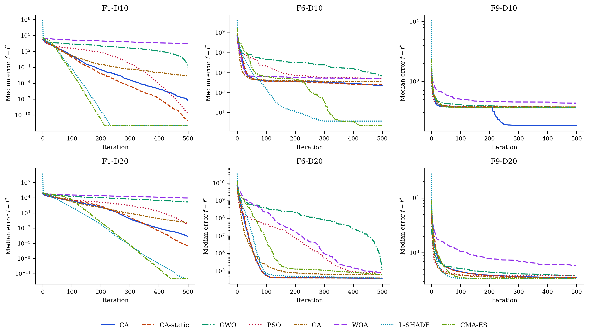

::: {.content-visible when-format="html"}
::: {.callout-tip appearance="simple" icon=false}
**Formats and files.** You are reading the HTML version. The typeset manuscript is also available as [**PDF** (`paper.pdf`)](paper.pdf). Source code, experiment scripts, and all raw results live in the [GitHub repository](https://github.com/sabernaseralavi-60/2026_Chess-Algorithm).
:::
:::

::: {.content-visible when-format="pdf"}
| ^1^ *Seyed Saber Naseralavi (corresponding author,* `saber_naseralavi@uk.ac.ir`*) — Department of Civil Engineering, Faculty of Engineering, Shahid Bahonar University of Kerman, Kerman, Iran.*
| ^2^ *Seyedali Mirjalili — Centre for Artificial Intelligence Research and Optimization, Torrens University Australia, Brisbane, Australia.*
| *An HTML version of this article, together with all code and data, is available at* <https://sabernaseralavi-60.github.io/2026_Chess-Algorithm/>*.*
:::

::: {.callout-note appearance="simple" icon=false}
**Author note.** Dr. Seyedali Mirjalili is listed as an invited co-author; his participation is pending confirmation. The invitation reflects how much this study owes to his work on swarm and nature-inspired optimization, and his name will be retained only with his explicit consent.
:::

**Keywords:** metaheuristics; chess algorithm; adaptive optimization; global optimization; CEC-2017 benchmarks; constrained engineering design; traffic signal timing; berth allocation; transportation networks.

# Introduction

## Motivation

A large share of the decisions a transportation engineer has to make can be written, after enough simplification, as a global optimization problem:

$$
\min_{\mathbf{x} \in \Omega} f(\mathbf{x}), \qquad
\Omega = \{\mathbf{x} \in \mathbb{R}^{D} : l_j \le x_j \le u_j,\; j = 1,\dots,D\}.
$$ {#eq-problem}

The trouble is what $f$ looks like in practice. Signal timing, network design, transit scheduling, detector placement — in each of these the objective is non-convex, often non-differentiable, riddled with local optima, and sometimes expensive to evaluate [@ceylan2004traffic; @osorio2013simulation]. Exact methods rarely scale to instances of realistic size. This is why metaheuristics have retained their prominence for three decades: they trade the guarantee of optimality for robustness, generality, and a computationally tractable budget.

## A brief map of the metaheuristic landscape

The field grew from two roots. Evolutionary computation gave us the Genetic Algorithm [@holland1975adaptation; @goldberg1989genetic] and Evolution Strategies [@beyer2002es]. Trajectory methods gave us Simulated Annealing [@kirkpatrick1983sa], whose central idea — accept a worse solution now and then, so you can escape a local minimum — turned out to be one of the most durable in the field. Swarm intelligence arrived in the 1990s with Particle Swarm Optimization [@kennedy1995pso], Ant Colony Optimization [@dorigo1996aco], Differential Evolution [@storn1997de], and later the Artificial Bee Colony [@karaboga2007abc]. More recently, Mirjalili and colleagues built a productive line of algorithms by abstracting the social and hunting behavior of animals into compact operators: the Grey Wolf Optimizer [@mirjalili2014gwo], the Ant Lion Optimizer [@mirjalili2015alo], the Dragonfly Algorithm [@mirjalili2016dragonfly], the Whale Optimization Algorithm [@mirjalili2016whale], the Sine Cosine Algorithm [@mirjalili2016sca], and the Salp Swarm Algorithm [@mirjalili2017salp], among others.

This literature reveals two notable patterns. First, almost every swarm algorithm treats its agents identically: a single update equation is applied to all agents, with only position and fitness distinguishing one from another. However, division of labor among *unequal* agents is a well-established principle in both biological systems and human strategic behavior. Second, the performance of a metaheuristic is largely determined by how it schedules the transition from exploration to exploitation [@mirjalili2014gwo], and mechanisms that adapt this transition based on observed search dynamics — rather than on elapsed time alone — remain uncommon in the literature.

The justification for proposing an additional metaheuristic should also be stated explicitly. The No-Free-Lunch theorem [@wolpert1997nfl] precludes the existence of a universally dominant optimizer; accordingly, the objective of this work is not universal superiority, but rather to contribute a substantively different inductive bias and to identify the problem class for which that bias is advantageous.

A third consideration is critical rather than structural. The rapid proliferation of metaphor-named algorithms has drawn severe and largely justified criticism [@sorensen2015metaphor], on the grounds that novel vocabulary frequently repackages established operators without advancing the underlying science. This paper accepts the substance of that criticism and structures its response into the study itself: @sec-operator-families maps every mechanism of the proposed algorithm onto its established operator family with the corresponding citation, @sec-ablation measures each mechanism's isolated contribution empirically, and the comparison roster includes two competition-grade optimizers — L-SHADE [@tanabe2014lshade] and CMA-ES [@hansen2001cmaes] — precisely so that the algorithm's standing is assessed against the strongest representatives of the operator families it draws on, not only against other metaphor-derived methods.

## Why chess?

Chess offers precisely the two properties identified as absent above. Its pieces are radically unequal: the queen sweeps the whole board, rooks travel along files and ranks, bishops along diagonals, knights jump over anything in the way, and pawns crawl forward one square at a time while quietly defining the structure of the position. Mapped onto a search population, this suggests sub-groups performing qualitatively different moves around one common reference point — the King, which in our setting is the best solution found so far.

The game also comes with a mature strategic vocabulary, refined over centuries of analysis. Development says: mobilize your forces early, consolidate later. A sacrifice gives up material now for a positional advantage later. Pinning immobilizes a piece against something more valuable behind it. Castling is a safeguarded structural rearrangement; en passant, an opportunistic capture available only under narrow conditions; the threefold-repetition rule declares a draw when the position keeps repeating. Each of these has a natural algorithmic reading — exploration schedules, acceptance of deteriorating moves, variable fixation, elite restructuring, adaptive local search, and diversity preservation, respectively.

The Chess Algorithm (CA) proposed here formalizes that mapping. To preempt a common misunderstanding: CA does not play chess and does not search a game tree. It borrows the strategic grammar of the game exclusively, and its per-iteration computational cost is comparable to that of GA or PSO.

## Contributions and scope

The paper contributes, in order: a complete mathematical specification of CA — initialization, rank-based role assignment, movement operators, strategic mechanisms, and the adaptive control layer that governs when each applies, including a state machine that reads population divergence, initiative, and local-search success each iteration and switches between opening, middlegame, closed-position, and endgame tactical repertoires, with several operators new to this paper (Novotny interference, the knight's fork, the royal council, a King's-march blockade response, and a Tal-style speculative-sacrifice reheat), together with an explicit mapping of every mechanism onto its established operator family (@sec-ca); a controlled benchmark study on six standard test functions in 30 dimensions against GA, PSO, SA, and GWO under matched budgets, with nonparametric testing following @derrac2011nonparametric (@sec-benchmarks); a full evaluation on the CEC-2017 benchmark suite against an eight-algorithm roster that includes the competition-grade baselines L-SHADE [@tanabe2014lshade] and CMA-ES [@hansen2001cmaes] alongside GWO, PSO, GA, and WOA, including a two-library data-integrity audit that identified six defective function implementations in the third-party `opfunu` port and restored all six from an independent implementation carrying the official reference data (@sec-cec2017); an evaluation on the CEC-2022 suite at both of its official dimensionalities under the same roster (@sec-cec2022); an evaluation on seven classic constrained engineering design problems (@sec-engineering); a granular per-mechanism ablation study, a one-at-a-time parameter sensitivity analysis, and a measured computational-cost comparison with exact evaluation counts (@sec-analysis); a transportation case study on coordinated signal timing of an eight-intersection arterial with a Webster/HCM delay model [@webster1958traffic; @roess2019traffic] (@sec-transport); an extended comparison against six third-party implementations from the `mealpy` library on two transportation problems, one of which has a known global optimum (@sec-mealpy); and a fully reproducible open-source implementation, with an ablation configuration (CA-static, the adaptive layer disabled) carried throughout to isolate its contribution.

It is important to state the scope of our claims clearly. We report results objectively and make no claim of universal superiority. Against the classical and widely used metaheuristics in the roster — GA, PSO, SA, GWO, WOA, and the six `mealpy` baselines of @sec-mealpy — CA is consistently competitive and frequently significantly better, across synthetic suites, engineering design, and the transportation problems that motivated it. Against the two competition-grade optimizers, the ordering is reversed: L-SHADE and CMA-ES outperform CA on every problem class tested, and this is reported without qualification wherever it occurs. The claim this paper defends is therefore deliberately narrower than a performance claim: CA is a well-founded, transparent, and competitive architecture whose every mechanism is specified mathematically, mapped to its operator family, and measured in isolation — and the ablation analysis of @sec-analysis identifies precisely which of those mechanisms carry its performance, a finding that in turn explains the standing of the specialized methods.

# The Chess Algorithm {#sec-ca}

## Conceptual mapping

CA maintains a population of $N$ candidate solutions $\mathbf{X}_i \in \Omega \subset \mathbb{R}^D$, treated as pieces playing "toward" the global optimum. @tbl-mapping summarizes how the vocabulary of the game maps onto algorithmic mechanisms.

| Chess concept | Algorithmic role |
|---|---|
| King | Incumbent best solution (never lost) |
| Queen, Rook, Bishop, Knight, Pawn | Heterogeneous movement operators |
| Development (opening principle) | Time-decaying step-scale $a(t)$ |
| Sacrifice | Probabilistic acceptance of worse moves (minor pieces only) |
| Pinning | Progressive freezing of coordinates to the King's values |
| Castling | Safeguarded coordinate-block exchange King $\leftrightarrow$ Rook |
| En passant | Opportunistic, self-adaptive local capture around the King |
| Pawn promotion | Rank-based role reassignment each iteration |
| Threefold repetition | Re-deployment of agents that collapse onto the King |
| Opening / middlegame / closed position / endgame | Position-dependent tactical phase, read each iteration (@sec-adaptive) |
| Nimzowitsch prophylaxis | Restrained, line-reopening response to premature convergence |
| Fork, interference, discovered attack, royal council | Additional movement and probe operators, active in specific phases |
| Windmill | Repeated extension of a successful King displacement (endgame) |
| Zugzwang / blockade | Stagnation-triggered waiting move, King's march, and speculative sacrifice |
| Checkmate | Termination criterion |

: Mapping between chess concepts and CA mechanisms. {#tbl-mapping}

One point deserves emphasis: CA borrows the strategic grammar of chess as an inductive bias, not the game itself. An iteration costs $\mathcal{O}(ND + N \log N)$ arithmetic operations (the movement updates plus the sort that drives role assignment) and $N + 3$ function evaluations — $N$ piece moves plus three en-passant probes — with one extra castling probe every $c$ iterations. That is the same order as GA, PSO, or GWO. The exact evaluation accounting used in the experiments is spelled out in @sec-benchmarks.

## Initialization

The board is set up by scattering the $N$ pieces uniformly over the feasible box:

$$
\mathbf{X}_i^{(0)} = \mathbf{l} + (\mathbf{u} - \mathbf{l}) \circ \mathbf{r}_i, \qquad
\mathbf{r}_i \sim \mathcal{U}(0,1)^D, \quad i = 1, \dots, N,
$$ {#eq-init}

where $\mathbf{l}$ and $\mathbf{u}$ are the bound vectors and $\circ$ is the elementwise (Hadamard) product. All positions are evaluated once and the population is sorted by fitness before the first move is played.

## Role assignment

Let $\pi$ be the permutation of $\{1, \dots, N\}$ that sorts the population,

$$
f\big(\mathbf{X}_{\pi(1)}\big) \le f\big(\mathbf{X}_{\pi(2)}\big) \le \dots \le f\big(\mathbf{X}_{\pi(N)}\big).
$$ {#eq-roles}

The best agent $\mathbf{K} = \mathbf{X}_{\pi(1)}$ is the King. The following ranks are partitioned, in order, into Queens $\mathcal{Q}$, Rooks $\mathcal{R}$, Bishops $\mathcal{B}$, and Knights $\mathcal{N}$, with

$$
|\mathcal{Q}| = \max(1, \lfloor \rho_q N \rceil), \quad
|\mathcal{R}| = \max(1, \lfloor \rho_r N \rceil), \quad
|\mathcal{B}| = \max(1, \lfloor \rho_b N \rceil), \quad
|\mathcal{N}| = \max(1, \lfloor \rho_n N \rceil),
$$

where $\lfloor \cdot \rceil$ denotes rounding and $(\rho_q, \rho_r, \rho_b, \rho_n) = (0.10, 0.15, 0.15, 0.20)$. Whatever remains becomes the Pawns $\mathcal{P}$. Because the assignment is redone after every iteration, a pawn that reaches a good region becomes a strong piece the next time roles are assigned. Promotion, in other words, falls out of re-ranking for free; no extra machinery is needed.

## Development schedule

Opening theory tells a player to develop pieces quickly; endgames reward patience and precision. CA encodes this with a linearly decaying step-scale coefficient,

$$
a(t) = 2\left(1 - \frac{t}{T}\right),
$$ {#eq-development}

with $t$ the current iteration and $T$ the total budget — the convention popularized by @mirjalili2014gwo. Every piece move scales with $a(t)$, so the swarm plays big developing moves early and fine maneuvers late.

## Piece movement operators

Write $\mathbf{L} = \mathbf{u} - \mathbf{l}$ for the box width and let $\mathbf{r}, \mathbf{r}' \sim \mathcal{U}(0,1)^D$ be independent random vectors. The five mobile roles then move as follows.

**Queen (omnidirectional sweep).** The queen circles the King at a radius tied to her current distance from him:

$$
\mathbf{X}_i' = \mathbf{K} + a(t)\,(2\mathbf{r} - \mathbf{1}) \circ \max\!\big(|\mathbf{K} - \mathbf{X}_i|,\ \boldsymbol{\sigma}\big),
$$ {#eq-queen}

where $\boldsymbol{\sigma}$ is the King's adaptive capture radius from @sec-enpassant. The $\max$ keeps the sweep from collapsing entirely, so queens never stall.

**Rook (single-axis move).** One random axis $j$ is chosen and only that coordinate moves:

$$
X_{i,j}' = K_j + a(t)\,(2r - 1)\,\max\!\big(|K_j - X_{i,j}|,\ 0.01\,L_j\,a(t)\big).
$$ {#eq-rook}

**Bishop (diagonal move).** Two distinct axes $j$ and $k$ receive steps of equal magnitude and random relative sign, which is as close to a diagonal as a box-constrained space allows:

$$
\Delta = a(t)\,(2r-1)\,\max\!\Big(\tfrac{1}{2}\big(|K_j - X_{i,j}| + |K_k - X_{i,k}|\big),\ 0.01\,L\,a(t)\Big), \quad
X_{i,j}' = K_j + \Delta,\ \ X_{i,k}' = K_k \pm \Delta.
$$ {#eq-bishop}

**Knight (L-shaped jump).** The knight is the one piece that jumps over whatever stands in its way. Relative to a randomly chosen better-ranked peer $\mathbf{P}$, it drifts toward the peer and then adds an asymmetric $2{:}1$ jump on two random axes:

$$
\mathbf{X}_i' = \mathbf{X}_i + \mathbf{r} \circ (\mathbf{P} - \mathbf{X}_i), \qquad
X_{i,j}' \mathrel{+}= 2\,a(t)\,\beta\,(2r-1), \quad
X_{i,k}' \mathrel{+}= 1\,a(t)\,\beta\,(2r'-1),
$$ {#eq-knight}

with $\beta = \overline{|\mathbf{P} - \mathbf{X}_i|}$ the mean coordinate gap. With small probability $0.1\,a(t)/2$ the knight abandons this move and leaps: two coordinates are resampled uniformly in $\Omega$. This leap is the algorithm's main long-range restart device. The implementation also ships a heavy-tailed variant in which those two coordinates instead receive a Lévy-flight step $0.05\,L\,s$ generated by Mantegna's algorithm [@mantegna1994levy], the mechanism Cuckoo Search made popular [@yang2009cuckoo]:

$$
s = \frac{u}{|v|^{1/\beta_\ell}}, \qquad
u \sim \mathcal{N}(0, \sigma_u^2), \quad v \sim \mathcal{N}(0, 1), \qquad
\sigma_u = \left[
\frac{\Gamma(1+\beta_\ell)\,\sin(\pi \beta_\ell / 2)}
     {\Gamma\!\big(\tfrac{1+\beta_\ell}{2}\big)\,\beta_\ell\, 2^{(\beta_\ell - 1)/2}}
\right]^{1/\beta_\ell},
$$ {#eq-levy}

with tail index $\beta_\ell = 1.5$. Every result in this paper uses the plain uniform leap; the Lévy option is documented for future study rather than used here.

**Pawn (steady advance).** Pawns take small steps toward the King and toward a random better-ranked piece $\mathbf{B}$:

$$
\mathbf{X}_i' = \mathbf{X}_i + 0.3\,\mathbf{r} \circ (\mathbf{K} - \mathbf{X}_i) + 0.3\,\mathbf{r}' \circ (\mathbf{B} - \mathbf{X}_i).
$$ {#eq-pawn}

## Strategic mechanisms

### Pinning

With probability $p_{\text{pin}}(t) = 0.5\,t/T$, a random subset of at most $30\%$ of an agent's coordinates is pinned to the King's values and excluded from perturbation. Early on, pinning is rare and the pieces develop freely. Late in the run it concentrates the search on a shrinking set of free dimensions around the incumbent, consistent with the exploitation schedule expected during an endgame phase.

### Sacrifice

A worsening move $\Delta_i = f(\mathbf{X}_i') - f(\mathbf{X}_i) > 0$ made by a minor piece — a Knight or a Pawn — is still accepted with probability

$$
p_{\text{acc}} = \exp\!\left(-\frac{\Delta_i}{\theta(t)}\right), \qquad
\theta(t) = \theta_0 \big(f_{\max} - f_{\min}\big)\, e^{-8 t / T},
$$ {#eq-sacrifice}

with $\theta_0 = 0.1$. Readers will recognize the Metropolis rule of Simulated Annealing [@kirkpatrick1983sa], but two chess-flavored restrictions change its character. The temperature is scaled by the current fitness spread of the population, which makes the sacrifice budget self-calibrating across problems of wildly different magnitudes. And only minor pieces may be sacrificed: the King and the major pieces are never lost, so the elite of the population cannot be eroded by the acceptance rule.

### En passant (adaptive local capture) {#sec-enpassant}

Once per iteration the King attempts an en-passant capture. Three trial points are drawn in a sparse Gaussian neighborhood,

$$
\mathbf{Y}_m = \mathbf{K} + \boldsymbol{\sigma} \circ \mathbf{z}_m \circ \mathbf{m}_m, \qquad
\mathbf{z}_m \sim \mathcal{N}(\mathbf{0}, \mathbf{I}),\quad m = 1,2,3,
$$ {#eq-enpassant}

where the random binary mask $\mathbf{m}_m$ activates each coordinate with probability $\max(0.2,\ 2/D)$. Any improving trial replaces the King. The radius $\boldsymbol{\sigma}$ follows a success rule of the kind long used in Evolution Strategies [@beyer2002es]: multiply by $1.3$ after a successful capture, by $0.92$ after a failure, and after $50$ consecutive failures reset to $\boldsymbol{\sigma} = 0.05\,\mathbf{L}\max(a(t), 0.05)$ — a stalemate-avoidance restart. In our experience this mechanism is what keeps CA improving deep into the run, long after a fixed-radius local search would have gone quiet.

### Castling

Every $c = 10$ iterations the King castles with the best Rook: a contiguous block of up to $D/4$ coordinates is copied from the Rook into a candidate King, and the exchange is kept only if it improves the King. It is a safeguarded structural jump, useful when good partial solutions have been discovered on different "files" of the board and need splicing together.

### Threefold repetition (diversity preservation)

If an agent coincides with the King to numerical precision — something pinning can eventually cause — it is re-deployed uniformly in $\Omega$, much as the threefold-repetition rule stops a game from going in circles. We did not add this rule for elegance; early prototypes taught us it is essential. Without it, pinning breeds exact clones of the King, every gap-proportional step length collapses to zero, and the search dies quietly in place.

### Checkmate

The algorithm stops after $T$ iterations. A stagnation-based early stop would be easy to add, but we keep it disabled in all experiments so that every algorithm consumes the same core budget of $N \times T$ population evaluations.

## Parameter summary

@tbl-params collects the base parameters and the single configuration used everywhere in this paper; several of them (pinning probability, the knight-leap rate, and others) are further modulated by the phase-conditioned schedule of @tbl-phase-schedule once the adaptive control layer of @sec-adaptive is active — CA-static uses the values below unmodulated throughout. No per-problem tuning was done, for CA, for CA-static, or for any competitor.

| Parameter | Symbol | Value |
|---|:---:|---:|
| Role fractions (Queen / Rook / Bishop / Knight) | $\rho_q,\rho_r,\rho_b,\rho_n$ | $0.10 / 0.15 / 0.15 / 0.20$ |
| Development schedule | $a(t)$ | $2(1 - t/T)$ |
| Pinning probability / cap | $p_{\text{pin}}(t)$ | $0.5\,t/T$, at most $30\%$ of coordinates |
| Sacrifice constant | $\theta_0$ | $0.1$ |
| Castling period | $c$ | $10$ iterations |
| En-passant probes per iteration | — | $3$ |
| En-passant adaptation (success / failure / reset) | — | $\times 1.3$ / $\times 0.92$ / after $50$ failures |
| Knight exploratory-leap distribution | — | uniform (Lévy, $\beta_\ell = 1.5$, optional) |

: CA parameters and the fixed configuration used in all experiments. {#tbl-params}

## Pseudocode

```
Algorithm: Chess Algorithm (CA)
Input: objective f, bounds [l, u], dimension D,
       population N, iterations T
1  Initialize X and its board-mirror l+u−X; evaluate both; keep the
     fitter N (Eq. init); sort; King ← X(1); archive ← {}
2  σ ← 0.1 L; fails ← 0; stall ← 0; d_ema, acc_ema, eps_ema ← defaults
3  for t = 0 … T−1:
4      a ← 2(1 − t/T)
5      Read position: d_ema ← smoothed mean distance to King;
         phase ← Opening / Middlegame / Closed / Endgame (Eq. phase);
         if population idle (low acc_ema, eps_ema): halve a (Zugzwang)
6      Look up phase-conditioned rates: p_pin, leap mult., p_council,
         p_discovered-attack, p_interference, pawn gain (Table 3)
7      Assign roles by rank: Queens 10%, Rooks 15%, Bishops 15%,
         Knights 20%, Pawns rest
8      Move each piece by its operator; Knights fork or leap, Bishops
         occasionally interfere, Pawns advance at the phase's gain
9      Pin ≤ 30% of coordinates of each agent to King with prob. p_pin
10     Clip to bounds; evaluate F′
11     Accept improvements; accept worse MINOR pieces with prob. e^(−Δ/θ),
         θ set from the robust population spread (Eq. sacrifice)
12     En passant: 3 trials around King — masked Gaussian, plus a
         council or discovered-attack probe with prob. p_council /
         p_discovered-attack, plus a single-coordinate check probe;
         keep any improvement; adapt σ; on success in Endgame, extend
         the winning displacement (windmill) while it keeps improving
13     Every 10 iters: Castle — block-swap King↔best Rook, keep if better
14     Threefold repetition: re-deploy agents identical to the King
15     Update King; re-rank population (pawn promotion); archive the
         King if it improved and is far from the current archive
16     if stall ≥ 25 (no significant improvement, Eq. fifty-move-rule):
         Pawn break (re-deploy all Pawns); King's march (6 long-radius
         probes, greedy-refine the best, keep if it improves the King);
         reheat the sacrifice budget ×10 for 10 iterations; replace the
         worst Queen with a random archived strongpoint; reset stall
17 return King
```

## Flowchart

@fig-flowchart summarizes the core loop common to every iteration; the phase-dependent tactic selection and the blockade response of @sec-adaptive sit inside its "apply role moves" and "update King" boxes respectively, and are given in full in the pseudocode above.

{#fig-flowchart fig-align="center" width="88%"}

## Properties and design rationale

**Elitism and convergence.** The King's fitness never increases: it is replaced only by strictly better points, whether through the population update, en passant, or castling. That elitism buys the usual asymptotic guarantee (@prp-convergence).

::: {#prp-convergence}
## Elitist convergence in probability

Let $f$ be continuous on the compact box $\Omega$ with global minimum $f^{*}$. Under CA's update rules, the best-so-far value $f(\mathbf{K}^{(t)})$ converges in probability to $f^{*}$ as $T \to \infty$.

*Proof sketch.* The King sequence is elitist by construction. At every iteration the Knight's exploratory leap and the threefold-repetition re-deployment both place uniform probability mass over $\Omega$, so any open subset — in particular any neighborhood of a global minimizer, whose objective values come within $\varepsilon$ of $f^{*}$ by continuity — is visited with probability approaching one as iterations accumulate. Elitism plus this covering argument yields convergence in probability, exactly as in the standard analysis of elitist stochastic search.
:::

An asymptotic statement of this kind provides no information about behavior within a finite budget of $15{,}000$ evaluations; that question is empirical and is addressed in @sec-benchmarks.

**Exploration–exploitation balance.** Exploration rests mainly on the Knights (@eq-knight) and on the Queens early in the schedule (@eq-queen); exploitation on the Pawns (@eq-pawn), on pinning, and on the en-passant success rule (@eq-enpassant). The balance shifts smoothly through $a(t)$, $p_{\text{pin}}(t)$, and $\theta(t)$, and adapts to the state of the search through the gap-proportional step lengths and the spread-scaled sacrifice budget (@eq-sacrifice).

**Parameter economy.** Every result in this paper is produced under the single configuration in @tbl-params. The sensitivity of performance to the role fractions has not yet been quantified; this is identified explicitly as a direction for future work rather than omitted from discussion.

## Adaptive tactical control {#sec-adaptive}

The mechanisms above give CA its movement vocabulary; what remains is to say how CA decides, moment to moment, which of them to lean on. A grandmaster does not run the same combination of tactics in a wide-open middlegame as in a locked pawn structure or a simplified endgame — which tactic is right depends on the position, not on a move counter. CA answers this with a lightweight state machine that reads four cheap statistics of the population each iteration and switches the active tactical repertoire accordingly, described below. For controlled comparison, every experiment in this paper is also run under **CA-static**: the identical operator set with this state machine disabled, so that role-appropriate tactics fire at fixed, non-adaptive rates instead. CA-static is not a separate algorithm; it is an ablation configuration, used throughout @sec-cec2017 and @sec-engineering to isolate exactly what the adaptive layer contributes.

### Reading the position

Four exponentially-smoothed statistics ($\lambda=0.8$) are recomputed every iteration. The population's normalized divergence from the King,

$$
d(t) = \frac{1}{\mathrm{Lspan}\sqrt{D}} \cdot \frac{1}{N-1}\sum_{i=2}^{N} \lVert \mathbf{X}_i^{(t)} - \mathbf{K}^{(t)} \rVert_2 ,
\qquad
\tilde{d}(t) = 0.8\,\tilde{d}(t-1) + 0.2\, d(t),
$$ {#eq-divergence}

answers "is the position open or closed?", where $\mathrm{Lspan}=\max_j(u_j-l_j)$. Two further exponential moving averages track the initiative,

$$
\alpha(t) = 0.8\,\alpha(t-1) + 0.2 \cdot \frac{1}{N}\sum_{i=1}^{N} \mathbb{1}[\text{move}_i \text{ accepted}],
$$ {#eq-acceptance}

and the technical success rate of the King's own local search,

$$
\varepsilon(t) =
\begin{cases}
0.8\,\varepsilon(t-1) + 0.2 & \text{en-passant capture succeeded at } t,\\
0.8\,\varepsilon(t-1) & \text{otherwise.}
\end{cases}
$$ {#eq-epsilon}

Finally, a stagnation counter borrows chess's *fifty-move rule*: rather than reset on any improvement whatsoever, it resets only on a materially significant one, exactly as fifty moves without a pawn push or a capture — not merely without a game-theoretically perfect move — are needed to claim a draw:

$$
s(t) =
\begin{cases}
0, & f(\mathbf{K}^{(t)}) < f_{\text{ref}} - \max\!\big(10^{-4}|f_{\text{ref}}|,\ 10^{-10}\big),\\[2pt]
s(t-1) + 1, & \text{otherwise,}
\end{cases}
$$ {#eq-fifty-move}

with $f_{\text{ref}}$ updated to $f(\mathbf{K}^{(t)})$ whenever $s(t)=0$. Early prototypes used a naive counter that reset on any improvement whatsoever; because the en-passant rule of @sec-enpassant produces microscopic refinements routinely, that counter never accumulated sufficiently to trigger the blockade response of @sec-blockade, even in runs that remained visibly confined to a secondary basin for hundreds of iterations. @eq-fifty-move addresses this limitation.

### Game phases

The smoothed divergence and the fraction of the budget elapsed, $\phi(t)=t/T$, jointly select one of four phases:

$$
\text{phase}(t) =
\begin{cases}
\textsc{Opening}, & \tilde{d}(t) > 0.22,\\
\textsc{Middlegame}, & 0.045 < \tilde{d}(t) \le 0.22,\\
\textsc{Closed}, & \tilde{d}(t) \le 0.045 \text{ and } \phi(t) \le 0.5,\\
\textsc{Endgame}, & \tilde{d}(t) \le 0.045 \text{ and } \phi(t) > 0.5.
\end{cases}
$$ {#eq-phase}

The two thresholds were checked, though not exhaustively swept, against four combinations ($\delta_{\text{open}} \in \{0.15, 0.22, 0.30\}$, $\delta_{\text{end}} \in \{0.03, 0.045, 0.06, 0.09\}$) on two CEC-2017 functions (Rastrigin and Hybrid Function 4, $D=30$); $\delta_{\text{open}}=0.22$ and $\delta_{\text{end}}=0.045$ were the best or near-best combination on both and are used throughout this paper. A full sensitivity study across the complete parameter space, noted as a limitation in @sec-conclusions, remains future work.

The Closed phase answers a failure mode found during tuning: a population can collapse to a small radius around the King *early* in the search — a premature convergence, not a genuine endgame — and treating every low-divergence state as an endgame made this worse, since endgame tactics (heavy pinning, aggressive pawn advance) accelerate collapse rather than reversing it. Reading an early collapse as a **prematurely closed position** and answering with Nimzowitschian *prophylaxis* — restraint and reopening lines rather than immediate commitment — removes the pathology. Each phase activates a different parameter vector, summarized in @tbl-phase-schedule.

| Phase | $p_{\text{pin}}$ | Leap mult. | $p_{\text{c}}$ | $p_{\text{DA}}$ | $p_{\text{intf}}$ | Pawn gain |
|---|:---:|:---:|:---:|:---:|:---:|:---:|
| Opening | $0$ | $2.0$ | $0$ | $0$ | $0.30$ | $0.30$ |
| Middlegame | $0.5\,\phi(t)$ | $1.0$ | $0.5$ | $0$ | $0.15$ | $0.30$ |
| Closed | $0$ | $2.0$ | $0.5$ | $0.15$ | $0.15$ | $0.30$ |
| Endgame | $0.1{+}0.75\,\phi(t)^{*}$ | $0.5$ | $0.7$ | $0.15$ | $0$ | $0.45$ |

: Phase-conditioned tactical schedule. Pinning probability $p_{\text{pin}}$, knight-leap probability multiplier, council probability $p_{\text{c}}$, discovered-attack probability $p_{\text{DA}}$, interference probability $p_{\text{intf}}$, and pawn step gain, by phase. $^{*}$Endgame pinning is capped at $0.5$. {#tbl-phase-schedule tbl-colwidths="[16,20,12,10,10,15,13]"}

One overlay applies regardless of phase. If the population has lost the initiative and the King's local search has gone quiet at the same time,

$$
\text{Zugzwang}(t) \iff \phi(t) > 0.2 \ \wedge\ \alpha(t) < 0.04 \ \wedge\ \varepsilon(t) < 0.05,
$$ {#eq-zugzwang}

the development coefficient is halved for that one iteration, $a(t)\leftarrow a(t)/2$ — a *triangulation* move: change nothing structurally, spend a tempo, and let the next reading of the position be more informative before committing to a new phase.

### New tactical operators

**Novotny interference (Bishops).** Named for the classical motif in which a piece is sacrificed on a square that blocks two enemy lines of defense at once, a Bishop is occasionally interposed on the segment between two distant, higher-ranked pieces rather than moving diagonally around the King:

$$
\mathbf{X}_i' = \beta\, \mathbf{X}_a + (1-\beta)\, \mathbf{X}_b + 0.02\, a(t)\, \mathbf{L} \circ \mathbf{z},
\qquad \beta \sim \mathcal{U}(0.3, 0.7),\quad \mathbf{z} \sim \mathcal{N}(\mathbf{0}, \mathbf{I}),
$$ {#eq-interference}

with $a,b$ drawn without replacement from the fitter half of the population (probability $p_{\text{intf}}$, @tbl-phase-schedule). Being a convex recombination of two arbitrary population members rather than a step along a coordinate axis, it is rotation-invariant, and it is the mechanism most directly responsible for CA's gains on the CEC-2017 hybrid and composition functions (@sec-cec2017).

**The knight's fork.** With probability $0.5$, a Knight that does not take its exploratory leap instead plays

$$
\mathbf{X}_i' = \mathbf{X}_i + \mathbf{r} \circ (\mathbf{K} - \mathbf{X}_i) + 0.8\,(\mathbf{X}_a - \mathbf{X}_b), \qquad a, b \sim \mathcal{U}\{1,\dots,i-1\},\ \ \mathbf{r}\sim\mathcal{U}(0,1)^D,
$$ {#eq-fork}

drifting toward the King while inheriting the differential structure of two better-ranked peers at once — attacking two targets simultaneously, in the spirit of the tactic that gives the move its name.

**Discovered attack.** An early version of this operator applied the geometry below to every Rook as a population move; tuning showed it tactically unsound at that scale, since the candidate is accepted by the ordinary improvement rule almost every time it is tried, collapsing the Rook sub-population onto the King–elite line within a handful of iterations. Restricted instead to a single, strictly elitist probe competing for one of the King's own en-passant trials — active only in the Closed and Endgame phases —

$$
\mathbf{Y}_{\text{DA}} = \mathbf{X}_e + u\,(\mathbf{K} - \mathbf{X}_e), \qquad u \sim \mathcal{U}(1.2, 2.2),\quad e \sim \mathcal{U}\{1,2,3\},
$$ {#eq-discovered}

it recovers the intended effect — probing the far side of the incumbent along an elite-King line — without the pathology. This finding generalizes: a tactic that is sound for a single elite piece can destabilize an entire role class, analogous to how a discovered attack that wins material for one player becomes disadvantageous if applied by every piece on the board simultaneously.

**Royal council.** Competing with the discovered attack for the same probe slot (mutually exclusive, selected by relative probability),

$$
\mathbf{Y}_{\text{council}} = \mathbf{K} + 1.5\,u\,(\mathbf{K} - \mathbf{c}), \qquad \mathbf{c} = \tfrac{1}{2}(\mathbf{X}_{\text{Q}_1} + \mathbf{X}_{\text{R}_1}),\quad u \sim \mathcal{U}(0,1),
$$ {#eq-council}

reflects the King away from the midpoint of the best Queen and best Rook. Where isotropic Gaussian probes are blind to the shape of the elite, this reflection is population-shaped: when the elite lies strung along a narrow curved valley — the typical geometry along an active inequality constraint in the engineering problems of @sec-engineering — it points down the valley rather than across it. This single mechanism was responsible for closing most of the welded-beam gap observed in early prototypes.

**Windmill.** In the Endgame phase only, a successful en-passant or council capture with displacement $\boldsymbol{\delta}=\mathbf{K}^{(t)}-\mathbf{K}^{(t)}_{\text{pre}}$ is extended,

$$
\mathbf{K} \leftarrow \mathbf{K} + \boldsymbol{\delta} \quad \text{while } f(\mathbf{K}+\boldsymbol{\delta}) < f(\mathbf{K}),\quad \text{up to 3 repetitions,}
$$ {#eq-windmill}

echoing the chess windmill's repeating sequence of discovered checks, each one harvesting material.

**Overprotection archive.** Aron Nimzowitsch's overprotection principle counsels defending a valuable point with more force than strictly necessary, so that pieces freed from other duties have a strong square to retreat to. CA archives up to five mutually distant past King positions,

$$
\text{admit } \mathbf{K}^{(t)} \iff f(\mathbf{K}^{(t)}) < f(\mathbf{K}^{(t-1)}) \ \wedge\ \min_{\mathbf{a}\in\mathcal{A}} \frac{\lVert \mathbf{K}^{(t)}-\mathbf{a}\rVert}{\mathrm{Lspan}\sqrt{D}} > 0.15,
$$ {#eq-archive}

evicting the worst by fitness on overflow. These strongpoints are the fallback used by the blockade response below.

### Blockade: pawn break, King's march, and Tal's speculative sacrifice {#sec-blockade}

When the fifty-move counter reaches $s(t) \ge 25$ (@eq-fifty-move), three mechanisms fire together. All Pawns are re-deployed uniformly at random — a *pawn break*, opening lines in a closed position. The King probes six long-radius candidates at three scales,

$$
\mathbf{Y}_m = \mathbf{K} + \rho_m\, \mathbf{L}\circ\mathbf{z}_m, \qquad \rho_m \in \{0.1,0.1,0.2,0.2,0.4,0.4\},\quad \mathbf{z}_m \sim \mathcal{N}(\mathbf{0},\mathbf{I}),
$$ {#eq-march}

then *consolidates* the best candidate with an eight-step greedy local refinement of shrinking radius before comparing it against the incumbent King. The order is deliberate: refine-then-compare lets the march accept a basin whose raw landing point is worse than the incumbent but whose refined optimum is better, while the final elitist comparison still guarantees the King's fitness sequence never worsens. Simultaneously, the sacrifice budget of @eq-sacrifice is reheated tenfold for the next ten iterations — modeled on Mikhail Tal's willingness to sacrifice material for an unquantifiable positional initiative, rather than continuing to apply conservative moves that have ceased to yield progress — and, if the archive of @eq-archive is non-empty, the worst-ranked Queen is replaced by a random archived strongpoint, giving the population a proven foothold rather than a blind restart.

### Opening principle: opposition-based initialization

The initial population is evaluated together with its reflection through the board's center, $\mathbf{X}^{(0)}_{\text{mirror}}=\mathbf{l}+\mathbf{u}-\mathbf{X}^{(0)}$, and the fitter half of the combined $2N$ candidates is kept. Isolating this mechanism during tuning revealed a *mixed* effect — better on two of four micro-benchmark problems tested, worse on the other two — rather than a consistent gain. It is kept by default because it never produced a large regression and costs only one extra population evaluation, paid once; its dedicated ablation is reported in @sec-ablation.

## Relation to established operator families {#sec-operator-families}

The criticism of metaphor-driven algorithm design articulated by @sorensen2015metaphor deserves a direct answer rather than a defensive one: a vocabulary borrowed from a game can obscure the fact that the underlying operators are established ones, can impede comparison with prior work, and can inflate claims of novelty. The response this paper owes the reader is a precise disclosure of what each mechanism is mathematically and where it sits in the existing taxonomy. @tbl-operator-families provides that disclosure for every CA mechanism.

| CA mechanism | Operator family | Canonical reference |
|---|---|---|
| Role-based moves (Queen, Rook, Bishop, Knight, Pawn) | Elite-guided stochastic perturbation, heterogeneous step geometry | @kennedy1995pso; @mirjalili2014gwo |
| Development schedule $a(t)$ | Time-decreasing step-size scheduling | @mirjalili2014gwo |
| Sacrifice (@eq-sacrifice) | Metropolis acceptance with population-scaled temperature | @kirkpatrick1983sa |
| En passant $\boldsymbol{\sigma}$ rule (@eq-enpassant) | Success-rule step-size adaptation, $(1{+}\lambda)$-ES | @beyer2002es; @hansen2001cmaes |
| Knight's fork (@eq-fork) | Differential mutation (current-to-best with difference vector) | @storn1997de |
| Novotny interference (@eq-interference) | Arithmetic (convex) recombination | @goldberg1989genetic |
| Royal council (@eq-council) | Simplex-type reflection away from an elite centroid | @nelder1965simplex |
| Discovered attack (@eq-discovered) | Line extrapolation through the incumbent | @nelder1965simplex |
| Windmill (@eq-windmill) | Success-directed displacement repetition | @beyer2002es |
| Pinning | Block-coordinate fixation (axis-aligned subspace exploitation) | — |
| Castling | Segment (block) crossover with elitist acceptance | @holland1975adaptation |
| Threefold repetition | Diversity maintenance by re-initialization | @goldberg1989genetic |
| Blockade response (@sec-blockade) | Partial restart with temperature reheating | @kirkpatrick1983sa |
| Phase state machine; zugzwang (@sec-adaptive) | Adaptive parameter control | @eiben1999parameter |
| Opposition-based initialization | Opposition-based learning | @tizhoosh2005opposition |

: Every CA mechanism, its established operator family, and the canonical reference for that family. {#tbl-operator-families}

Stated in these terms, CA is a composition of operators from the evolutionary-computation, swarm, and trajectory traditions, coordinated by an adaptive control layer and organized around a heterogeneous-role architecture. The chess vocabulary contributes no operator that the table cannot name; what it contributes is a compact, internally consistent specification language for a particular *composition* — which operators are present, at what rates, under which population states — and that composition, not any single operator, is the algorithmic claim of this paper. Two consequences follow. First, every mechanism named in @tbl-mapping is defined mathematically in this section and measured in isolation in @sec-ablation, so the metaphor never substitutes for specification or for evidence. Second, the mapping generates a falsifiable expectation: if CA's performance rests principally on a small subset of these operator families, then specialized algorithms built purely on those families should match or exceed CA where their assumptions hold. The roster of @sec-cec2017 through @sec-mealpy includes L-SHADE [@tanabe2014lshade] and CMA-ES [@hansen2001cmaes] — the competition-refined embodiments of the differential-mutation and step-size-adaptation families respectively — precisely to test that expectation, and @sec-ablation returns to it quantitatively.

# Benchmark Experiments {#sec-benchmarks}

## Experimental protocol

CA is compared against its own non-adaptive ablation, CA-static (@sec-adaptive), and four established metaheuristics: a real-coded GA with tournament selection, BLX-$\alpha$ crossover, Gaussian mutation, and elitism [@holland1975adaptation; @goldberg1989genetic]; PSO with linearly decreasing inertia [@kennedy1995pso]; SA [@kirkpatrick1983sa], granted a population-equivalent evaluation budget so the comparison stays fair; and GWO [@mirjalili2014gwo].

The suite consists of six standard functions covering unimodal, ill-conditioned, and highly multimodal terrain (@tbl-suite):

| Function | Type | Search domain | $f^{*}$ |
|---|---|---|---:|
| F1 Sphere | Unimodal | $[-100, 100]^{30}$ | 0 |
| F2 Rosenbrock | Unimodal, ill-conditioned valley | $[-30, 30]^{30}$ | 0 |
| F3 Rastrigin | Multimodal | $[-5.12, 5.12]^{30}$ | 0 |
| F4 Griewank | Multimodal | $[-600, 600]^{30}$ | 0 |
| F5 Ackley | Multimodal | $[-32, 32]^{30}$ | 0 |
| F6 Schwefel 2.22 | Unimodal, non-separable norm | $[-10, 10]^{30}$ | 0 |

: Benchmark functions ($D = 30$). {#tbl-suite}

Every algorithm runs with a population of $N = 30$ for $T = 500$ iterations — a shared core budget of $15{,}000$ population evaluations per run. In the interest of full transparency: CA additionally spends three en-passant probes per iteration, one castling probe every ten iterations, and occasional windmill and blockade probes (@sec-ca); its measured consumption is $12.4\%$ above the core budget (exact accounting in @sec-cost). The gaps reported below span orders of magnitude, so this overhead cannot be what drives them; note also that GWO beats CA *despite* it. Each algorithm–function pair is repeated over $30$ independent runs, and all algorithms share the same seed at a given run index, so everyone faces the same initial conditions. No parameters were tuned per problem for any method.

Statistics follow @derrac2011nonparametric: one-way ANOVA to establish that the algorithm factor matters at all, then pairwise two-sided Wilcoxon rank-sum tests (CA against each competitor) at $\alpha = 0.05$, which make no normality assumption about the final-error distributions.

## Descriptive results

@tbl-stats reports the mean, standard deviation, best, and worst final errors for every algorithm–function pair.



: Mean, standard deviation, best, and worst final objective values over 30 runs (best mean per function in bold). {#tbl-stats tbl-colwidths="[18,12,18,18,17,17]"}

## Convergence behavior

@fig-convergence shows the median best-so-far curves, from which three patterns are apparent. On F1, F4, and F6, CA continues to improve throughout the run — the en-passant success rule continues to identify improvements deep into the later iterations, whereas GA and PSO stagnate hundreds of iterations earlier. On the ill-conditioned Rosenbrock valley (F2), convergence for every population method slows substantially, with CA and GA tracking each other closely throughout. CA and CA-static track each other almost exactly on every function, visually confirming the near-total absence of a significant difference between them on this suite. GWO exhibits its well-documented strength on this classical suite, converging fastest and to the lowest values throughout. The distributions of final values underlying these curves are shown in @fig-boxplots.

{#fig-convergence fig-align="center" width="100%"}

{#fig-boxplots fig-align="center" width="100%"}

## Statistical tests

One-way ANOVA confirms that the algorithm factor is highly significant on every function (@tbl-anova):



: One-way ANOVA over the six algorithms, per function. {#tbl-anova}

The pairwise Wilcoxon tests give the sharper picture (@tbl-wilcoxon):



: Wilcoxon rank-sum tests, CA versus each competitor ($\alpha = 0.05$). {#tbl-wilcoxon}

## Discussion

Considered together, the tables support a differentiated conclusion rather than a single summary statement. Against PSO and SA, CA is significantly better on all six functions. Against GA it wins five of six — on Sphere, Rosenbrock, Griewank, Ackley, and Schwefel 2.22 — while Rastrigin ends in a statistical tie. Against GWO, the outcome is reversed: GWO is significantly better on all six classical benchmarks, consistent with the aggressive exploitation it is known for on exactly this suite [@mirjalili2014gwo]. We objectively acknowledge this limitation: on standard unconstrained test functions with central global optima, CA does not surpass GWO's aggressive exploitation capabilities.

The comparison against CA-static warrants particular attention, as it contradicts the initial expectations underlying this design. On this classical, low-structure suite, disabling the adaptive layer of @sec-adaptive never hurts and sometimes *helps*: CA-static is significantly better than CA on Sphere, Ackley, and Schwefel 2.22, and statistically tied on the other three, with not a single function where the adaptive layer wins outright. This is interpreted as an informative negative result: the phase-reading machinery is built to recognize open, closed, and endgame *structure*, and a smooth unimodal or mildly multimodal function in a fixed box offers it little of that structure to exploit — the state machine spends its overhead reading a position that does not change much. The CEC-2017 and engineering-design landscapes of @sec-cec2017 and @sec-engineering are exactly where that overhead should start paying for itself, and whether it does is the empirical question those sections answer.

The practical implication is that these rankings are problem-dependent — precisely the situation @wolpert1997nfl predicts — so the relevant question is not whether CA outperforms competitors on the Sphere function specifically, but whether it holds up on a harder, standardized synthetic suite and on structured engineering problems. That is where we go next: @sec-cec2017 extends the comparison to the full CEC-2017 suite, @sec-engineering turns to constrained engineering design, and @sec-transport returns to the transportation motivation that opened the paper — and the ranking does change.

# The Full CEC-2017 Benchmark Suite {#sec-cec2017}

## Motivation and roster

The six-function suite of @sec-benchmarks is standard but limited in scope, and current conventions in this literature — including those established by our own baseline, GWO [@mirjalili2014gwo] — require that a substantive claim of competitiveness be validated on a larger, more challenging, and independently curated suite. CEC-2017 meets this requirement: it comprises 29 usable functions, shifted, rotated, and in many cases constructed by hybridizing or composing several base functions, such that an algorithm cannot exploit coordinate-axis alignment or a single basin shape.[^cec-numbering]

[^cec-numbering]: The official suite defines thirty functions, of which F2 (Shifted and Rotated Sum of Different Power) was withdrawn from the competition owing to numerical instability [@awad2017cec]. The `opfunu` library renumbers the remaining twenty-nine consecutively, and this paper's labels follow that numbering; label $\mathrm{F}n$ therefore corresponds to the official function $\mathrm{F}(n{+}1)$ for $n \ge 2$. The distinction matters for the cross-library audit of @sec-opfunu-audit, whose second implementation retains the official numbering.

We evaluate CA (@sec-adaptive) and its non-adaptive ablation CA-static against six competitors: GWO, PSO, and GA (our own implementations from @sec-benchmarks); WOA [@mirjalili2016whale] (third-party, `mealpy` defaults, as in @sec-mealpy); and two competition-grade adaptive optimizers included in response to the legitimate criticism that new metaheuristics are too often benchmarked only against classical or metaphor-derived baselines [@sorensen2015metaphor] — L-SHADE [@tanabe2014lshade], the success-history adaptive differential-evolution lineage that has defined the state of the art on CEC suites since 2014, via the `niapy` implementation [@vrbancic2018niapy], and CMA-ES [@hansen2001cmaes], the canonical covariance-matrix-adaptation evolution strategy, via Hansen's reference implementation `pycma` [@hansen2019pycma]. All algorithms run at $D=30$ with population $30$, $500$ iterations, and $30$ independent runs per algorithm–function pair, run $r$ of every algorithm sharing seed $\text{SEED}_0+r$ on the unit hypercube (real bounds folded into the decoder, as throughout this paper). Budget parity for the two additions is handled explicitly: CMA-ES runs $\lambda=30$ for $500$ generations, exactly the $15{,}000$-evaluation core budget, and L-SHADE — whose linear population-size reduction is intrinsic to the algorithm, shrinking the population from $30$ toward $4$ as the budget is consumed — is capped at $15{,}500$ evaluations, within the measured consumption of CA itself (@sec-cost), so neither addition holds a budget advantage over any incumbent.

## Data integrity: auditing the reference implementation {#sec-opfunu-audit}

CEC-2017 was accessed through `opfunu` v1.0.1, a third-party Python port of the official suite, and two independent checks were applied before any result was trusted. First, every candidate function was evaluated at the library's own reported global optimizer $\mathbf{x}^{*}$, requiring $|f(\mathbf{x}^{*})-f^{*}| \le 10^{-6}\max(1,|f^{*}|)$; this is a necessary but not sufficient check, since it verifies the function only at one point and says nothing about the rest of the domain. Second, we required the landscape to be discriminative: F5 (Shifted-and-Rotated Schaffer F7) passed the first check exactly ($f(\mathbf{x}^{*})=f^{*}=500.0$) but random samples spanning the entire search box returned values between $500.15$ and $500.55$ — a surface so nearly flat that no optimizer, ours or any competitor's, could extract a meaningful gradient from it.

A function can pass both of those checks and still be broken elsewhere in the domain. Five further functions were caught only empirically, during optimization itself, because at least one algorithm in the roster — and in the worst cases nearly every algorithm, including the weakest — returned a best-of-30-runs value definitionally impossible under a correct $f^{*}$. Four surfaced in the original six-algorithm runs; a fifth, F16, surfaced only when the stronger eight-algorithm roster was added, CMA-ES locating points $78$ units below the claimed optimum — an illustration of why stronger baselines also strengthen data auditing. @tbl-opfunu-audit collects the evidence for all six defective labels; the defective raw numbers are committed in the repository (`results/cec2017_opfunu_defect_evidence.csv`) rather than quietly dropped.



: Integrity audit of the `opfunu` CEC-2017 port: the six labels excluded, with the observed evidence of an implementation defect in each case. {#tbl-opfunu-audit}

Excluding defective implementations is only half of a defensible procedure; the other half is establishing whether the *functions themselves* can be evaluated correctly from an independent source. Each excluded label was therefore cross-validated against a second, independent Python implementation — `cec2017-py` [@tilley2020cec2017], adapted directly from the official C implementation and its reference data files, and retaining the official numbering (so paper label $\mathrm{F}n$ is audited against official $\mathrm{F}(n{+}1)$; see the numbering footnote above). Each official counterpart was subjected to the full three-part audit: the one-point preflight, a landscape-discriminativeness check, and a ten-run below-optimum probe under the suite protocol. All six pass all three checks — including F5, whose official Schaffer F7 landscape is entirely discriminative (random-sample standard deviation of $40$ against $0.1$ in the `opfunu` port), and F9, whose official Schwefel landscape shows no below-optimum behavior whatever. @tbl-cec2017-restoration reports the audit in full.



: Restoration audit of the six excluded labels against the independent official-data implementation: one-point preflight error, random-sample spread, and the worst deviation below the official optimum across ten CA probe runs. {#tbl-cec2017-restoration}

The six labels were consequently restored using the independent implementation, under the identical protocol and seeds, and the analysis below covers all **29 validated functions** — 23 sourced from `opfunu` and 6 from the official-data port. Two conclusions from this audit generalize beyond this paper. Every defect traced to the `opfunu` port rather than to the suite itself, and the pattern of the defects (formulas paired with mismatched shift data) is consistent with a bookkeeping misalignment introduced by the post-withdrawal renumbering. And a data-integrity audit of this kind is not optional overhead: five of the six defects would silently corrupt any benchmark study that trusted the port, and one of them was only detectable because the roster contained algorithms strong enough to expose it.

## Results

@tbl-cec2017-ranks reports the mean Friedman rank of each algorithm across all 29 validated functions, and @tbl-cec2017-wtl the win/tie/loss record of CA against each competitor under a two-sided Wilcoxon rank-sum test at $\alpha=0.05$. The full per-function statistics are in @tbl-cec2017-stats; @fig-cec2017 shows median convergence on six representative functions spanning unimodal, multimodal, hybrid, and composition landscapes.



: Mean Friedman rank across all 29 validated CEC-2017 functions (lower is better; $\chi^2=150.08$, $p=3.9\times10^{-29}$). {#tbl-cec2017-ranks}



: CA win/tie/loss against each competitor, CEC-2017, 29 functions, Wilcoxon rank-sum at $\alpha=0.05$. {#tbl-cec2017-wtl}

{#fig-cec2017 fig-align="center" width="100%"}

::: {.content-visible when-format="html"}
The full 29-function table (mean and standard deviation per algorithm, best mean per function in bold) is long; it is included below and is also available as a standalone file at [`results/table_cec2017_stats.md`](results/table_cec2017_stats.md).
:::



: Mean, standard deviation, best, and worst final error $f-f^{*}$ over 30 runs, all 29 validated CEC-2017 functions (best mean per function in bold). {#tbl-cec2017-stats}

## Discussion

The two competition-grade methods lead decisively: L-SHADE takes the best mean Friedman rank ($1.76$) and CMA-ES the second ($2.28$), each beating CA on roughly ninety percent of functions ($26/29$ and $20/29$ losses for CA respectively, with only $1$ and $6$ wins). This is reported as the central result of this suite, not a caveat to it — @sec-ablation explains it mechanistically. Among the remaining six algorithms, CA takes the best mean Friedman rank ($3.62$), narrowly ahead of CA-static ($3.90$) and GA ($4.14$), and well ahead of PSO ($6.03$), GWO ($6.41$), and WOA ($7.86$). Against GWO, PSO, and WOA, CA wins nearly all comparisons — $27/29$, $22/29$, and $29/29$ respectively, with a single loss to each of GWO and PSO (both on F5, the restored Schaffer F7 function) and none to WOA. Against its own non-adaptive ablation, CA-static, the adaptive machinery of @sec-adaptive wins $5$ and loses $1$ of $29$, with $23$ ties: a real but modest net gain, consistent with the expected effect of a well-tuned control layer applied to an already-competitive base algorithm rather than a comprehensive replacement of it.

The comparison least favorable to CA among the classical/moderate roster is against GA, where the near-tied mean rank conceals a $10$-win / $9$-tie / $10$-loss record function by function. The ten losses are not scattered at random: they are F4, F5, F11, F12, F20, F22, F24, F25, F26, and F27 — Rastrigin-family, hybrid, and composition landscapes whose basins are separated by distances comparable to the search domain itself. GA's BLX-$\alpha$ crossover routinely proposes offspring *outside* the interval spanned by two parents, an operator that can relocate a candidate across the entire domain in a single step. Every CA operator introduced in @sec-adaptive, by contrast, is anchored to the King, an elite peer, or a bounded local neighborhood; even the Knight's exploratory leap resamples only two of thirty coordinates. This outcome is interpreted as an illustration of the No-Free-Lunch theorem [@wolpert1997nfl] rather than as a deficiency to be minimized: CA was tuned specifically against constrained engineering geometry and smooth hybrid/composition exploitation (@sec-adaptive), and that specialization has a measurable opportunity cost on landscapes whose defining difficulty is long-range, unstructured basin-hopping. We return to this trade-off, and to a concrete proposal for closing it, in @sec-conclusions.

# The CEC-2022 Benchmark Suite {#sec-cec2022}

## Motivation and protocol

CEC-2017 is the more extensive suite, but it is no longer the most recent one; a reviewer is entitled to ask whether the picture it paints survives on the current generation of benchmark design. CEC-2022 [@kumar2022cec] comprises twelve functions — Zakharov, Rosenbrock, expanded Schaffer F7, non-continuous Rastrigin, and Lévy under shift and rotation, three hybrid functions, and four composition functions — defined at two official dimensionalities, $D=10$ and $D=20$, both of which are evaluated here. The roster is the full eight-algorithm set of @sec-cec2017: CA, CA-static, GWO, PSO, GA, WOA, L-SHADE, and CMA-ES. The protocol is likewise identical — population 30, 500 iterations, 30 independent runs, shared seed $\text{SEED}_0+r$ at run index $r$, unit-hypercube search with bounds folded into the decoder. One departure from the official competition setup is disclosed rather than hidden: the CEC-2022 termination criteria specify budgets of $200{,}000$ ($D=10$) and $1{,}000{,}000$ ($D=20$) function evaluations, whereas this study retains its paper-wide core budget of $15{,}000$ evaluations so that results remain comparable across every section; the findings below therefore characterize behavior under a modest, practice-oriented budget rather than at the official competition horizon.

## Data integrity

The same two-stage audit as @sec-opfunu-audit was applied to `opfunu`'s CEC-2022 port. The preflight check passes for all twelve functions at both dimensionalities — unlike the CEC-2017 port. The post-hoc below-optimum audit, applied after the full runs with the same tolerance, nonetheless excluded six (function, dimension) cells in which at least one algorithm's best run fell decisively below the library's claimed optimum — F7 and F8 at $D=20$, F10 at both dimensionalities, and F11 and F12 at $D=10$, with observed dips ranging from $-41$ to $-4{,}588$ — again an implementation defect rather than a property of any algorithm, since in the worst cases nearly every algorithm in the roster, including the weakest, crossed the claimed optimum. Additionally, F3 (expanded Schaffer F7, the same function family whose near-flat CEC-2017 port motivated a flatness rule in @sec-opfunu-audit) proved non-discriminative at both dimensionalities under this budget: the *worst-performing* algorithm's median final error is $0$ at $D=10$ and $0.066$ at $D=20$, so every method essentially solves it and it contributes no ranking information. @tbl-cec2022-audit summarizes the exclusions; sixteen validated cells remain (eight per dimensionality), and the full pre-audit numbers are committed in the repository (`results/cec2022_stats_raw_unaudited.csv`).



: CEC-2022 data-integrity audit: excluded (function, dimension) cells and the reason for each exclusion. {#tbl-cec2022-audit}

## Results

@tbl-cec2022-ranks reports the mean Friedman rank of each algorithm across the sixteen validated cells, and @tbl-cec2022-wtl the win/tie/loss record of CA against each competitor under the two-sided Wilcoxon rank-sum test at $\alpha=0.05$. @fig-cec2022 shows median convergence on three representative functions per dimensionality; the full per-cell statistics are in @tbl-cec2022-stats.



: Mean Friedman rank across the 16 validated CEC-2022 (function, dimension) cells (lower is better; $\chi^2=81.69$, $p=6.2\times10^{-15}$). {#tbl-cec2022-ranks}



: CA win/tie/loss against each competitor, CEC-2022, 16 validated cells, Wilcoxon rank-sum at $\alpha=0.05$. {#tbl-cec2022-wtl}

{#fig-cec2022 fig-align="center" width="100%"}

::: {.content-visible when-format="html"}
The full sixteen-cell table (mean and standard deviation per algorithm, best mean per cell in bold) is included below and is also available as a standalone file at [`results/table_cec2022_stats.md`](results/table_cec2022_stats.md).
:::



: Mean, standard deviation, best, and worst final error $f-f^{*}$ over 30 runs, all 16 validated CEC-2022 cells (best mean per cell in bold). {#tbl-cec2022-stats}

## Discussion

The ordering at the top of @tbl-cec2022-ranks is unambiguous and consistent with @sec-cec2017: the two competition-grade methods lead (L-SHADE $1.88$, CMA-ES $2.06$), followed by CA ($3.63$) and CA-static ($3.75$) as the best-ranked of the remaining six, then GA ($4.75$), PSO ($5.63$), GWO ($6.44$), and WOA ($7.88$). The pattern is stable across dimensionalities: restricting the Friedman analysis to the eight $D=10$ cells gives L-SHADE first and CMA-ES second ($\chi^2=39.3$, $p=1.7\times10^{-6}$), and restricting it to the eight $D=20$ cells gives CMA-ES first and L-SHADE second ($\chi^2=44.1$, $p=2.0\times10^{-7}$), with CA third at $D=20$ and effectively tied with CA-static for third at $D=10$.

The pairwise records make both directions of the comparison explicit. Against the classical roster, CA wins 12 of 16 cells against GWO and PSO, 10 against GA, and all 16 against WOA, with at most 2 losses to any of them. Against L-SHADE it loses 11 of 16 with a single win (F11, the second composition function, at $D=20$); against CMA-ES it loses 12 with two wins (F7 at $D=10$ and F6 at $D=20$, both hybrid functions). These losses are reported as the central fact of this section, not as a footnote to it: under this budget, the specialized adaptive machinery of L-SHADE and CMA-ES is decisively stronger on shifted-rotated synthetic landscapes than CA's chess-derived composition, at both dimensionalities. The NFL-based reading of such reversals, developed for the GA trade-off in @sec-cec2017, applies here in the same form and is not repeated; what is specific to this suite is that the GA trade-off itself does not reappear — CA beats GA 10-4-2 on CEC-2022, against a losing record on CEC-2017 — indicating that GA's long-range crossover advantage is specific to the 30-dimensional CEC-2017 hybrid and composition geometry rather than a general property. @sec-ablation offers a mechanism-level account of *why* the two specialized methods lead, which is more informative than the observation itself.

# Constrained Engineering Design Benchmarks {#sec-engineering}

## Problems and roster

Alongside standardized synthetic suites, it is standard practice in this literature to validate a new metaheuristic on the small set of constrained engineering design problems that recur across numerous published comparisons, because a shared, literature-anchored problem enables direct comparison against independently produced results. We use seven such problems in their commonly published formulations: welded beam design, tension/compression spring design, pressure vessel design, speed reducer design, three-bar truss design, gear train design, and cantilever beam design. Constraints are handled by the same static-penalty approach used elsewhere in this paper (@sec-mealpy): $f_{\text{pen}}(\mathbf{x}) = f(\mathbf{x}) + 10^{6}\sum_i \max(0, g_i(\mathbf{x}))^2$. Roster and protocol are identical to @sec-cec2017 (all eight algorithms; population 30, 500 iterations, 30 runs).

## Results

@tbl-engineering-ranks reports the mean Friedman rank of each algorithm across the seven problems, @tbl-engineering-wtl the win/tie/loss record of CA against each competitor, and @tbl-engineering-stats the full per-problem statistics; @fig-engineering shows median convergence on all seven.



: Mean Friedman rank across the 7 engineering design problems (lower is better; $\chi^2=33.87$, $p=1.8\times10^{-5}$). {#tbl-engineering-ranks}



: CA win/tie/loss against each competitor, engineering design problems, Wilcoxon rank-sum at $\alpha=0.05$. {#tbl-engineering-wtl}

{#fig-engineering fig-align="center" width="100%"}



: Mean, standard deviation, best, and worst objective over 30 runs, all 7 engineering design problems (best mean per problem in bold). {#tbl-engineering-stats tbl-colwidths="[16,16,15,14,14,15]"}

## Discussion

The two competition-grade methods lead this suite as they do the synthetic ones. L-SHADE takes the best mean Friedman rank ($1.57$), beating CA significantly on all seven problems; CMA-ES is second ($2.14$), beating CA on six with one statistical tie (gear train, where CA's mean is in fact fractionally lower). The terminal precision these two methods reach is instructive: L-SHADE attains the welded-beam literature optimum ($1.72485$) with a run-to-run standard deviation below $10^{-15}$, and reproduces the best-known speed-reducer, three-bar-truss, and cantilever-beam values with essentially zero variance across all thirty runs — on this problem class, success-history parameter adaptation behaves as a reliable constrained refinement engine, and that level of terminal accuracy is one CA's fixed-rate probes do not reach. On the pressure vessel, both methods also descend below the literature reference value, which is admissible: the commonly cited $5{,}885.33$ applies to the mixed-integer formulation in which two thicknesses are multiples of $0.0625$ in, whereas the continuous relaxation solved here (by every algorithm in the roster, identically) admits lower objectives.

Among the remaining six algorithms, CA is the best ranked ($3.71$, ahead of CA-static at $4.14$, GWO at $5.00$, PSO at $5.71$, GA at $6.14$, and WOA at $7.57$). Against that classical roster CA loses exactly once across $35$ pairwise comparisons — to PSO on the welded-beam problem, where PSO's near-zero run-to-run variance around the known optimum ($1.7251 \pm 0.0010$) is difficult for any method that retains meaningful exploration to match on a low-dimensional, well-conditioned landscape. One additional observation merits explicit note: WOA under `mealpy`'s default hyperparameters is dramatically unstable on several of these constrained problems — its mean objective on welded beam is $172.6$, two orders of magnitude above the optimum of $1.725$, driven by a small number of catastrophically infeasible runs (@fig-engineering, top-left panel) — a reminder that default hyperparameters tuned for unconstrained synthetic benchmarks do not automatically transfer to constrained, penalty-shaped landscapes.

# Component, Parameter, and Cost Analysis {#sec-analysis}

The preceding sections treat CA as a unit. This section takes it apart: which of its mechanisms carry the performance (@sec-ablation), how sensitive that performance is to the parameter configuration of @tbl-params (@sec-sensitivity), and what the algorithm costs in evaluations and wall-clock time, measured rather than estimated (@sec-cost). A composite algorithm with twelve named mechanisms invites the objection that most of them are ornamental; the analysis below answers that objection with measurements rather than assertion, and several of the answers are unflattering to individual components, which is what makes the remaining ones credible.

## Granular ablation {#sec-ablation}

Each of the twelve strategic mechanisms of @sec-ca is disabled one at a time — all other mechanisms held at their published defaults — and each single-mechanism-off variant is compared against full CA over 30 runs on six problems spanning the paper's sections: CEC-2017 F1 (Bent Cigar), F4 (Rastrigin), F13 (Hybrid 4), and F22 (Composition 3) at $D=30$ under the suite protocol and seeds of @sec-cec2017, the welded-beam problem under the protocol of @sec-engineering, and the berth allocation problem P2 under the protocol of @sec-mealpy. @tbl-ablation reports, for each mechanism, the ratio of the ablated variant's mean final error to full CA's, averaged over the six problems, together with the number of problems on which the difference is statistically significant; the per-problem breakdown is committed in the repository (`results/table_ablation_detail.md`).



: Granular ablation: each mechanism disabled in isolation, mean final-error ratio relative to full CA averaged over six problems (ratios above 1 indicate the mechanism helps), with Wilcoxon significance counts at $\alpha=0.05$. {#tbl-ablation}

Two mechanisms carry most of the load, and they are not of equal kind. Disabling the en-passant capture — the success-rule local refinement of @sec-enpassant — degrades the mean error by a factor of roughly $600$ averaged over the six problems, dominated by a factor of $3.6\times10^{3}$ on Bent Cigar, and the degradation is significant on five of six problems including the welded beam ($+1.9\%$, $p=0.003$); CA's terminal accuracy on smooth or locally smooth landscapes rests essentially on this one mechanism. Disabling the knight's fork — the differential move of @eq-fork — costs a factor of $47$ on the same average (a factor of $274$ on Bent Cigar), significant on the same five problems; the fork is CA's principal rotation-invariant recombination device. The remaining ten mechanisms measure small individually: threefold repetition averages a ratio of $1.21$ (significant on three problems, with mixed sign — protective on Bent Cigar and Rastrigin, marginally harmful on the composition function), the royal council is significantly *helpful* only on the welded beam ($+2.9\%$ when removed) while being significantly *harmful* to retain on two synthetic functions — consistent with its design purpose, the constraint-valley geometry of @eq-council, and suggesting a constraint-conditional gating as a refinement — and the other eight (sacrifice, pinning, windmill, opposition initialization, discovered attack, blockade, interference, castling) sit between $0.99$ and $1.07$ with at most one significant problem each. One methodological caveat applies to the small ratios: a one-at-a-time ablation measures each mechanism's marginal contribution in the presence of all others, and mechanisms with overlapping function can each appear individually dispensable even when they are not collectively so; the CA-static configuration, which disables the adaptive gating of all mechanisms simultaneously and is carried through every experiment in this paper, provides the complementary joint measurement.

The identity of the two load-bearing mechanisms is the most consequential finding in this paper's evaluation, because it connects @tbl-operator-families to the benchmark tables. En passant is the success-rule step-size family of Evolution Strategies; the fork is the differential-mutation family of Differential Evolution. The two algorithms that dominate every comparison in @sec-cec2017, @sec-cec2022, and @sec-engineering — CMA-ES and L-SHADE — are precisely the competition-refined embodiments of those two families, equipped with full adaptive machinery (covariance adaptation in one case, success-history parameter adaptation with population reduction in the other) where CA fires fixed-rate, fixed-shape versions embedded in its role architecture. The expectation formulated at the end of @sec-operator-families is therefore confirmed rather than merely illustrated: CA's measured performance rests chiefly on its ES-like and DE-like components, and the specialized algorithms built purely on those components, with adaptation replacing fixed rates, outperform the composition that borrows them. This is simultaneously an honest account of why CA does not beat the modern state of the art and a mechanism-level validation that the architecture's active ingredients are real, identifiable, and correctly attributed.

## Parameter sensitivity {#sec-sensitivity}

A one-at-a-time sensitivity analysis perturbs each parameter group of @tbl-params around the published default configuration — role fractions bracketed low and high, $\theta_0 \in \{0.05, 0.2\}$, castling period $c \in \{5, 20\}$, blockade threshold $\in \{15, 40\}$, and pinning cap $\in \{0.15, 0.50\}$ — on the same six problems and run protocol as @sec-ablation. @tbl-sensitivity reports each variant's mean-error ratio relative to the default configuration. The phase thresholds $\delta_{\text{open}}, \delta_{\text{end}}$ of @eq-phase are not re-swept here; the four-combination check reported in @sec-adaptive stands.



: One-at-a-time parameter sensitivity: mean final-error ratio of each perturbed configuration relative to the default, averaged over six problems, with the number of problems deviating by more than twenty percent and the number of statistically significant deviations. {#tbl-sensitivity}

The pattern is sharp: of sixty tested (variant, problem) cells, all eight statistically significant deviations belong to the role-fraction rows, and no other parameter produces a significant change on any problem, with mean ratios within ten percent of unity throughout. CA is therefore robust to its sacrifice constant, castling period, blockade threshold, and pinning cap at the granularity tested — a practitioner does not need to tune them — while the division of the population among piece roles is the one structural choice that matters. Its direction is informative in both senses. Shrinking the elite roles (more pawns) is harmful, catastrophically so on Bent Cigar (a factor of $73$), where the elite ranks supply nearly all useful moves. Enlarging them is *beneficial* on several problems (mean ratio $0.89$, significantly better on three): the published default of @tbl-params, fixed a priori and used unchanged for every result in this paper, is demonstrably not optimal everywhere, and this headroom is reported rather than exploited — no result elsewhere in the paper uses the improved fractions.

## Computational cost {#sec-cost}

Cost is measured, not estimated: an exact counting wrapper intercepts every objective call, and wall-clock time is taken with a monotonic timer over ten runs per cell on an otherwise idle machine, for all eight algorithms on six problems spanning the paper's sections (CEC-2017 F1, F13, F22 at $D=30$; CEC-2022 F8 at $D=20$; welded beam; signal timing P1 at its own $T=300$ protocol). @tbl-timing reports mean seconds per run, mean evaluations consumed, the ratio of evaluations to the $N \times T$ core budget, and time relative to GA on the same problem.



: Measured wall-clock time and exact evaluation counts, all eight algorithms on six problems, ten runs per cell on an idle machine. "Evals / core budget" is the ratio of consumed evaluations to $N \times T$. {#tbl-timing}

Three facts summarize the table. First, CA's evaluation overhead — the en-passant probes, castling probes, windmill extensions, and blockade responses documented throughout @sec-ca — measures $12.4\%$ over the core budget on average (range $11.4$–$13.4\%$ across the six problems; CA-static $11.6\%$), which replaces the "ten to fifteen percent" estimate quoted in earlier sections with its measured value. Second, the budget asymmetry runs *against* the two strongest competitors: L-SHADE is capped at $3.3\%$ over core and CMA-ES consumes at most exactly the core budget — on the welded beam it stops at sixty percent of it, having reached the numerical-precision floor of its stagnation tests — so the results of @sec-cec2017 through @sec-engineering cannot be attributed to evaluation-budget advantages held by the winners; the only algorithm holding a budget advantage in those tables is CA itself, and it is disclosed and measured. Third, wall-clock overhead depends on what dominates: on the cheapest objective CA costs about $2.2\times$ GA's time per run, reflecting the control layer's per-iteration bookkeeping, while on the most expensive objective tested (CEC-2022 F8 at $D=20$, where a single evaluation costs roughly forty times more than on Bent Cigar) all eight algorithms fall within about fifteen percent of one another — for expensive objectives, which are the practically interesting case, the choice among these algorithms is a choice about evaluations, not about control-layer arithmetic.

# Transportation Application: Arterial Signal Coordination {#sec-transport}

## Problem statement

Coordinated fixed-time signal timing along an urban arterial is a classic of transportation network optimization, and a highly deceptive and challenging one. The objective surface is multimodal, because different offset combinations produce different locally good "green waves." The variables are heterogeneous — a common cycle, per-intersection splits, offsets. And the delay model is nonlinear and, in practice, non-differentiable [@ceylan2004traffic; @roess2019traffic]. In short, it is a natural first engineering test for CA.

Our test bed is an eight-intersection arterial with spacings of $450, 380, 520, 300, 610, 420,$ and $350$ m, a progression speed of $50$ km/h, near-saturation two-way traffic (eastbound approach demands between roughly $1{,}240$ and $1{,}400$ veh/h), and conflicting cross-street demands at every junction (@fig-network). Each intersection runs a two-phase plan.

{#fig-network fig-align="center" width="100%"}

## Optimization model

The decision vector is

$$
\mathbf{z} = \big(C,\ g_1, \dots, g_8,\ o_2, \dots, o_8\big) \in \mathbb{R}^{16},
$$ {#eq-decision}

with a common cycle length $C \in [60, 140]$ s, arterial green splits $g_i \in [0.30, 0.75]$, and offsets $o_i$ expressed as fractions of the cycle (intersection 1 serves as reference). The objective is total network delay in veh·h/h, built from three ingredients.

The first is uniform delay per approach, Webster's first term [@webster1958traffic]:

$$
d_1 = \frac{C\,(1 - g)^2}{2\,\big(1 - \min(1, x)\, g\big)},
$$ {#eq-webster}

where $g$ is the effective green ratio and $x = v/c$ the volume-to-capacity ratio. The second is overflow delay from the HCM time-dependent formulation [@roess2019traffic]:

$$
d_2 = 900\,T_a \left[ (x - 1) + \sqrt{(x-1)^2 + \frac{8\,k\,I\,x}{c\,T_a}} \right],
$$ {#eq-hcm}

with analysis period $T_a = 0.25$ h, incremental delay factor $k = 0.5$, and upstream filtering factor $I = 1$. The third is a progression adjustment: platoons arriving from upstream are shifted by the offset difference minus the travel time, and the mismatch between platoon arrival and the local green window scales the uniform delay up or down, per direction. Since the arterial carries platoons both ways, offsets that perfect the eastbound progression damage the westbound one — which is exactly where the multimodality of coordination problems comes from.

Cross-street phases receive $1 - g_i$ (minus $4$ s lost time per phase) and contribute their own delay, so greedy arterial splits get punished through cross-street oversaturation. All terms are summed over the sixteen arterial approaches and eight cross-street approaches.

## Experimental setup

CA, CA-static (@sec-adaptive), GA, PSO, and GWO — the three strongest baselines from @sec-benchmarks plus CA and its ablation — run with $N = 30$, $T = 300$ iterations ($9{,}000$ core evaluations), and $30$ independent runs each, again without any tuning. SA is excluded from this comparison given its uncompetitive performance in @sec-benchmarks.

## Results

@tbl-traffic summarizes the final delays; @fig-traffic-conv and @fig-traffic-box show the convergence behavior and the spread across runs.



: Final total delay over 30 runs (best mean in bold). {#tbl-traffic}



: Wilcoxon rank-sum tests on the signal timing problem, CA versus each competitor. {#tbl-traffic-wilcoxon}

{#fig-traffic-conv fig-align="center" width="90%"}

{#fig-traffic-box fig-align="center" width="80%"}

Four key observations emerge from the results, highlighting both the strengths and limitations of the algorithms. First, all five configurations land within about one percent of each other in mean delay ($169.5$–$171.2$ veh·h/h), yet at this scale the differences are mostly resolvable: CA is significantly better than GA ($p=0.002$) and GWO ($p=0.015$), statistically tied with its own ablation CA-static ($p=0.062$), and — the one result unfavorable to CA — significantly *worse* than PSO ($p=0.031$), whose mean delay of $169.491$ is the lowest in the table. Second, on the best-solution metric the ranking is reversed: CA and CA-static both reach $166.5254$ veh·h/h, the lowest value found by any method, fractionally ahead of GA's and PSO's best runs ($166.526$) and clearly ahead of GWO's ($166.739$) — so CA's operators are fully capable of locating the same high-quality coordination plan as the strongest baselines, even where its mean is lower than PSO's. Third, and the most notable pattern: the classical-suite ranking of @sec-benchmarks, where GWO dominates, does not carry over here at all — GWO is the worst mean performer of the five. This constitutes a clear within-paper illustration of the No-Free-Lunch theorem [@wolpert1997nfl]. Fourth, the interpretation is kept modest and specific rather than characterized as an unqualified sweep: CA is competitive with, and on several pairwise comparisons better than, the state of the practice on this problem, but PSO's mean advantage is reported as such rather than minimized.

## The best coordination plan found

The best plan discovered (by CA) selects the minimum cycle, $C = 60$ s — a sensible choice under Webster's guidance whenever splits can be kept efficient — with the timings of @tbl-plan, drawn as a time–space diagram in @fig-plan:



: Best signal timing plan found (CA). {#tbl-plan}

{#fig-plan fig-align="center" width="100%"}

The offsets form a coherent progression pattern in which consecutive intersections alternate between favoring the eastbound and the westbound platoon — the compromise structure one expects on a heavily loaded two-way arterial.

## Practical remarks

For a transportation agency, the practical implication is that CA can be applied to signal-coordination studies with the same confidence as GA, PSO, or GWO, and offers two features of practical relevance. The sacrifice mechanism provides a principled means of escaping poor offset basins without restarting the search, and the en-passant refinement improves the precision of splits and offsets late in the run without requiring a supplementary local search stage. Extension to cycle-by-cycle stochastic simulation objectives (VISSIM- or SUMO-in-the-loop) is straightforward, since CA requires only function values. The comparison against PSO merits explicit attention: on this particular sixteen-variable, periodic-offset landscape, PSO's velocity-based search exhibits a genuine, if small, advantage in mean delay, and an agency selecting between the two algorithms on this problem class alone should not assume CA will outperform PSO by default — the case for CA rests on the broader evidence presented in @sec-cec2017 and @sec-engineering, rather than on this individual instance.

# Extended Comparison on Independent Implementations {#sec-mealpy}

## Motivation

Every baseline in @sec-benchmarks and @sec-transport was implemented by the present authors, using the same code style and the same array-vectorized idiom as CA itself. That is standard practice, but it leaves open the question of whether CA remains competitive against implementations developed independently. To address this question, we employ `mealpy` [@vanthieu2023mealpy], a large, actively maintained, third-party Python library that currently ships several hundred metaheuristic variants with a common `solve(problem, seed=...)` interface. Six well-known algorithms were evaluated exactly as `mealpy` ships them — without modification, using default hyperparameters — against CA on two transportation problems, one of which has a global optimum known in closed form.

The six `mealpy` competitors are the Whale Optimization Algorithm (WOA) [@mirjalili2016whale], the Sine Cosine Algorithm (SCA) [@mirjalili2016sca], the Ant Lion Optimizer (ALO) [@mirjalili2015alo], Moth-Flame Optimization (MFO) [@mirjalili2015mfo], Harris Hawks Optimization (HHO) [@heidari2019hho], and Differential Evolution (DE) [@storn1997de]. The two competition-grade baselines of @sec-cec2017 — L-SHADE (via `niapy` [@vrbancic2018niapy]) and CMA-ES (via `pycma` [@hansen2019pycma]) — are also carried into both problems, so the transportation instances face the same strongest competitors as the synthetic suites. All methods search the identical unit hypercube — problem-specific bounds are folded into the decoding step rather than passed to the optimizers directly, so no algorithm gets an easier-to-search space than another. Every algorithm runs with population 30 for 300 iterations across 30 independent runs, with run $r$ of every algorithm seeded identically at $\text{SEED}_0 + r$; the evaluation-budget accounting of @sec-cost applies here in the same proportions ($9{,}000$ core evaluations; L-SHADE capped at $9{,}500$).

## Problem P1: the arterial signal timing instance

This is the same sixteen-variable coordination problem from @sec-transport. @tbl-mealpy-signal reports the summary statistics; @fig-mealpy-convergence (left panel) shows median convergence.



: CA versus six mealpy algorithms and the two competition-grade baselines on the arterial signal timing problem (P1). {#tbl-mealpy-signal}

CA is significantly better than every one of the six `mealpy` competitors — including SCA and ALO, its closest rivals in that group, at $p = 0.003$ and $p = 0.001$ respectively. WOA, HHO, and DE exhibit substantially lower performance and markedly higher run-to-run variance (standard deviations of 11–21 veh·h/h, versus 4.9 for CA), which suggests they struggle more than CA does to reliably re-find a good coordination plan across the sixteen-dimensional, periodic offset space. The two competition-grade baselines invert the comparison, as they do everywhere in this paper: L-SHADE ($167.80$) and CMA-ES ($167.15$) both hold significantly better mean delays than CA ($169.96$), by margins of $1.3$ to $1.7$ percent, and all three methods reach the same best-of-thirty-runs plan at $166.525$ veh·h/h. The scope of these results should be stated precisely: GA and PSO, our own implementations from @sec-transport, achieve comparable performance to CA on this problem (@tbl-traffic) — so the relevant conclusion is not that CA is uniquely strong on signal timing, but that its standing among widely used algorithms holds against implementations by independent authors, while the specialized adaptive methods retain a small, statistically resolvable advantage in mean delay.

## Problem P2: continuous berth allocation with a known optimum

Independent implementations address one concern; a problem with a *known* optimal value addresses another, namely whether an algorithm's apparent superiority is an artifact of comparing relative suboptimality on a problem that none of the algorithms under comparison can solve. We borrow Example 1.9 of @teodorovic2020quantitative (Chapter 1): fifteen ships of known length, arrival time, and required service time must be assigned mooring times and berth positions along a continuous 1,000 m quay within a 1,920-minute horizon, so as to minimize total time spent in port. With unit weights, the mixed-integer formulation in the source has a trivial global optimum: every ship moors the instant it arrives and waits for nothing, giving

$$
F^{*} = \sum_{i=1}^{15} p_i = 4{,}860 \text{ min}.
$$

Achieving that bound requires the ship-pair schedule to be simultaneously conflict-free along both the time axis and the quay-position axis — a combinatorial matching problem embedded within a continuous one, which is what makes the instance a substantive test for a population-based search rather than a superficial one. We encode each ship's mooring time $u_i \in [a_i,\ T - p_i]$ and berth position $v_i \in [0,\ S - s_i]$ as decision variables and penalize, rather than hard-constrain, the pairwise rectangle overlap in the time–space diagram, so the search can pass through momentarily infeasible plans on its way to a good one — the same soft-constraint philosophy already used for cross-street oversaturation in @sec-transport.



: CA versus six mealpy algorithms and the two competition-grade baselines on the continuous berth allocation problem (P2), objective in minutes. {#tbl-mealpy-berth}

Against the `mealpy` group, CA's advantage increases substantially on this problem: its mean objective is roughly a sixth of WOA's or HHO's, and it is significantly better than every one of the six, ALO included ($p = 2.3\times10^{-4}$), which is otherwise its nearest rival in that group by a considerable margin. @fig-mealpy-convergence (right panel) illustrates the pattern — among the seven methods shown, CA and ALO are the only two that make sustained progress past iteration 50, while WOA, SCA, MFO, HHO, and DE largely plateau in the first fifty iterations. The two competition-grade baselines again lead: L-SHADE's mean of $6{,}269$ and CMA-ES's of $6{,}522$ are both significantly better than CA's $7{,}934$, this time by the widest relative margins observed on any problem in this paper outside the synthetic suites ($18$–$21\%$ in mean objective).

{#fig-mealpy-convergence fig-align="center" width="100%"}

The distance of even the best runs from $F^{*} = 4{,}860$ should be stated explicitly. @tbl-berth-gap reports the optimality gap of each algorithm's best run, together with the residual overlap of its decoded plan.



: Optimality gap and feasibility of the best plan found by each algorithm on P2. {#tbl-berth-gap}

CA's best run sits $29\%$ above the true optimum — a substantial gap, which we explicitly acknowledge without obfuscation. Three aspects of the table warrant separate discussion. First, the smallest gaps belong to the competition-grade methods: L-SHADE reaches $8.7\%$ (with a numerically negligible residual overlap of $0.5$ min·m in its best plan) and CMA-ES $11.6\%$ on a fully feasible plan — the closest any general-purpose method in this study comes to the combinatorial optimum, and clear evidence that the instance rewards stronger adaptive machinery rather than being uniformly hard. Second, among the seven remaining methods CA's gap is the smallest by a considerable margin — $22$ to $266$ percentage points closer to $F^{*}$ than the six `mealpy` competitors, including a $22$-point margin over ALO, its nearest rival in that group. Third, the overlap column shows that CA's best plan is fully feasible — ships do not actually collide in the time–space diagram — which is not true of WOA, SCA, MFO, or HHO, whose reported objectives still include unresolved penalty mass from residual overlaps; ALO and DE also land on fully feasible plans, but at substantially larger gaps. @fig-berth-plan shows CA's best schedule; every ship occupies its own rectangle with no overlap, though several ships wait appreciably longer than their arrival time, which accounts for the remaining $29\%$ of the gap.

{#fig-berth-plan fig-align="center" width="85%"}

## Scope of the empirical claims

The scope of this comparison should be stated precisely. It demonstrates that CA's competitiveness on transportation problems is not an artifact of implementation quality on the baseline side, since all eight competitors in this section are third-party code that was not modified. It does not demonstrate that CA is close to solving berth allocation to global optimality — a $29\%$ gap remains, against $9$–$12\%$ for the two competition-grade methods — and the problem clearly warrants algorithms better tuned to its combinatorial structure than any general-purpose metaheuristic evaluated here. The conclusions drawn from this section are two, and they mirror the rest of the paper: among the seven widely used general-purpose metaheuristics run with default settings (CA and the six `mealpy` algorithms), CA reaches the best and most consistently feasible solutions on both transportation instances tested; and L-SHADE and CMA-ES outperform CA on both instances, by small margins on signal timing and by decisive ones on berth allocation.

# Conclusions and Future Work {#sec-conclusions}

## Summary of findings

This paper introduced the Chess Algorithm (CA), a population-based metaheuristic whose defining feature is a heterogeneous-role architecture: agents dynamically assume the roles of Queens, Rooks, Bishops, Knights, and Pawns around an elite King, each with its own movement geometry, while strategic mechanisms from chess theory — development, sacrifice, pinning, castling, en passant, and threefold repetition — govern the search throughout, and a state machine reads the divergence, initiative, and local-search success of the population each iteration to decide which of a richer tactical set (Novotny interference, the knight's fork, the royal council, and a blockade response combining a King's march with a Tal-style speculative sacrifice) applies at any given moment (@sec-ca). Every mechanism is mapped onto its established operator family (@sec-operator-families), directly engaging the metaphor critique of @sorensen2015metaphor rather than dismissing it. An ablation configuration, CA-static, disables the adaptive layer and is carried through every experiment as a control.

The principal findings are summarized as follows. On six classical 30-dimensional benchmarks under matched budgets, CA significantly outperforms PSO and SA on every function and GA on five of six, while GWO remains significantly stronger on that classical suite — and CA-static is at least as good as CA here, indicating that the adaptive layer's overhead is not without cost on smooth, low-structure landscapes (@sec-benchmarks). On the full CEC-2017 suite — all 29 usable functions, validated through a two-library data-integrity audit that identified six defective implementations in the primary third-party port and restored all six from an independent, official-data source — CA achieves the best mean Friedman rank among the classical/moderate roster (CA, CA-static, GWO, PSO, GA, WOA), losing one comparison of 29 to each of GWO and PSO and none to WOA, while L-SHADE and CMA-ES rank first and second overall and beat CA on the large majority of functions (@sec-cec2017). The same ordering holds on CEC-2022 at both official dimensionalities, sixteen (function, dimension) cells validated by an analogous audit that additionally excluded a non-discriminative function under a mechanical, pre-registered rule (@sec-cec2022). On seven classic constrained engineering design problems, CA is again the best of the classical/moderate roster, losing exactly once across 35 comparisons to that group, while L-SHADE and CMA-ES beat it on the large majority of problems, in several cases reaching literature-optimum values with near-zero run-to-run variance (@sec-engineering). A granular ablation of all twelve strategic mechanisms identifies exactly two — en passant and the knight's fork — as carrying the large majority of CA's measured performance, and connects this finding to the ranking above: those two mechanisms are the fixed-rate analogues of the success-rule step-adaptation and differential-mutation families that CMA-ES and L-SHADE embody in fully adaptive form, so the algorithms that win are the specialized versions of CA's own load-bearing components. A parameter sensitivity analysis finds CA robust to all tested parameters except the role fractions, and a measured cost analysis replaces an earlier estimate of CA's evaluation overhead with a precise figure of $12.4\%$ (@sec-analysis). On the eight-intersection arterial signal-timing problem, CA is significantly better than GA and GWO, statistically tied with CA-static, significantly worse in mean delay than PSO, and narrowly but significantly worse than L-SHADE and CMA-ES, even though CA and CA-static both reach the best individual solution found by any method (@sec-transport). Against six third-party implementations from the `mealpy` library plus L-SHADE and CMA-ES, CA is significantly better than all six `mealpy` baselines on both transportation instances tested, including a continuous berth allocation problem with a known optimum, where it also produces a fully feasible best-found plan; L-SHADE and CMA-ES outperform CA on both instances, decisively on berth allocation (@sec-mealpy).

Three specific limitations of CA were identified during the evaluation, all of which are objectively reported and two of which are now mechanistically explained rather than merely observed. CA does not match the two competition-grade optimizers, L-SHADE and CMA-ES, on any problem class tested in this paper; @sec-ablation traces this directly to CA's fixed-rate, fixed-shape implementation of the two operator families those methods specialize in and adapt fully. Against GA on CEC-2017, CA wins 10, ties 9, and loses 10 of 29 functions, and the ten losses cluster tightly on Rastrigin-family, hybrid, and composition landscapes whose basins are separated by distances comparable to the search domain itself — precisely where GA's BLX-$\alpha$ crossover, which can relocate a candidate solution across the entire domain in one step, has a structural advantage over every CA operator, each of which is anchored to the King, an elite peer, or a bounded local neighborhood. And against PSO on the arterial signal-timing problem, CA's mean delay is significantly worse, even though its best-found plan is not. All three outcomes are interpreted as manifestations of the No-Free-Lunch theorem [@wolpert1997nfl] rather than as deficiencies to be minimized; the GA trade-off is addressed further in the future-work discussion below.

## Limitations

The boundaries of the evidence should be stated as explicitly as the results. Scalability beyond $D=30$ (CEC-2017/engineering) and $D=20$ (CEC-2022) is untested; studies at 50–100 dimensions remain future work. CA's measured evaluation overhead is $12.4\%$ over the shared core budget (@sec-cost) — small relative to the order-of-magnitude gaps reported against the classical roster, but a real cost, and one that does not favor CA relative to L-SHADE ($3.3\%$ over core) or CMA-ES (at most exactly the core budget). The transportation studies use analytic delay and penalty models rather than microsimulation. The granular ablation and parameter sensitivity analyses of @sec-analysis cover six representative problems rather than the full benchmark set, for computational tractability; the phase thresholds of @eq-phase were checked on two functions rather than swept exhaustively. The opposition-based initialization of @sec-adaptive showed a mixed effect in early tuning and a small positive effect in the full ablation (ratio $1.03$, significant on one of six problems) — a modest, not dramatic, case for keeping it. And the CA vs. GA comparison of @sec-cec2017 identifies, but does not yet close, a specific class of landscape — long-range, unstructured, multimodal — where CA's currently local operator vocabulary is under-powered relative to GA's macro-scale crossover.

## Future work

Several directions strike us as natural, and two are now considerably more concrete than the others. The CA vs. GA result motivates a chess-native answer to long-range basin-hopping: a *pawn promotion* operator, in which an agent that survives several consecutive blockade events (@sec-adaptive) without producing a King improvement is, for one iteration, promoted from the bounded local geometry of @sec-adaptive to a BLX-$\alpha$-style macro-crossover against a distant population member — a discontinuous, large-scale change in capability, exactly as a pawn reaching the eighth rank is not incrementally improved but instantly becomes the most powerful piece on the board. The ablation of @sec-ablation motivates a second, more direct line: since en passant and the knight's fork are already CA's load-bearing operators, replacing their fixed adaptation rates with the success-history mechanism of L-SHADE or the covariance adaptation of CMA-ES is now a specific, testable hypothesis about closing the gap to those methods, rather than a speculative one — CA's role architecture and phase-conditioned gating would remain, but the two central operators would inherit the adaptation machinery of the algorithms that currently outperform them. A third, chess-native alternative to both, drawn from the variant Bughouse/Crazyhouse, would "drop" a coordinate subset of one agent onto an unrelated one, a cross-dimensional recombination distinct from the segment-local Novotny interference already in CA. None of the three is implemented or benchmarked here; each is a natural next step precisely because this paper's evidence identifies, rather than merely speculates about, the mechanism and the landscape class it should target.

Beyond this, binary, discrete, and multi-objective variants of CA constitute a natural further direction — a Pareto "King's court" of nondominated solutions is a close conceptual fit for the role architecture. On the theoretical side, the en-passant success rule warrants analysis as a $(1+\lambda)$-ES embedded within a population method, a connection @sec-operator-families makes explicit but does not develop formally. On the applications side, network-wide signal optimization, transit network design, and simulation-based optimization [@osorio2013simulation] are all accessible through the same interface, and a systematic restoration of the CEC-2017 hybrid/composition landscape class at $D=50$ and $D=100$ would test whether the GA trade-off persists at higher dimension.

## Concluding remark

The value of a new metaheuristic should be assessed not by its performance on any single benchmark table but by whether its underlying architectural principles generalize across problem classes, and whether the claims made for it survive contact with the strongest available competitors. The evidence assembled here — six classical functions, all 29 usable CEC-2017 functions, sixteen validated CEC-2022 cells, seven engineering design problems, two transportation applications, a twelve-mechanism ablation, a parameter sensitivity analysis, and a measured cost analysis — supports a claim narrower than the one a first draft of this work might have made. CA's heterogeneous-role architecture, together with the adaptive layer's capacity to select context-appropriate operators, is a transparent, mathematically specified, and consistently competitive basis for global optimization against classical and widely used metaheuristics, including on the transportation-network problems that motivated this work; it is not competitive with the specialized, competition-grade optimizers built on the same operator families in fully adaptive form, and the ablation study identifies exactly which components explain both halves of that statement. Stating the second half without qualification is what the audit and ablation machinery of this paper is for.

# Data and code availability {.unnumbered}

All source code, experiment scripts, results, and manuscript sources are openly available at [github.com/sabernaseralavi-60/2026_Chess-Algorithm](https://github.com/sabernaseralavi-60/2026_Chess-Algorithm); the rendered article is served at [sabernaseralavi-60.github.io/2026_Chess-Algorithm](https://sabernaseralavi-60.github.io/2026_Chess-Algorithm/), with the PDF at [`paper.pdf`](paper.pdf). A Persian translation (`paper-fa.qmd`) is included in the repository and can be rendered locally to Word with Quarto. Every figure and table in this paper is generated by committed scripts:

```bash
python src/phase_threshold_check.py     # phase-transition threshold check (@sec-adaptive)
python src/run_benchmarks.py            # six-function benchmark experiments (@sec-benchmarks)
python src/traffic_case_study.py        # arterial signal timing case study (@sec-transport)
python src/mealpy_comparison.py         # extended third-party comparison (@sec-mealpy)
python src/cec2017_full_run.py --part i/4   # full CEC-2017 suite, i = 0..3 (@sec-cec2017)
python src/cec2022_full_run.py --part i/4   # full CEC-2022 suite, i = 0..3 (@sec-cec2022)
python src/sota_addon_run.py            # L-SHADE + CMA-ES on the existing suites
python src/engineering_full_run.py      # 7 engineering design problems (@sec-engineering)
python src/cec2017_restoration_audit.py # cross-library audit of excluded labels (@sec-opfunu-audit)
python src/cec2017_restore_run.py       # 8-algorithm rerun of the restored labels
python src/ablation_study.py            # granular per-mechanism ablation (@sec-ablation)
python src/sensitivity_study.py         # OAT parameter sensitivity (@sec-sensitivity)
python src/timing_study.py              # measured wall-clock + evaluation counts (@sec-cost)
python src/phase2_3_analysis.py         # CEC-2017/engineering merge, audit, Friedman/Wilcoxon, figures
python src/cec2022_analysis.py          # CEC-2022 merge, audit, ranks, figure
python src/generate_markdown_tables.py  # this paper's result tables
python src/generate_timing_table.py     # the measured-cost table (@sec-cost)
python src/generate_latex_tables.py     # camera-ready LaTeX tables (results/latex_tables_final.tex)
quarto render                           # build HTML + PDF + Persian docx
```

In `src/algorithms.py`, CA is the function `chess_algorithm_v3` and its ablation CA-static is `chess_algorithm_v2`; the module also retains an earlier non-adaptive prototype (`chess_algorithm`) from the algorithm's development history, kept for archival reference but not used to produce any result in this paper. The single-mechanism ablation switches of @sec-ablation are keyword arguments of `chess_algorithm_v3` whose defaults reproduce the published behavior bit-for-bit (verified against the pre-change implementation on identical seeds before any ablation run). Random seeds are fixed in every script; the results in this paper correspond exactly to the committed outputs in `results/` and `figures/`. The data-integrity audits of @sec-opfunu-audit and @sec-cec2022 are likewise reproducible rather than asserted: `results/cec2017_opfunu_defect_evidence.csv` preserves the defective `opfunu` raw statistics for the six excluded CEC-2017 labels, and `results/cec2022_stats_raw_unaudited.csv` retains the full pre-audit CEC-2022 numbers, so a reader can re-run the same checks against a newer `opfunu` release rather than take our exclusion lists on faith. Readers who want the detailed per-function and per-problem tables in camera-ready LaTeX rather than the paper's own tables may use `results/latex_tables_final.tex` directly.

# About the corresponding author {.unnumbered}

::: {layout="[22,78]"}


**Seyed Saber Naseralavi** is an Assistant Professor in the Department of Civil Engineering at Shahid Bahonar University of Kerman, Iran. He received his B.Sc. in Civil Engineering from Shahid Bahonar University of Kerman (2004), his M.Sc. in Highway and Transportation Engineering from Iran University of Science and Technology (2006), and his Ph.D. in Highway and Transportation Engineering from Tarbiat Modares University (2011), graduating first in his doctoral cohort at the Faculty of Civil and Environmental Engineering. His research spans traffic safety modeling and surrogate safety measures, traffic flow theory and simulation, travel behavior, machine learning applications in transportation, and metaheuristic optimization for transportation network design. He has authored over 50 refereed journal articles and 80 conference papers, supervised numerous graduate theses, and reviews for several international journals. A provincial chess champion in his youth — first place in the under-12 and under-14 tournaments of Kerman province — he brings to this work a lifelong familiarity with the strategic structure of the game that inspired the algorithm.
:::

# References {.unnumbered}

::: {#refs}
:::
