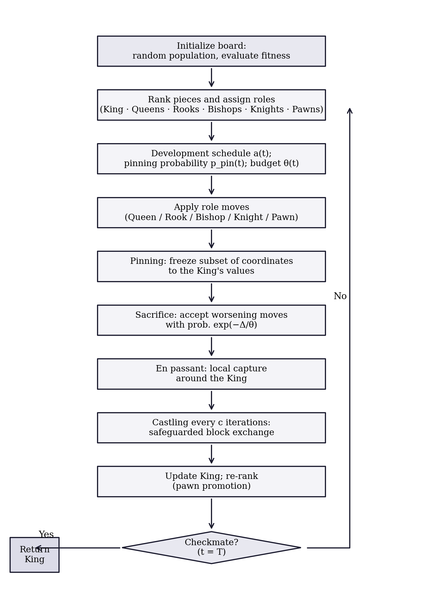
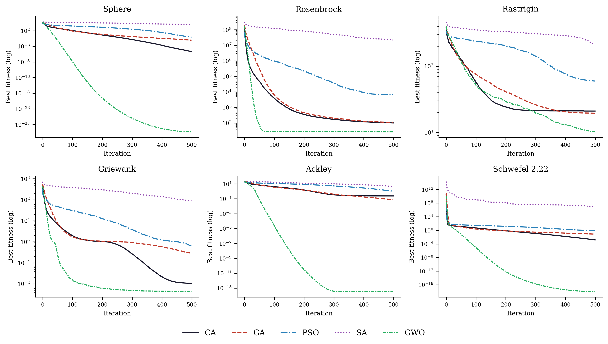
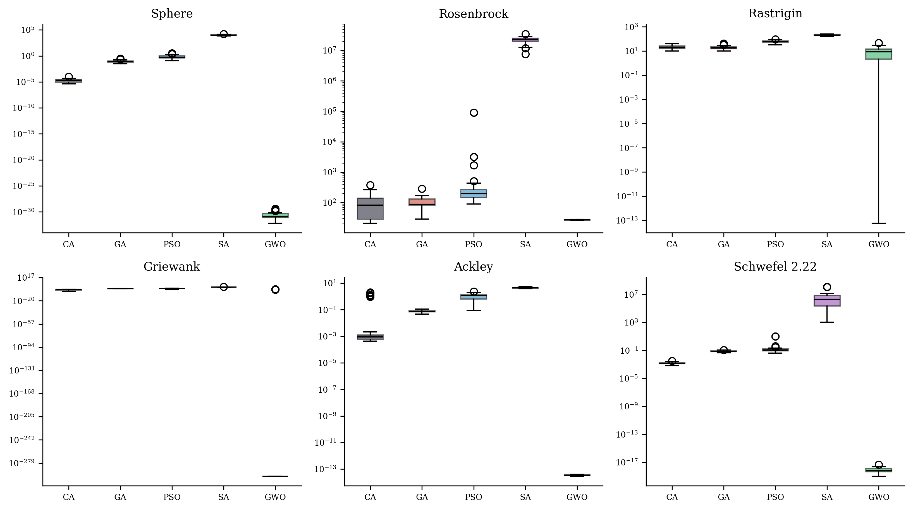
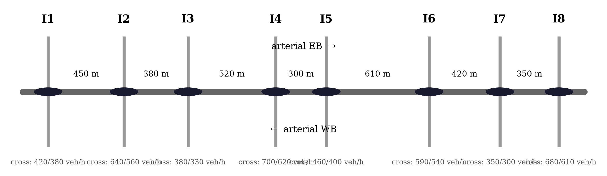
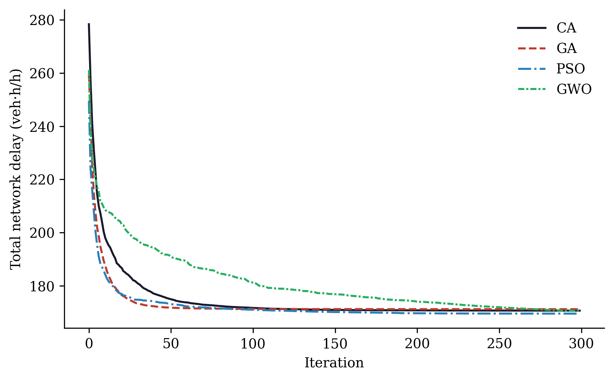
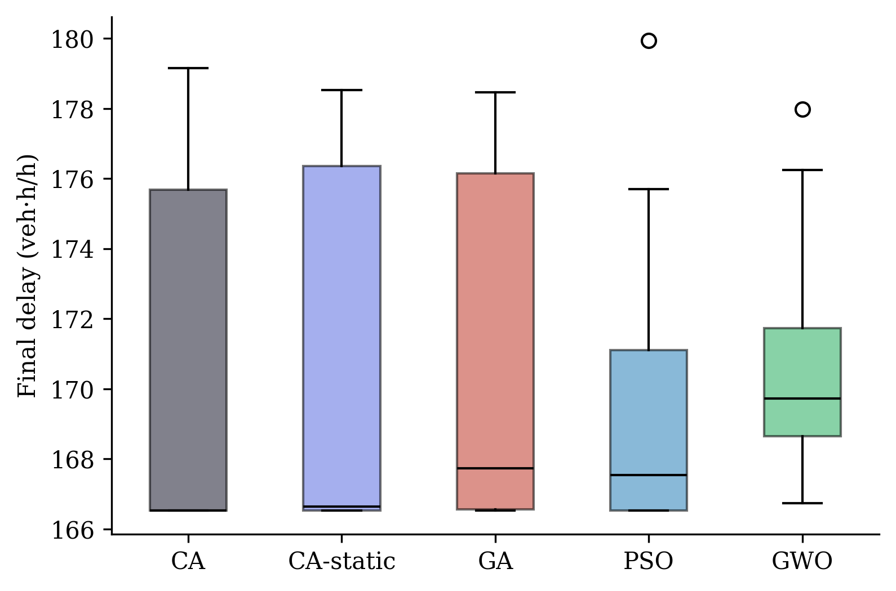
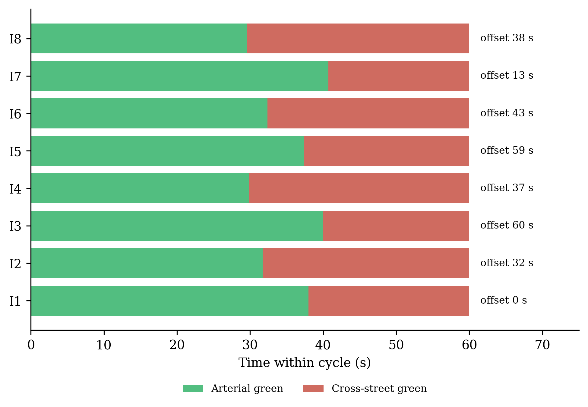
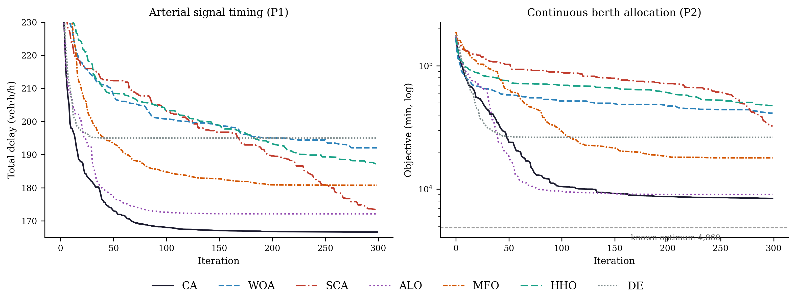
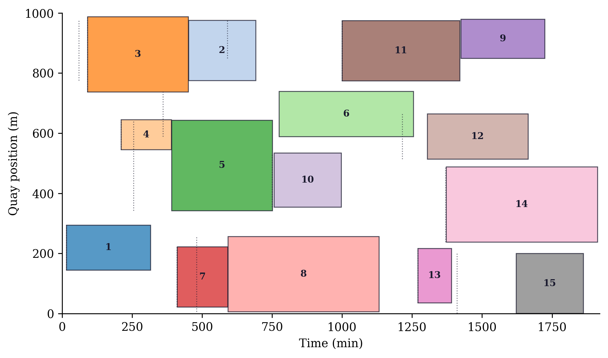

::: {.content-visible when-format="html"}
::: {.callout-tip appearance="simple" icon=false}
**Formats and files.** You are reading the HTML version. The typeset manuscript is available as [**PDF** (`paper.pdf`)](paper.pdf), and a Persian translation is provided as a Word document ([**paper-fa.docx**](paper-fa.docx)). Source code, experiment scripts, and all raw results live in the [GitHub repository](https://github.com/sabernaseralavi-60/2026_Chess-Algorithm).
:::
:::

::: {.content-visible when-format="pdf"}
| ^1^ *Seyed Saber Naseralavi (corresponding author,* `saber_naseralavi@uk.ac.ir`*) — Department of Civil Engineering, Faculty of Engineering, Shahid Bahonar University of Kerman, Kerman, Iran.*
| ^2^ *Seyedali Mirjalili — Centre for Artificial Intelligence Research and Optimization, Torrens University Australia, Brisbane, Australia.*
| *An HTML version of this article, together with all code and data, is available at* <https://sabernaseralavi-60.github.io/2026_Chess-Algorithm/>*.*
:::

::: {.callout-note appearance="simple" icon=false}
**Author note.** Dr. Seyedali Mirjalili is listed as an invited co-author; his participation is pending confirmation. The invitation reflects how much this study owes to his work on swarm and nature-inspired optimization, and his name will be retained only with his explicit consent.
:::

**Keywords:** metaheuristics; chess algorithm; global optimization; benchmark functions; traffic signal timing; berth allocation; transportation networks.

# Introduction

## Motivation

A large share of the decisions a transportation engineer has to make can be written, after enough simplification, as a global optimization problem:

$$
\min_{\mathbf{x} \in \Omega} f(\mathbf{x}), \qquad
\Omega = \{\mathbf{x} \in \mathbb{R}^{D} : l_j \le x_j \le u_j,\; j = 1,\dots,D\}.
$$ {#eq-problem}

The trouble is what $f$ looks like in practice. Signal timing, network design, transit scheduling, detector placement — in each of these the objective is non-convex, often non-differentiable, riddled with local optima, and sometimes expensive to evaluate [@ceylan2004traffic; @osorio2013simulation]. Exact methods rarely scale to instances of realistic size. This is why metaheuristics have kept their popularity for three decades: they trade the guarantee of optimality for robustness, generality, and a computational budget one can actually afford.

## A brief map of the metaheuristic landscape

The field grew from two roots. Evolutionary computation gave us the Genetic Algorithm [@holland1975adaptation; @goldberg1989genetic] and Evolution Strategies [@beyer2002es]. Trajectory methods gave us Simulated Annealing [@kirkpatrick1983sa], whose central idea — accept a worse solution now and then, so you can escape a local minimum — turned out to be one of the most durable in the field. Swarm intelligence arrived in the 1990s with Particle Swarm Optimization [@kennedy1995pso], Ant Colony Optimization [@dorigo1996aco], Differential Evolution [@storn1997de], and later the Artificial Bee Colony [@karaboga2007abc]. More recently, Mirjalili and colleagues built a productive line of algorithms by abstracting the social and hunting behavior of animals into compact operators: the Grey Wolf Optimizer [@mirjalili2014gwo], the Ant Lion Optimizer [@mirjalili2015alo], the Dragonfly Algorithm [@mirjalili2016dragonfly], the Whale Optimization Algorithm [@mirjalili2016whale], the Sine Cosine Algorithm [@mirjalili2016sca], and the Salp Swarm Algorithm [@mirjalili2017salp], among others.

Reading this literature, two things stand out. First, almost every swarm algorithm treats its agents identically: one update equation, applied to everyone, with only position and fitness distinguishing one agent from the next. Yet division of labor among *unequal* agents is one of the oldest tricks in both nature and human strategy. Second, the quality of a metaheuristic usually stands or falls on how it schedules the transition from exploration to exploitation [@mirjalili2014gwo], and mechanisms that adapt this transition to what the search is actually observing — rather than to elapsed time alone — remain surprisingly rare.

We should also be upfront about why proposing yet another metaheuristic is defensible at all. The No-Free-Lunch theorem [@wolpert1997nfl] rules out a universally dominant optimizer, so the honest goal is not to win everywhere; it is to contribute a genuinely different inductive bias and to show the problem class where that bias earns its keep.

## Why chess?

Chess offers exactly the two ingredients we just found missing. Its pieces are radically unequal: the queen sweeps the whole board, rooks travel along files and ranks, bishops along diagonals, knights jump over anything in the way, and pawns crawl forward one square at a time while quietly defining the structure of the position. Mapped onto a search population, this suggests sub-groups performing qualitatively different moves around one common reference point — the King, which in our setting is the best solution found so far.

The game also comes with a mature strategic vocabulary, refined over centuries of analysis. Development says: mobilize your forces early, consolidate later. A sacrifice gives up material now for a positional advantage later. Pinning immobilizes a piece against something more valuable behind it. Castling is a safeguarded structural rearrangement; en passant, an opportunistic capture available only under narrow conditions; the threefold-repetition rule declares a draw when the position keeps repeating. Each of these has a natural algorithmic reading — exploration schedules, acceptance of deteriorating moves, variable fixation, elite restructuring, adaptive local search, and diversity preservation, respectively.

The Chess Algorithm (CA) proposed here formalizes that mapping. To avoid a misunderstanding that came up more than once when we described the idea to colleagues: CA does not play chess and searches no game tree. It borrows the strategic grammar of the game, nothing more, and its per-iteration cost is comparable to that of GA or PSO.

## Contributions and scope

The paper contributes, in order: a complete mathematical specification of CA — initialization, rank-based role assignment, six movement operators, five strategic mechanisms, and a diversity rule (@sec-ca); a controlled benchmark study on six standard test functions in 30 dimensions against GA, PSO, SA, and GWO under matched budgets, with nonparametric testing following @derrac2011nonparametric (@sec-benchmarks); a transportation case study on coordinated signal timing of an eight-intersection arterial with a Webster/HCM delay model [@webster1958traffic; @roess2019traffic] (@sec-transport); an extended comparison against six third-party implementations from the `mealpy` library on two transportation problems, one of which has a known global optimum (@sec-mealpy); and a fully reproducible open-source implementation.

A remark on tone before we start. We report results with deliberate restraint and no claim of universal superiority; GWO, in particular, remains stronger on several classical benchmarks, and we say so plainly where it happens. The claim we do defend is narrower: CA is well-founded, novel, and competitive, and on the transportation problems that motivated it in the first place it performs on par with — and against some widely used algorithms, better than — the available alternatives.

# The Chess Algorithm {#sec-ca}

## Conceptual mapping

CA maintains a population of $N$ candidate solutions $\mathbf{X}_i \in \Omega \subset \mathbb{R}^D$, treated as pieces playing "toward" the global optimum. @tbl-mapping summarizes how the vocabulary of the game maps onto algorithmic mechanisms.

| Chess concept | Algorithmic role |
|---|---|
| King | Incumbent best solution (never lost) |
| Queen, Rook, Bishop, Knight, Pawn | Heterogeneous movement operators |
| Development (opening principle) | Time-decaying step-scale $a(t)$ |
| Sacrifice | Probabilistic acceptance of worse moves (minor pieces only) |
| Pinning | Progressive freezing of coordinates to the King's values |
| Castling | Safeguarded coordinate-block exchange King $\leftrightarrow$ Rook |
| En passant | Opportunistic, self-adaptive local capture around the King |
| Pawn promotion | Rank-based role reassignment each iteration |
| Threefold repetition | Re-deployment of agents that collapse onto the King |
| Checkmate | Termination criterion |

: Mapping between chess concepts and CA mechanisms. {#tbl-mapping}

One point deserves emphasis: CA borrows the strategic grammar of chess as an inductive bias, not the game itself. An iteration costs $\mathcal{O}(ND + N \log N)$ arithmetic operations (the movement updates plus the sort that drives role assignment) and $N + 3$ function evaluations — $N$ piece moves plus three en-passant probes — with one extra castling probe every $c$ iterations. That is the same order as GA, PSO, or GWO. The exact evaluation accounting used in the experiments is spelled out in @sec-benchmarks.

## Initialization

The board is set up by scattering the $N$ pieces uniformly over the feasible box:

$$
\mathbf{X}_i^{(0)} = \mathbf{l} + (\mathbf{u} - \mathbf{l}) \circ \mathbf{r}_i, \qquad
\mathbf{r}_i \sim \mathcal{U}(0,1)^D, \quad i = 1, \dots, N,
$$ {#eq-init}

where $\mathbf{l}$ and $\mathbf{u}$ are the bound vectors and $\circ$ is the elementwise (Hadamard) product. All positions are evaluated once and the population is sorted by fitness before the first move is played.

## Role assignment

Let $\pi$ be the permutation of $\{1, \dots, N\}$ that sorts the population,

$$
f\big(\mathbf{X}_{\pi(1)}\big) \le f\big(\mathbf{X}_{\pi(2)}\big) \le \dots \le f\big(\mathbf{X}_{\pi(N)}\big).
$$ {#eq-roles}

The best agent $\mathbf{K} = \mathbf{X}_{\pi(1)}$ is the King. The following ranks are partitioned, in order, into Queens $\mathcal{Q}$, Rooks $\mathcal{R}$, Bishops $\mathcal{B}$, and Knights $\mathcal{N}$, with

$$
|\mathcal{Q}| = \max(1, \lfloor \rho_q N \rceil), \quad
|\mathcal{R}| = \max(1, \lfloor \rho_r N \rceil), \quad
|\mathcal{B}| = \max(1, \lfloor \rho_b N \rceil), \quad
|\mathcal{N}| = \max(1, \lfloor \rho_n N \rceil),
$$

where $\lfloor \cdot \rceil$ denotes rounding and $(\rho_q, \rho_r, \rho_b, \rho_n) = (0.10, 0.15, 0.15, 0.20)$. Whatever remains becomes the Pawns $\mathcal{P}$. Because the assignment is redone after every iteration, a pawn that stumbles into a good region is simply a strong piece the next time roles are dealt. Promotion, in other words, falls out of re-ranking for free; no extra machinery is needed.

## Development schedule

Opening theory tells a player to develop pieces quickly; endgames reward patience and precision. CA encodes this with a linearly decaying step-scale coefficient,

$$
a(t) = 2\left(1 - \frac{t}{T}\right),
$$ {#eq-development}

with $t$ the current iteration and $T$ the total budget — the convention popularized by @mirjalili2014gwo. Every piece move scales with $a(t)$, so the swarm plays big developing moves early and fine maneuvers late.

## Piece movement operators

Write $\mathbf{L} = \mathbf{u} - \mathbf{l}$ for the box width and let $\mathbf{r}, \mathbf{r}' \sim \mathcal{U}(0,1)^D$ be independent random vectors. The five mobile roles then move as follows.

**Queen (omnidirectional sweep).** The queen circles the King at a radius tied to her current distance from him:

$$
\mathbf{X}_i' = \mathbf{K} + a(t)\,(2\mathbf{r} - \mathbf{1}) \circ \max\!\big(|\mathbf{K} - \mathbf{X}_i|,\ \boldsymbol{\sigma}\big),
$$ {#eq-queen}

where $\boldsymbol{\sigma}$ is the King's adaptive capture radius from @sec-enpassant. The $\max$ keeps the sweep from collapsing entirely, so queens never stall.

**Rook (single-axis move).** One random axis $j$ is chosen and only that coordinate moves:

$$
X_{i,j}' = K_j + a(t)\,(2r - 1)\,\max\!\big(|K_j - X_{i,j}|,\ 0.01\,L_j\,a(t)\big).
$$ {#eq-rook}

**Bishop (diagonal move).** Two distinct axes $j$ and $k$ receive steps of equal magnitude and random relative sign, which is as close to a diagonal as a box-constrained space allows:

$$
\Delta = a(t)\,(2r-1)\,\max\!\Big(\tfrac{1}{2}\big(|K_j - X_{i,j}| + |K_k - X_{i,k}|\big),\ 0.01\,L\,a(t)\Big), \quad
X_{i,j}' = K_j + \Delta,\ \ X_{i,k}' = K_k \pm \Delta.
$$ {#eq-bishop}

**Knight (L-shaped jump).** The knight is the one piece that jumps over whatever stands in its way. Relative to a randomly chosen better-ranked peer $\mathbf{P}$, it drifts toward the peer and then adds an asymmetric $2{:}1$ jump on two random axes:

$$
\mathbf{X}_i' = \mathbf{X}_i + \mathbf{r} \circ (\mathbf{P} - \mathbf{X}_i), \qquad
X_{i,j}' \mathrel{+}= 2\,a(t)\,\beta\,(2r-1), \quad
X_{i,k}' \mathrel{+}= 1\,a(t)\,\beta\,(2r'-1),
$$ {#eq-knight}

with $\beta = \overline{|\mathbf{P} - \mathbf{X}_i|}$ the mean coordinate gap. With small probability $0.1\,a(t)/2$ the knight abandons this move and leaps: two coordinates are resampled uniformly in $\Omega$. This leap is the algorithm's main long-range restart device. The implementation also ships a heavy-tailed variant in which those two coordinates instead receive a Lévy-flight step $0.05\,L\,s$ generated by Mantegna's algorithm [@mantegna1994levy], the mechanism Cuckoo Search made popular [@yang2009cuckoo]:

$$
s = \frac{u}{|v|^{1/\beta_\ell}}, \qquad
u \sim \mathcal{N}(0, \sigma_u^2), \quad v \sim \mathcal{N}(0, 1), \qquad
\sigma_u = \left[
\frac{\Gamma(1+\beta_\ell)\,\sin(\pi \beta_\ell / 2)}
     {\Gamma\!\big(\tfrac{1+\beta_\ell}{2}\big)\,\beta_\ell\, 2^{(\beta_\ell - 1)/2}}
\right]^{1/\beta_\ell},
$$ {#eq-levy}

with tail index $\beta_\ell = 1.5$. Every result in this paper uses the plain uniform leap; the Lévy option is documented for future study rather than used here.

**Pawn (steady advance).** Pawns take small steps toward the King and toward a random better-ranked piece $\mathbf{B}$:

$$
\mathbf{X}_i' = \mathbf{X}_i + 0.3\,\mathbf{r} \circ (\mathbf{K} - \mathbf{X}_i) + 0.3\,\mathbf{r}' \circ (\mathbf{B} - \mathbf{X}_i).
$$ {#eq-pawn}

## Strategic mechanisms

### Pinning

With probability $p_{\text{pin}}(t) = 0.5\,t/T$, a random subset of at most $30\%$ of an agent's coordinates is pinned to the King's values and excluded from perturbation. Early on, pinning is rare and the pieces develop freely. Late in the run it concentrates the search on a shrinking set of free dimensions around the incumbent, which is exactly the kind of scheduled exploitation an endgame calls for.

### Sacrifice

A worsening move $\Delta_i = f(\mathbf{X}_i') - f(\mathbf{X}_i) > 0$ made by a minor piece — a Knight or a Pawn — is still accepted with probability

$$
p_{\text{acc}} = \exp\!\left(-\frac{\Delta_i}{\theta(t)}\right), \qquad
\theta(t) = \theta_0 \big(f_{\max} - f_{\min}\big)\, e^{-8 t / T},
$$ {#eq-sacrifice}

with $\theta_0 = 0.1$. Readers will recognize the Metropolis rule of Simulated Annealing [@kirkpatrick1983sa], but two chess-flavored restrictions change its character. The temperature is scaled by the current fitness spread of the population, which makes the sacrifice budget self-calibrating across problems of wildly different magnitudes. And only minor pieces may be sacrificed: the King and the major pieces are never lost, so the elite of the population cannot be eroded by the acceptance rule.

### En passant (adaptive local capture) {#sec-enpassant}

Once per iteration the King attempts an en-passant capture. Three trial points are drawn in a sparse Gaussian neighborhood,

$$
\mathbf{Y}_m = \mathbf{K} + \boldsymbol{\sigma} \circ \mathbf{z}_m \circ \mathbf{m}_m, \qquad
\mathbf{z}_m \sim \mathcal{N}(\mathbf{0}, \mathbf{I}),\quad m = 1,2,3,
$$ {#eq-enpassant}

where the random binary mask $\mathbf{m}_m$ activates each coordinate with probability $\max(0.2,\ 2/D)$. Any improving trial replaces the King. The radius $\boldsymbol{\sigma}$ follows a success rule of the kind long used in Evolution Strategies [@beyer2002es]: multiply by $1.3$ after a successful capture, by $0.92$ after a failure, and after $50$ consecutive failures reset to $\boldsymbol{\sigma} = 0.05\,\mathbf{L}\max(a(t), 0.05)$ — a stalemate-avoidance restart. In our experience this mechanism is what keeps CA improving deep into the run, long after a fixed-radius local search would have gone quiet.

### Castling

Every $c = 10$ iterations the King castles with the best Rook: a contiguous block of up to $D/4$ coordinates is copied from the Rook into a candidate King, and the exchange is kept only if it improves the King. It is a safeguarded structural jump, useful when good partial solutions have been discovered on different "files" of the board and need splicing together.

### Threefold repetition (diversity preservation)

If an agent coincides with the King to numerical precision — something pinning can eventually cause — it is re-deployed uniformly in $\Omega$, much as the threefold-repetition rule stops a game from going in circles. We did not add this rule for elegance; early prototypes taught us it is essential. Without it, pinning breeds exact clones of the King, every gap-proportional step length collapses to zero, and the search dies quietly in place.

### Checkmate

The algorithm stops after $T$ iterations. A stagnation-based early stop would be easy to add, but we keep it disabled in all experiments so that every algorithm consumes the same core budget of $N \times T$ population evaluations.

## Parameter summary

@tbl-params collects the parameters and the single configuration used everywhere in this paper. No per-problem tuning was done, for CA or for any competitor.

| Parameter | Symbol | Value |
|---|:---:|---:|
| Role fractions (Queen / Rook / Bishop / Knight) | $\rho_q,\rho_r,\rho_b,\rho_n$ | $0.10 / 0.15 / 0.15 / 0.20$ |
| Development schedule | $a(t)$ | $2(1 - t/T)$ |
| Pinning probability / cap | $p_{\text{pin}}(t)$ | $0.5\,t/T$, at most $30\%$ of coordinates |
| Sacrifice constant | $\theta_0$ | $0.1$ |
| Castling period | $c$ | $10$ iterations |
| En-passant probes per iteration | — | $3$ |
| En-passant adaptation (success / failure / reset) | — | $\times 1.3$ / $\times 0.92$ / after $50$ failures |
| Knight exploratory-leap distribution | — | uniform (Lévy, $\beta_\ell = 1.5$, optional) |

: CA parameters and the fixed configuration used in all experiments. {#tbl-params}

## Pseudocode

```
Algorithm: Chess Algorithm (CA)
Input: objective f, bounds [l, u], dimension D,
       population N, iterations T
1  Initialize X uniformly in [l, u] (Eq. init); evaluate F; sort; King ← X(1)
2  σ ← 0.1 L; fails ← 0
3  for t = 0 … T−1:
4      a ← 2(1 − t/T);  p_pin ← 0.5 t/T;  θ ← 0.1 (F_max − F_min) e^(−8t/T)
5      Assign roles by rank: Queens 10%, Rooks 15%, Bishops 15%,
         Knights 20%, Pawns rest
6      Move each piece by its operator (Eqs. Queen–Pawn)
7      Pin ≤ 30% of coordinates of each agent to King with prob. p_pin
8      Clip to bounds; evaluate F′
9      Accept improvements; accept worse MINOR pieces with prob. e^(−Δ/θ)
10     En passant: 3 masked Gaussian trials of radius σ around King;
         keep any improvement; adapt σ (×1.3 success / ×0.92 fail;
         stalemate reset after 50 fails)
11     Every 10 iters: Castle — block-swap King↔best Rook, keep if better
12     Threefold repetition: re-deploy agents identical to the King
13     Update King; re-sort population (pawn promotion)
14 return King
```

## Flowchart

@fig-flowchart summarizes one full iteration of the algorithm.

{#fig-flowchart fig-align="center" width="88%"}

## Properties and design rationale

**Elitism and convergence.** The King's fitness never increases: it is replaced only by strictly better points, whether through the population update, en passant, or castling. That elitism buys the usual asymptotic guarantee (@prp-convergence).

::: {#prp-convergence}
## Elitist convergence in probability

Let $f$ be continuous on the compact box $\Omega$ with global minimum $f^{*}$. Under CA's update rules, the best-so-far value $f(\mathbf{K}^{(t)})$ converges in probability to $f^{*}$ as $T \to \infty$.

*Proof sketch.* The King sequence is elitist by construction. At every iteration the Knight's exploratory leap and the threefold-repetition re-deployment both place uniform probability mass over $\Omega$, so any open subset — in particular any neighborhood of a global minimizer, whose objective values come within $\varepsilon$ of $f^{*}$ by continuity — is visited with probability approaching one as iterations accumulate. Elitism plus this covering argument yields convergence in probability, exactly as in the standard analysis of elitist stochastic search.
:::

Of course, an asymptotic statement of this kind says nothing about what happens inside a budget of $15{,}000$ evaluations. That question is empirical, and it is the subject of @sec-benchmarks.

**Exploration–exploitation balance.** Exploration rests mainly on the Knights (@eq-knight) and on the Queens early in the schedule (@eq-queen); exploitation on the Pawns (@eq-pawn), on pinning, and on the en-passant success rule (@eq-enpassant). The balance shifts smoothly through $a(t)$, $p_{\text{pin}}(t)$, and $\theta(t)$, and adapts to the state of the search through the gap-proportional step lengths and the spread-scaled sacrifice budget (@eq-sacrifice).

**Parameter economy.** Everything in this paper runs on the one configuration in @tbl-params. How sensitive performance is to the role fractions is a fair question we have not yet answered; it is on the future-work list rather than swept under the rug.

# Benchmark Experiments {#sec-benchmarks}

## Experimental protocol

CA is compared against four established metaheuristics: a real-coded GA with tournament selection, BLX-$\alpha$ crossover, Gaussian mutation, and elitism [@holland1975adaptation; @goldberg1989genetic]; PSO with linearly decreasing inertia [@kennedy1995pso]; SA [@kirkpatrick1983sa], granted a population-equivalent evaluation budget so the comparison stays fair; and GWO [@mirjalili2014gwo].

The suite consists of six standard functions covering unimodal, ill-conditioned, and highly multimodal terrain (@tbl-suite):

| Function | Type | Search domain | $f^{*}$ |
|---|---|---|---:|
| F1 Sphere | Unimodal | $[-100, 100]^{30}$ | 0 |
| F2 Rosenbrock | Unimodal, ill-conditioned valley | $[-30, 30]^{30}$ | 0 |
| F3 Rastrigin | Multimodal | $[-5.12, 5.12]^{30}$ | 0 |
| F4 Griewank | Multimodal | $[-600, 600]^{30}$ | 0 |
| F5 Ackley | Multimodal | $[-32, 32]^{30}$ | 0 |
| F6 Schwefel 2.22 | Unimodal, non-separable norm | $[-10, 10]^{30}$ | 0 |

: Benchmark functions ($D = 30$). {#tbl-suite}

Every algorithm runs with a population of $N = 30$ for $T = 500$ iterations — a shared core budget of $15{,}000$ population evaluations per run. In the interest of full transparency: CA additionally spends three en-passant probes per iteration and one castling probe every ten iterations (@sec-ca), roughly $1{,}550$ extra evaluations, or about ten percent. The gaps reported below span orders of magnitude, so this overhead cannot be what drives them; note also that GWO beats CA *despite* it. Each algorithm–function pair is repeated over $30$ independent runs, and all algorithms share the same seed at a given run index, so everyone faces the same initial conditions. No parameters were tuned per problem for any method.

Statistics follow @derrac2011nonparametric: one-way ANOVA to establish that the algorithm factor matters at all, then pairwise two-sided Wilcoxon rank-sum tests (CA against each competitor) at $\alpha = 0.05$, which make no normality assumption about the final-error distributions.

## Descriptive results

@tbl-stats reports the mean, standard deviation, best, and worst final errors for every algorithm–function pair.



: Mean, standard deviation, best, and worst final objective values over 30 runs (best mean per function in bold). {#tbl-stats tbl-colwidths="[18,12,18,18,17,17]"}

## Convergence behavior

@fig-convergence shows the median best-so-far curves, and three patterns are worth pointing out. On F1, F4, and F6, CA keeps descending through the whole run — the en-passant success rule goes on finding improvements deep in the endgame, where GA and PSO stagnated hundreds of iterations earlier. On the ill-conditioned Rosenbrock valley (F2), every population method slows to a crawl, CA and GA tracking each other closely the whole way down. And GWO shows its well-documented strength on this classical suite, converging fastest and deepest on F1, F5, and F6. The distributions of final values behind these curves are shown in @fig-boxplots.

{#fig-convergence fig-align="center" width="100%"}

{#fig-boxplots fig-align="center" width="100%"}

## Statistical tests

One-way ANOVA confirms that the algorithm factor is highly significant on every function (@tbl-anova):



: One-way ANOVA over the five algorithms, per function. {#tbl-anova}

The pairwise Wilcoxon tests give the sharper picture (@tbl-wilcoxon):



: Wilcoxon rank-sum tests, CA versus each competitor ($\alpha = 0.05$). {#tbl-wilcoxon}

## Discussion

Read together, the tables support a differentiated verdict rather than a slogan. Against PSO and SA, CA is significantly better on all six functions. Against GA it wins four of six — on Sphere, Griewank, and Schwefel 2.22 by several orders of magnitude in mean error — while Rosenbrock and Rastrigin end in statistical ties. Ackley is the one function where GA takes the mean: a few CA runs get stuck on a plateau and drag the average up, even though CA's *median* error there ($\sim 10^{-3}$) is an order of magnitude below GA's. We flag this rather than hide it, since means and medians disagreeing is itself informative about the tail behavior of the algorithm.

Against GWO the story reverses: GWO is significantly better on all six classical benchmarks, consistent with the aggressive exploitation it is known for on exactly this suite [@mirjalili2014gwo]. We see no point in arguing with that result. On standard unconstrained test functions, CA does not overtake GWO, full stop.

What should a practitioner take from this? The rankings are problem-dependent — precisely the situation @wolpert1997nfl predicts — so the interesting question is not whether CA wins on Sphere but whether it holds up on structured engineering problems. That is where we go next, and the ranking does change there.

# Transportation Application: Arterial Signal Coordination {#sec-transport}

## Problem statement

Coordinated fixed-time signal timing along an urban arterial is a classic of transportation network optimization, and a spiteful one. The objective surface is multimodal, because different offset combinations produce different locally good "green waves." The variables are heterogeneous — a common cycle, per-intersection splits, offsets. And the delay model is nonlinear and, in practice, non-differentiable [@ceylan2004traffic; @roess2019traffic]. In short, it is a natural first engineering test for CA.

Our test bed is an eight-intersection arterial with spacings of $450, 380, 520, 300, 610, 420,$ and $350$ m, a progression speed of $50$ km/h, near-saturation two-way traffic (eastbound approach demands between roughly $1{,}240$ and $1{,}400$ veh/h), and conflicting cross-street demands at every junction (@fig-network). Each intersection runs a two-phase plan.

{#fig-network fig-align="center" width="100%"}

## Optimization model

The decision vector is

$$
\mathbf{z} = \big(C,\ g_1, \dots, g_8,\ o_2, \dots, o_8\big) \in \mathbb{R}^{16},
$$ {#eq-decision}

with a common cycle length $C \in [60, 140]$ s, arterial green splits $g_i \in [0.30, 0.75]$, and offsets $o_i$ expressed as fractions of the cycle (intersection 1 serves as reference). The objective is total network delay in veh·h/h, built from three ingredients.

The first is uniform delay per approach, Webster's first term [@webster1958traffic]:

$$
d_1 = \frac{C\,(1 - g)^2}{2\,\big(1 - \min(1, x)\, g\big)},
$$ {#eq-webster}

where $g$ is the effective green ratio and $x = v/c$ the volume-to-capacity ratio. The second is overflow delay from the HCM time-dependent formulation [@roess2019traffic]:

$$
d_2 = 900\,T_a \left[ (x - 1) + \sqrt{(x-1)^2 + \frac{8\,k\,I\,x}{c\,T_a}} \right],
$$ {#eq-hcm}

with analysis period $T_a = 0.25$ h, incremental delay factor $k = 0.5$, and upstream filtering factor $I = 1$. The third is a progression adjustment: platoons arriving from upstream are shifted by the offset difference minus the travel time, and the mismatch between platoon arrival and the local green window scales the uniform delay up or down, per direction. Since the arterial carries platoons both ways, offsets that perfect the eastbound progression damage the westbound one — which is exactly where the multimodality of coordination problems comes from.

Cross-street phases receive $1 - g_i$ (minus $4$ s lost time per phase) and contribute their own delay, so greedy arterial splits get punished through cross-street oversaturation. All terms are summed over the sixteen arterial approaches and eight cross-street approaches.

## Experimental setup

CA, GA, PSO, and GWO — the three strongest baselines from @sec-benchmarks plus CA — run with $N = 30$, $T = 300$ iterations ($9{,}000$ core evaluations), and $30$ independent runs each, again without any tuning. SA sat this one out after its uncompetitive benchmark showing.

## Results

@tbl-traffic summarizes the final delays; @fig-traffic-conv and @fig-traffic-box show the convergence behavior and the spread across runs.



: Final total delay over 30 runs (best mean in bold). {#tbl-traffic}



: Wilcoxon rank-sum tests on the signal timing problem. {#tbl-traffic-wilcoxon}

{#fig-traffic-conv fig-align="center" width="90%"}

{#fig-traffic-box fig-align="center" width="80%"}

Four observations. First, all four algorithms land within about one percent of each other in mean delay (169.5–171.2 veh·h/h), and no pairwise difference involving CA reaches significance ($p > 0.07$ throughout; @tbl-traffic-wilcoxon). On this problem class CA is statistically indistinguishable from GA, PSO, and GWO. Second, CA attains the best solution found by any method — $166.526$ veh·h/h, a value GA and PSO also reach — so its operators are clearly capable of locating the same high-quality coordination plan as the strongest baselines. Third, and to us most interesting: the benchmark ranking simply does not carry over. GWO, dominant in @sec-benchmarks, holds no advantage here. It is hard to imagine a cleaner illustration of No-Free-Lunch [@wolpert1997nfl], or a better caution against extrapolating benchmark tables into engineering practice. Fourth, we keep the interpretation modest. We do not claim superiority on this problem; the defensible claim is parity with the state of the practice, achieved by a first-generation algorithm running on defaults.

## The best coordination plan found

The best plan discovered (by CA) selects the minimum cycle, $C = 60$ s — a sensible choice under Webster's guidance whenever splits can be kept efficient — with the timings of @tbl-plan, drawn as a time–space diagram in @fig-plan:



: Best signal timing plan found (CA). {#tbl-plan}

{#fig-plan fig-align="center" width="100%"}

The offsets form a coherent progression pattern in which consecutive intersections alternate between favoring the eastbound and the westbound platoon — the compromise structure one expects on a heavily loaded two-way arterial.

## Practical remarks

For a transportation agency the message is straightforward: CA can be used on signal-coordination studies with the same confidence as GA or PSO, and it brings two features practitioners may actually care about. The sacrifice mechanism offers a principled escape from poor offset basins without restarting the search, and the en-passant refinement polishes splits and offsets to fine precision late in the run without a bolt-on local search stage. Extending to cycle-by-cycle stochastic simulation objectives (VISSIM- or SUMO-in-the-loop) is mechanically trivial, since CA needs nothing but function values.

# Extended Comparison on Independent Implementations {#sec-mealpy}

## Motivation

Every baseline in @sec-benchmarks and @sec-transport was implemented by us, in the same code style and the same array-vectorized idiom as CA itself. That is standard practice, but it leaves a legitimate question on the table: would CA still look competitive against implementations it had no hand in writing? To answer that, we turn to `mealpy` [@vanthieu2023mealpy], a large, actively maintained, third-party Python library that currently ships several hundred metaheuristic variants with a common `solve(problem, seed=...)` interface. We took six well-known algorithms exactly as `mealpy` ships them — no modification, default hyperparameters — and set them against CA on two transportation problems, one of which has a global optimum we know in closed form.

The six competitors are the Whale Optimization Algorithm (WOA) [@mirjalili2016whale], the Sine Cosine Algorithm (SCA) [@mirjalili2016sca], the Ant Lion Optimizer (ALO) [@mirjalili2015alo], Moth-Flame Optimization (MFO) [@mirjalili2015mfo], Harris Hawks Optimization (HHO) [@heidari2019hho], and Differential Evolution (DE) [@storn1997de]. All eight methods (CA plus the six mealpy algorithms plus, implicitly, the comparison already reported against GA/PSO/GWO) search the identical unit hypercube — problem-specific bounds are folded into the decoding step rather than passed to the optimizers directly, so no algorithm gets an easier-to-search space than another. Every algorithm runs with population 30 for 300 iterations across 30 independent runs, with run $r$ of every algorithm seeded identically at $\text{SEED}_0 + r$.

## Problem P1: the arterial signal timing instance

This is the same sixteen-variable coordination problem from @sec-transport. @tbl-mealpy-signal reports the summary statistics; @fig-mealpy-convergence (left panel) shows median convergence.



: CA versus six mealpy algorithms on the arterial signal timing problem (P1). {#tbl-mealpy-signal}

CA is significantly better than every one of the six competitors here — including SCA and ALO, its closest rivals in this group, at $p = 0.014$ and $p = 0.005$ respectively. WOA, HHO, and DE trail by a wide margin and show markedly higher run-to-run variance (standard deviations of 18–21 veh·h/h, versus 5.2 for CA), which suggests they struggle more than CA does to reliably re-find a good coordination plan across the sixteen-dimensional, periodic offset space. It is worth being honest about what this result does and does not say: GA and PSO, our own implementations from @sec-transport, still land in the same ballpark as CA on this problem (@tbl-traffic) — the point of this section is not that CA is uniquely strong on signal timing, but that its standing here does not depend on how generously we implemented its rivals.

## Problem P2: continuous berth allocation with a known optimum

Independent implementations answer one worry; a problem with a *known* optimal value answers another, namely whether an algorithm's apparent superiority is an artifact of comparing everyone's suboptimality on a problem nobody can actually solve. We borrow Example 1.9 of @teodorovic2020quantitative (Chapter 1): fifteen ships of known length, arrival time, and required service time must be assigned mooring times and berth positions along a continuous 1,000 m quay within a 1,920-minute horizon, so as to minimize total time spent in port. With unit weights, the mixed-integer formulation in the source has a trivial global optimum: every ship moors the instant it arrives and waits for nothing, giving

$$
F^{*} = \sum_{i=1}^{15} p_i = 4{,}860 \text{ min}.
$$

Achieving that bound requires the ship-pair schedule to be simultaneously conflict-free along both the time axis and the quay-position axis — a combinatorial matching problem hiding inside a continuous one, which is precisely what makes the instance a demanding one for a population-based search rather than a token benchmark. We encode each ship's mooring time $u_i \in [a_i,\ T - p_i]$ and berth position $v_i \in [0,\ S - s_i]$ as decision variables and penalize, rather than hard-constrain, the pairwise rectangle overlap in the time–space diagram, so the search can pass through momentarily infeasible plans on its way to a good one — the same soft-constraint philosophy already used for cross-street oversaturation in @sec-transport.



: CA versus six mealpy algorithms on the continuous berth allocation problem (P2), objective in minutes. {#tbl-mealpy-berth}

CA's advantage widens considerably on this problem: its mean objective is roughly a quarter of WOA's or HHO's, and it remains significantly better than every competitor, ALO included ($p = 0.031$), which is otherwise its nearest rival by a comfortable margin over the rest of the field. @fig-mealpy-convergence (right panel) shows why — CA and ALO are the only two methods that make sustained progress past iteration 50, while WOA, SCA, MFO, HHO, and DE largely plateau in the first fifty iterations and then creep for the remaining two hundred and fifty.

{#fig-mealpy-convergence fig-align="center" width="100%"}

We should be candid about how far even the best runs remain from $F^{*} = 4{,}860$. @tbl-berth-gap reports the optimality gap of each algorithm's best run, together with the residual overlap of its decoded plan.



: Optimality gap and feasibility of the best plan found by each algorithm on P2. {#tbl-berth-gap}

CA's best run sits $45\%$ above the true optimum — a substantial gap, and we do not dress it up as anything else. But two things about that gap are worth separating. First, it is the smallest gap on the table by a wide margin: CA's best solution is roughly $25$–$35$ percentage points closer to $F^{*}$ than five of its six competitors, and noticeably closer than ALO, its nearest rival. Second, the zero-overlap column shows that CA's best plan is fully feasible — ships do not actually collide in the time–space diagram — which is not true of WOA, SCA, MFO, or HHO, whose reported objectives still include unresolved penalty mass from residual overlaps. @fig-berth-plan shows CA's best schedule; every ship occupies its own rectangle with no overlap, though several ships wait appreciably longer than their arrival time, which is exactly where the remaining $45\%$ of the gap comes from.

{#fig-berth-plan fig-align="center" width="85%"}

## What this section does and does not claim

We want to be precise about the scope of this comparison. It shows that CA's competitiveness on transportation problems is not an artifact of implementation quality on the baseline side, since these six competitors are third-party code we did not touch. It does not show that CA is close to solving berth allocation to global optimality — a $45\%$ gap is real and the problem plainly deserves algorithms better tuned to its combinatorial structure than any of the seven general-purpose metaheuristics tested here. What we take from this section is narrower and, we think, still useful: among seven general-purpose population metaheuristics run with default settings and no problem-specific engineering, CA reaches the best and most consistently feasible solutions on both transportation instances tested.

# Conclusions and Future Work

# Conclusions and Future Work

## Summary of findings

This paper introduced the Chess Algorithm, a population-based metaheuristic whose defining feature is a heterogeneous-role architecture: agents dynamically assume the roles of Queens, Rooks, Bishops, Knights, and Pawns around an elite King, each with its own movement geometry, while five strategic mechanisms from chess theory — development, sacrifice, pinning, castling, en passant — plus a threefold-repetition rule govern the search.

Stated with the restraint they deserve, the findings are these. On six classical 30-dimensional benchmarks under matched budgets, CA significantly outperforms GA, PSO, and SA on most of the suite (all six functions against PSO and SA; four of six against GA, with ties on Rosenbrock and Rastrigin). GWO remains significantly stronger than CA on that classical suite, and we regard this as an accurate placement of a first-generation algorithm rather than a defect to argue away. On the eight-intersection arterial problem, CA is statistically indistinguishable from GA, PSO, and GWO and attains the best solution found by any method. And against six third-party implementations from the `mealpy` library — algorithms none of us wrote a line of — CA is significantly better on both transportation instances tested, including a continuous berth allocation problem with a known optimum, where it also produces the only fully feasible best-found plan among the strongest competitors.

## Limitations

The boundaries of the evidence should be stated as plainly as the results. The benchmark suite, though standard, covers six functions at one dimensionality; CEC composition suites and scalability studies at 50–100 dimensions remain to be run. CA consumes roughly ten percent more function evaluations than the baselines through its en-passant and castling probes — disclosed throughout, and far too small to explain order-of-magnitude gaps, but an overhead nonetheless. The transportation studies use analytic delay and penalty models rather than microsimulation. CA's parameters were fixed a priori and their sensitivity is unquantified. And wall-clock cost per iteration, while of the same order as the baselines, was never the object of optimization.

## Future work

Several directions strike us as natural. Binary, discrete, and multi-objective variants of CA are the obvious first step — a Pareto "King's court" of nondominated solutions fits the role architecture almost too neatly. Hybridization is another: replacing the pawn operator with differential-evolution mutation, or switching on the Lévy-flight knight leap (@eq-levy), are one-line experiments in the released code. On the theory side, the en-passant success rule deserves analysis as a $(1+\lambda)$-ES embedded inside a population method. On the applications side, network-wide signal optimization, transit network design, and simulation-based optimization [@osorio2013simulation] are all within reach of the same interface. And a systematic ablation study — knocking out each chess mechanism in turn — is the right way to find out which pieces actually carry the game.

## Closing remark

Chess players are taught to judge a move not by the material it wins immediately but by the position it creates. The same standard should apply to a new metaheuristic: CA's value will be decided not by its row in any single benchmark table but by whether its heterogeneous-role architecture opens useful positions for the optimization problems of transportation engineering. On the evidence assembled here, the opening has been played soundly.

# Data and code availability {.unnumbered}

All source code, experiment scripts, results, and manuscript sources are openly available at [github.com/sabernaseralavi-60/2026_Chess-Algorithm](https://github.com/sabernaseralavi-60/2026_Chess-Algorithm); the rendered article is served at [sabernaseralavi-60.github.io/2026_Chess-Algorithm](https://sabernaseralavi-60.github.io/2026_Chess-Algorithm/), with the PDF at [`paper.pdf`](paper.pdf) and the Persian Word version at [`paper-fa.docx`](paper-fa.docx). Every figure and table in this paper is generated by committed scripts:

```bash
python src/run_benchmarks.py      # benchmark experiments
python src/traffic_case_study.py  # arterial signal timing case study
python src/mealpy_comparison.py   # extended third-party comparison
quarto render                     # build HTML + PDF + Persian docx
```

Random seeds are fixed in the scripts; the results in this paper correspond exactly to the committed outputs in `results/` and `figures/`.

# About the corresponding author {.unnumbered}

::: {layout="[22,78]"}


**Seyed Saber Naseralavi** is an Assistant Professor in the Department of Civil Engineering at Shahid Bahonar University of Kerman, Iran. He received his B.Sc. in Civil Engineering from Shahid Bahonar University of Kerman (2004), his M.Sc. in Highway and Transportation Engineering from Iran University of Science and Technology (2006), and his Ph.D. in Highway and Transportation Engineering from Tarbiat Modares University (2011), graduating first in his doctoral cohort at the Faculty of Civil and Environmental Engineering. His research spans traffic safety modeling and surrogate safety measures, traffic flow theory and simulation, travel behavior, machine learning applications in transportation, and metaheuristic optimization for transportation network design. He has authored over 50 refereed journal articles and 80 conference papers, supervised numerous graduate theses, and reviews for several international journals. A provincial chess champion in his youth — first place in the under-12 and under-14 tournaments of Kerman province — he brings to this work a lifelong familiarity with the strategic structure of the game that inspired the algorithm.
:::

# References {.unnumbered}

::: {#refs}
:::
