::: {.content-visible when-format="html"}
::: {.callout-tip appearance="simple" icon=false}
**Formats and files.** You are reading the HTML version. The typeset manuscript is also available as [**PDF** (`paper.pdf`)](paper.pdf). Source code, experiment scripts, and all raw results are maintained under version control for exact reproducibility and will be released at the [project repository](https://github.com/sabernaseralavi-60/2026_Chess-Algorithm) upon acceptance.
:::
:::

::: {.content-hidden when-meta="elsevier-submission"}
::: {.content-visible when-format="pdf"}
| ^1^ *Seyedsaber Naseralavi (corresponding author,* `saber_naseralavi@uk.ac.ir`*), Department of Civil Engineering, Faculty of Engineering, Shahid Bahonar University of Kerman, Kerman, Iran.*
| ^2^ *Seyedali Mirjalili, Centre for Artificial Intelligence Research and Optimization, Torrens University Australia, Brisbane, Australia.*
| *An HTML version of this article will be made available, together with the complete code and data, at* <https://sabernaseralavi-60.github.io/2026_Chess-Algorithm/> *upon acceptance.*
:::

**Keywords:** metaheuristics; chess algorithm; adaptive optimization; global optimization; CEC-2017 benchmarks; constrained engineering design; traffic signal timing; berth allocation; transportation networks.
:::

# Introduction

A large share of the decisions a transportation engineer has to make can be written, after enough simplification, as a global optimization problem:

$$
\min_{\mathbf{x} \in \Omega} f(\mathbf{x}), \qquad
\Omega = \{\mathbf{x} \in \mathbb{R}^{D} : l_j \le x_j \le u_j,\; j = 1,\dots,D\}.
$$ {#eq-problem}

The trouble is what $f$ looks like in practice. In signal timing, network design, transit scheduling and detector placement, the objective is non-convex, often non-differentiable, riddled with local optima, and sometimes expensive to evaluate [@ceylan2004traffic; @osorio2013simulation]. Exact methods rarely scale to instances of realistic size. That is why metaheuristics have kept their place in engineering practice for three decades: they trade the guarantee of optimality for robustness, generality and a computationally tractable budget. @fig-motivation states the argument of this section in one picture, with the structural properties of these objectives on the left, the two features of a conventional homogeneous population that answer them only partially in the middle, and the two design decisions taken here on the right. The rest of the introduction develops each column in turn.

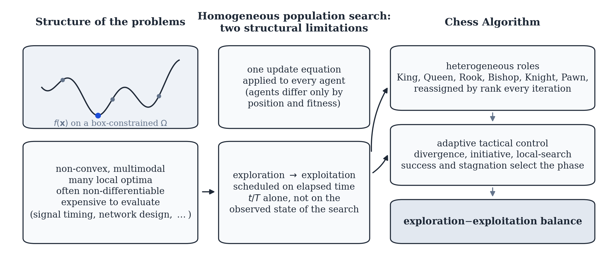{#fig-motivation fig-align="center" width="100%"}

The field grew from two roots. Evolutionary computation gave us the Genetic Algorithm [@holland1975adaptation; @goldberg1989genetic] and Evolution Strategies [@beyer2002es]. Trajectory methods gave us Simulated Annealing [@kirkpatrick1983sa], whose central idea, accepting a worse solution now and then so that a local minimum can be escaped, has proved one of the most durable in the field. Swarm intelligence arrived in the 1990s with Particle Swarm Optimization [@kennedy1995pso], Ant Colony Optimization [@dorigo1996aco], Differential Evolution [@storn1997de], and later the Artificial Bee Colony [@karaboga2007abc]. More recently, Mirjalili and colleagues built a productive line of algorithms by abstracting the social and hunting behaviour of animals into compact operators: the Grey Wolf Optimizer [@mirjalili2014gwo], the Ant Lion Optimizer [@mirjalili2015alo], the Dragonfly Algorithm [@mirjalili2016dragonfly], the Whale Optimization Algorithm [@mirjalili2016whale], the Sine Cosine Algorithm [@mirjalili2016sca], and the Salp Swarm Algorithm [@mirjalili2017salp], among others.

Two patterns stand out in this literature. First, almost every swarm algorithm treats its agents identically: a single update equation is applied to all of them, and only position and fitness distinguish one agent from another. Division of labour among *unequal* agents, by contrast, is a well-established principle in biological systems and in human strategic behaviour alike. Second, the performance of a metaheuristic is largely determined by how it schedules the transition from exploration to exploitation [@mirjalili2014gwo], and mechanisms that adapt that transition to the observed search dynamics, rather than to elapsed time alone, remain uncommon.

The justification for proposing yet another metaheuristic should also be stated explicitly. The No-Free-Lunch theorem [@wolpert1997nfl] rules out a universally dominant optimizer, so the aim of this work is not universal superiority but a substantively different inductive bias, together with an identification of the problem class for which that bias pays. A third consideration is critical rather than structural. The proliferation of metaphor-named algorithms has drawn severe and largely justified criticism [@sorensen2015metaphor], on the grounds that new vocabulary frequently repackages established operators without advancing the science. This paper accepts the substance of that criticism and builds the response into the study itself. @sec-operator-families maps every mechanism of the proposed algorithm onto its established operator family with the corresponding citation, @sec-ablation measures each mechanism's isolated contribution empirically, and the comparison roster includes two competition-grade optimizers, L-SHADE [@tanabe2014lshade] and CMA-ES [@hansen2001cmaes], so that the algorithm is assessed against the strongest representatives of the operator families it draws on rather than only against other metaphor-derived methods.

Chess offers precisely the two properties identified as absent above. Its pieces are radically unequal: the queen sweeps the whole board, rooks travel along files and ranks, bishops along diagonals, knights jump over anything in the way, and pawns crawl forward one square at a time while quietly defining the structure of the position. Mapped onto a search population, this suggests sub-groups performing qualitatively different moves around one common reference point, which in our setting is the best solution found so far and which we call the King.

The game also comes with a mature strategic vocabulary, refined over centuries of analysis. Development says: mobilize your forces early, consolidate later. A sacrifice gives up material now for a positional advantage later. Pinning immobilizes a piece against something more valuable behind it. Castling is a safeguarded structural rearrangement, en passant an opportunistic capture available only under narrow conditions, and the threefold-repetition rule declares a draw when the position keeps repeating. Each of these has a natural algorithmic reading: exploration schedules, acceptance of deteriorating moves, variable fixation, elite restructuring, adaptive local search, and diversity preservation, respectively.

The Chess Algorithm (CA) proposed here formalizes that mapping. @fig-abstraction states it precisely. Each piece becomes one movement geometry around the incumbent solution, and the figure names, for each, the search behaviour it produces and whether that behaviour serves exploration or exploitation. The right-hand column of the figure is deliberately not a claim of novelty, since @sec-operator-families maps every one of these operators onto an established family with its canonical reference. One misunderstanding is worth preempting at once: CA does not play chess and does not search a game tree. It borrows the strategic grammar of the game and nothing else, and its per-iteration cost is comparable to that of GA or PSO.

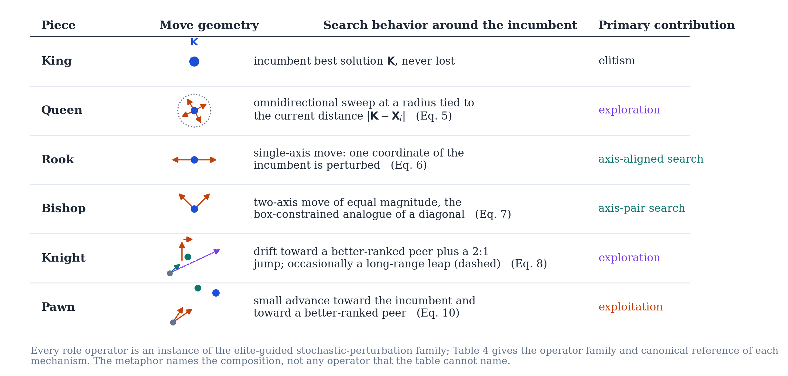{#fig-abstraction fig-align="center" width="94%"}

The contributions of this paper are the following. We give a complete mathematical specification of CA, covering initialization, rank-based role assignment, movement operators, strategic mechanisms, and the adaptive control layer that governs when each of them applies, including several operators new to this paper: Novotny interference, the knight's fork, the royal council, a King's-march blockade response, and a Tal-style speculative-sacrifice reheat. Every mechanism is then mapped onto its established operator family. We evaluate CA on six standard test functions in 30 dimensions, on the full CEC-2017 suite, on CEC-2022 at both official dimensionalities, on seven classic constrained engineering design problems, and on two transportation problems, against a roster that includes the competition-grade baselines L-SHADE and CMA-ES alongside GA, PSO, SA, GWO and WOA. Along the way we report a two-library data-integrity audit that identified six defective function implementations in a widely used third-party CEC-2017 port and restored all six from an independent implementation carrying the official reference data. We then take the algorithm apart, with a per-mechanism ablation, a one-at-a-time parameter sensitivity analysis, and a measured cost comparison with exact evaluation counts. Throughout, an ablation configuration with the adaptive layer disabled, CA-static, is carried alongside CA to isolate what that layer contributes, and the complete implementation will be released as open source upon acceptance.

It is worth stating the scope of our claims plainly. Against the classical and widely used metaheuristics in the roster, CA is consistently competitive and frequently significantly better, across synthetic suites, engineering design, and the transportation problems that motivated the work. Against the two competition-grade optimizers the ordering is reversed: L-SHADE and CMA-ES outperform CA on every problem class tested, and we report that wherever it occurs without qualification. The claim this paper defends is therefore narrower than a performance claim. CA is a transparent architecture whose every mechanism is specified mathematically, mapped to its operator family, and measured in isolation, and the ablation of @sec-analysis identifies precisely which of those mechanisms carry its performance, which in turn explains the standing of the specialized methods.

The remainder of the paper is organized as follows. @sec-ca specifies the algorithm, its adaptive control layer, and its time and memory complexity. @sec-benchmarks reports the classical benchmark study, @sec-cec2017 and @sec-cec2022 the two CEC suites, and @sec-engineering the constrained engineering design problems. @sec-analysis takes CA apart through ablation, sensitivity and cost analysis. @sec-transport and @sec-mealpy present the transportation applications, and @sec-conclusions concludes.

# The Chess Algorithm {#sec-ca}

## Conceptual mapping

CA maintains a population of $N$ candidate solutions $\mathbf{X}_i \in \Omega \subset \mathbb{R}^D$, treated as pieces playing toward the global optimum. @tbl-mapping summarizes how the vocabulary of the game maps onto algorithmic mechanisms.

| Chess concept | Algorithmic role |
|---|---|
| King | Incumbent best solution (never lost) |
| Queen, Rook, Bishop, Knight, Pawn | Heterogeneous movement operators |
| Development (opening principle) | Time-decaying step-scale $a(t)$ |
| Sacrifice | Probabilistic acceptance of worse moves (minor pieces only) |
| Pinning | Progressive freezing of coordinates to the King's values |
| Castling | Safeguarded coordinate-block exchange King $\leftrightarrow$ Rook |
| En passant | Opportunistic, self-adaptive local capture around the King |
| Pawn promotion | Rank-based role reassignment each iteration |
| Threefold repetition | Re-deployment of agents that collapse onto the King |
| Opening / middlegame / closed position / endgame | Position-dependent tactical phase, read each iteration (@sec-adaptive) |
| Nimzowitsch prophylaxis | Restrained, line-reopening response to premature convergence |
| Fork, interference, discovered attack, royal council | Additional movement and probe operators, active in specific phases |
| Windmill | Repeated extension of a successful King displacement (endgame) |
| Zugzwang / blockade | Stagnation-triggered waiting move, King's march, and speculative sacrifice |
| Checkmate | Termination criterion |

: Mapping between chess concepts and CA mechanisms. {#tbl-mapping}

One point deserves emphasis. CA borrows the strategic grammar of chess as an inductive bias, not the game itself. An iteration costs $\mathcal{O}(ND + N \log N)$ arithmetic operations, that is the movement updates plus the sort that drives role assignment, and $N + 3$ function evaluations, that is $N$ piece moves plus three en-passant probes, with one extra castling probe every $c$ iterations. That is the same order as GA, PSO, or GWO. @sec-complexity gives the full time and memory accounting, and the exact evaluation counts measured in the experiments are in @sec-cost.

## Architecture overview

Before the components are defined one by one, @fig-architecture shows how they are assembled into a single iteration, in the conventional flowchart notation: an oval for start and stop, a parallelogram for input and output, a diamond for a decision, and a rectangle for a process step. Three strands run inside the loop. The population is ranked, moved by role-specific operators, evaluated and filtered by an acceptance rule; the King runs its own local search through en passant, castling and the tactical probes; and the adaptive controller of @sec-adaptive reads four statistics of the population and conditions the rates at which the tactical operators fire. Each process box names the equation or table in which it is specified, so the figure doubles as a map of the rest of this section.

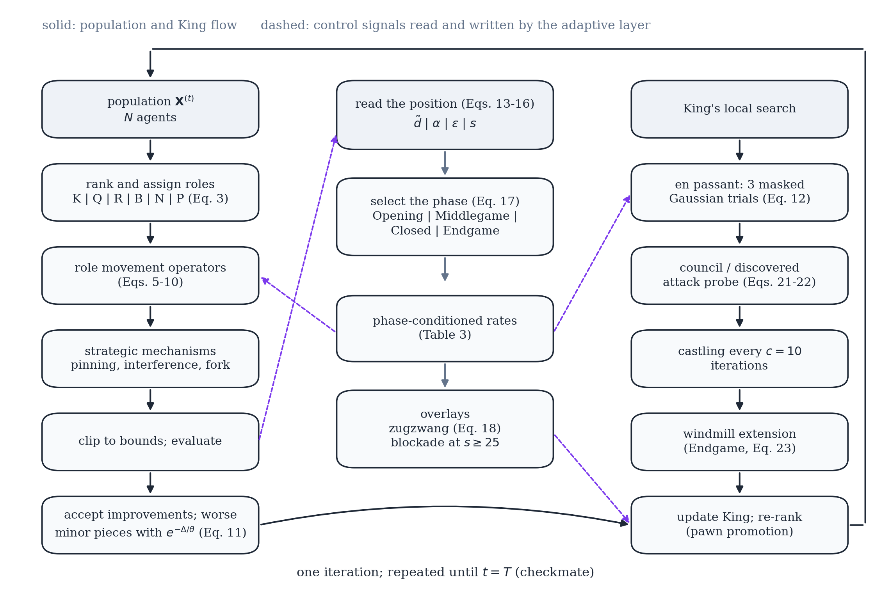{#fig-architecture fig-align="center" width="82%"}

## Initialization and role assignment

The board is set up by scattering the $N$ pieces uniformly over the feasible box:

$$
\mathbf{X}_i^{(0)} = \mathbf{l} + (\mathbf{u} - \mathbf{l}) \circ \mathbf{r}_i, \qquad
\mathbf{r}_i \sim \mathcal{U}(0,1)^D, \quad i = 1, \dots, N,
$$ {#eq-init}

where $\mathbf{l}$ and $\mathbf{u}$ are the bound vectors and $\circ$ is the elementwise (Hadamard) product. All positions are evaluated once and the population is sorted by fitness before the first move is played.

Let $\pi$ be the permutation of $\{1, \dots, N\}$ that sorts the population,

$$
f\big(\mathbf{X}_{\pi(1)}\big) \le f\big(\mathbf{X}_{\pi(2)}\big) \le \dots \le f\big(\mathbf{X}_{\pi(N)}\big).
$$ {#eq-roles}

The best agent $\mathbf{K} = \mathbf{X}_{\pi(1)}$ is the King. The following ranks are partitioned, in order, into Queens $\mathcal{Q}$, Rooks $\mathcal{R}$, Bishops $\mathcal{B}$, and Knights $\mathcal{N}$, with

$$
|\mathcal{Q}| = \max(1, \lfloor \rho_q N \rceil), \quad
|\mathcal{R}| = \max(1, \lfloor \rho_r N \rceil), \quad
|\mathcal{B}| = \max(1, \lfloor \rho_b N \rceil), \quad
|\mathcal{N}| = \max(1, \lfloor \rho_n N \rceil),
$$

where $\lfloor \cdot \rceil$ denotes rounding and $(\rho_q, \rho_r, \rho_b, \rho_n) = (0.10, 0.15, 0.15, 0.20)$. Whatever remains becomes the Pawns $\mathcal{P}$. Because the assignment is redone after every iteration, a pawn that reaches a good region becomes a strong piece the next time roles are assigned. Promotion, in other words, falls out of re-ranking for free, and no extra machinery is needed for it.

Opening theory tells a player to develop pieces quickly, while endgames reward patience and precision. CA encodes this with a linearly decaying step-scale coefficient,

$$
a(t) = 2\left(1 - \frac{t}{T}\right),
$$ {#eq-development}

with $t$ the current iteration and $T$ the total budget, following the convention popularized by Mirjalili et al. [@mirjalili2014gwo]. Every piece move scales with $a(t)$, so the swarm plays big developing moves early and fine manoeuvres late.

## Piece movement operators

Write $\mathbf{L} = \mathbf{u} - \mathbf{l}$ for the box width and let $\mathbf{r}, \mathbf{r}' \sim \mathcal{U}(0,1)^D$ be independent random vectors. The five mobile roles then move as follows. @fig-roles shows what each of the five equations below does geometrically, and makes the division of labour between them visible before the algebra is read: the Rook moves one coordinate and the Bishop two of equal magnitude, so both produce axis-structured candidates; the Queen sweeps in every direction at a radius tied to its distance from the King; the Knight combines a drift toward a better-ranked peer with an asymmetric jump; and the Pawn takes small steps toward both attractors, which is why its cloud is the tightest. The candidate clouds in the figure are not drawn by hand. They are 45 draws from the equation named in each panel, evaluated with a fixed seed.

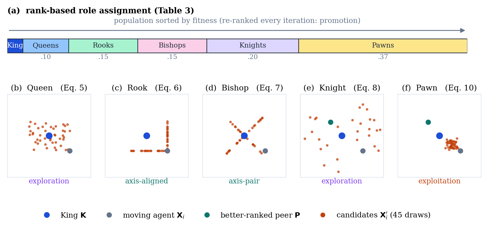{#fig-roles fig-align="center" width="100%"}

**Queen (omnidirectional sweep).** The queen circles the King at a radius tied to her current distance from him:

$$
\mathbf{X}_i' = \mathbf{K} + a(t)\,(2\mathbf{r} - \mathbf{1}) \circ \max\!\big(|\mathbf{K} - \mathbf{X}_i|,\ \boldsymbol{\sigma}\big),
$$ {#eq-queen}

where $\boldsymbol{\sigma}$ is the King's adaptive capture radius of @eq-enpassant. The $\max$ keeps the sweep from collapsing entirely, so queens never stall.

**Rook (single-axis move).** One random axis $j$ is chosen and only that coordinate moves:

$$
X_{i,j}' = K_j + a(t)\,(2r - 1)\,\max\!\big(|K_j - X_{i,j}|,\ 0.01\,L_j\,a(t)\big).
$$ {#eq-rook}

**Bishop (diagonal move).** Two distinct axes $j$ and $k$ receive steps of equal magnitude and random relative sign, which is as close to a diagonal as a box-constrained space allows:

$$
\Delta = a(t)\,(2r-1)\,\max\!\Big(\tfrac{1}{2}\big(|K_j - X_{i,j}| + |K_k - X_{i,k}|\big),\ 0.01\,L\,a(t)\Big), \quad
X_{i,j}' = K_j + \Delta,\ \ X_{i,k}' = K_k \pm \Delta.
$$ {#eq-bishop}

**Knight (L-shaped jump).** The knight is the one piece that jumps over whatever stands in its way. Relative to a randomly chosen better-ranked peer $\mathbf{P}$, it drifts toward the peer and then adds an asymmetric $2{:}1$ jump on two random axes:

$$
\mathbf{X}_i' = \mathbf{X}_i + \mathbf{r} \circ (\mathbf{P} - \mathbf{X}_i), \qquad
X_{i,j}' \mathrel{+}= 2\,a(t)\,\beta\,(2r-1), \quad
X_{i,k}' \mathrel{+}= 1\,a(t)\,\beta\,(2r'-1),
$$ {#eq-knight}

with $\beta = \overline{|\mathbf{P} - \mathbf{X}_i|}$ the mean coordinate gap. With small probability $0.1\,a(t)/2$ the knight abandons this move and leaps: two coordinates are resampled uniformly in $\Omega$. This leap is the algorithm's main long-range restart device. The implementation also ships a heavy-tailed variant in which those two coordinates instead receive a Lévy-flight step $0.05\,L\,s$ generated by Mantegna's algorithm [@mantegna1994levy], the mechanism that Cuckoo Search made popular [@yang2009cuckoo]:

$$
s = \frac{u}{|v|^{1/\beta_\ell}}, \qquad
u \sim \mathcal{N}(0, \sigma_u^2), \quad v \sim \mathcal{N}(0, 1), \qquad
\sigma_u = \left[
\frac{\Gamma(1+\beta_\ell)\,\sin(\pi \beta_\ell / 2)}
     {\Gamma\!\big(\tfrac{1+\beta_\ell}{2}\big)\,\beta_\ell\, 2^{(\beta_\ell - 1)/2}}
\right]^{1/\beta_\ell},
$$ {#eq-levy}

with tail index $\beta_\ell = 1.5$. Every result in this paper uses the plain uniform leap; the Lévy option is documented for future study rather than used here.

**Pawn (steady advance).** Pawns take small steps toward the King and toward a random better-ranked piece $\mathbf{B}$:

$$
\mathbf{X}_i' = \mathbf{X}_i + 0.3\,\mathbf{r} \circ (\mathbf{K} - \mathbf{X}_i) + 0.3\,\mathbf{r}' \circ (\mathbf{B} - \mathbf{X}_i).
$$ {#eq-pawn}

## Strategic mechanisms

**Pinning.** With probability $p_{\text{pin}}(t) = 0.5\,t/T$, a random subset of at most $30\%$ of an agent's coordinates is pinned to the King's values and excluded from perturbation. Early on, pinning is rare and the pieces develop freely. Late in the run it concentrates the search on a shrinking set of free dimensions around the incumbent, which is the exploitation behaviour expected during an endgame.

**Sacrifice.** A worsening move $\Delta_i = f(\mathbf{X}_i') - f(\mathbf{X}_i) > 0$ made by a minor piece, a Knight or a Pawn, is still accepted with probability

$$
p_{\text{acc}} = \exp\!\left(-\frac{\Delta_i}{\theta(t)}\right), \qquad
\theta(t) = \theta_0 \big(f_{\max} - f_{\min}\big)\, e^{-8 t / T},
$$ {#eq-sacrifice}

with $\theta_0 = 0.1$. Readers will recognize the Metropolis rule of Simulated Annealing [@kirkpatrick1983sa], but two chess-flavoured restrictions change its character. The temperature is scaled by the current fitness spread of the population, which makes the sacrifice budget self-calibrating across problems of wildly different magnitudes. And only minor pieces may be sacrificed, so that the King and the major pieces are never lost and the elite of the population cannot be eroded by the acceptance rule.

**En passant (adaptive local capture).** Once per iteration the King attempts an en-passant capture. Three trial points are drawn in a sparse Gaussian neighbourhood,

$$
\mathbf{Y}_m = \mathbf{K} + \boldsymbol{\sigma} \circ \mathbf{z}_m \circ \mathbf{m}_m, \qquad
\mathbf{z}_m \sim \mathcal{N}(\mathbf{0}, \mathbf{I}),\quad m = 1,2,3,
$$ {#eq-enpassant}

where the random binary mask $\mathbf{m}_m$ activates each coordinate with probability $\max(0.2,\ 2/D)$. Any improving trial replaces the King. The radius $\boldsymbol{\sigma}$ follows a success rule of the kind long used in Evolution Strategies [@beyer2002es]: multiply by $1.3$ after a successful capture, by $0.92$ after a failure, and after $50$ consecutive failures reset to $\boldsymbol{\sigma} = 0.05\,\mathbf{L}\max(a(t), 0.05)$, which is a stalemate-avoidance restart. In our experience this mechanism is what keeps CA improving deep into the run, long after a fixed-radius local search would have gone quiet.

**Castling.** Every $c = 10$ iterations the King castles with the best Rook: a contiguous block of up to $D/4$ coordinates is copied from the Rook into a candidate King, and the exchange is kept only if it improves the King. It is a safeguarded structural jump, useful when good partial solutions have been discovered on different files of the board and need splicing together.

**Threefold repetition.** If an agent coincides with the King to numerical precision, something that pinning can eventually cause, it is re-deployed uniformly in $\Omega$, much as the threefold-repetition rule stops a game from going in circles. We did not add this rule for elegance. Early prototypes taught us that it is essential: without it, pinning breeds exact clones of the King, every gap-proportional step length collapses to zero, and the search dies quietly in place.

**Checkmate.** The algorithm stops after $T$ iterations. A stagnation-based early stop would be easy to add, but we keep it disabled in all experiments so that every algorithm consumes the same core budget of $N \times T$ population evaluations.

Two design properties follow from these rules and are worth stating before the adaptive layer is introduced. The first is elitism: the King's fitness never increases, because the King is replaced only by strictly better points, whether through the population update, en passant, or castling. Together with the uniform probability mass that the Knight's exploratory leap and the threefold-repetition re-deployment place over $\Omega$ at every iteration, this puts CA in the class of elitist stochastic search methods for which convergence in probability to the global optimum as $T \to \infty$ is standard [@solis1981minimization]. Such asymptotic statements say nothing about behaviour within a finite budget of $15{,}000$ evaluations, which is an empirical question and is the subject of @sec-benchmarks. The second is the exploration and exploitation balance. Exploration rests mainly on the Knights (@eq-knight) and on the Queens early in the schedule (@eq-queen); exploitation rests on the Pawns (@eq-pawn), on pinning, and on the en-passant success rule (@eq-enpassant). The balance shifts smoothly through $a(t)$, $p_{\text{pin}}(t)$ and $\theta(t)$, and it adapts to the state of the search through the gap-proportional step lengths and the spread-scaled sacrifice budget of @eq-sacrifice.

## Adaptive tactical control {#sec-adaptive}

The mechanisms above give CA its movement vocabulary. What remains is to say how CA decides, moment to moment, which of them to lean on. A grandmaster does not play the same combination of tactics in a wide-open middlegame as in a locked pawn structure or a simplified endgame, because the right tactic depends on the position and not on a move counter. CA answers this with a lightweight state machine that reads four cheap statistics of the population each iteration and switches the active tactical repertoire accordingly. @fig-statemachine summarizes the result.

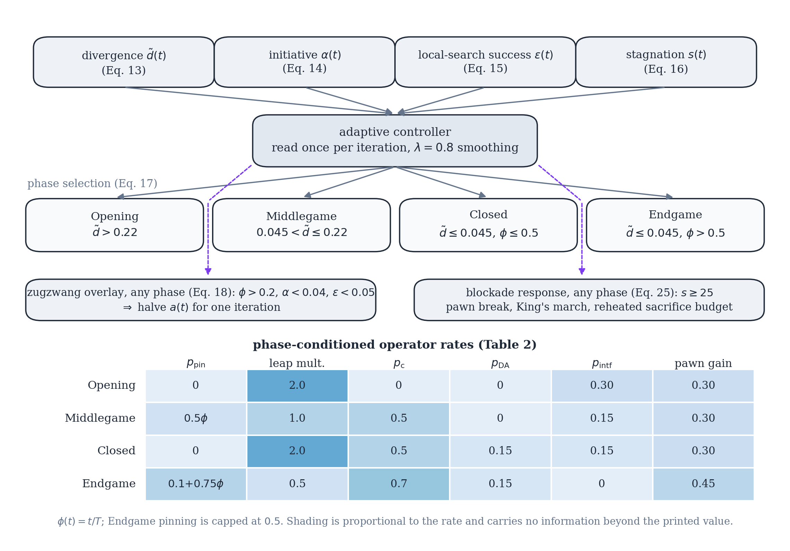{#fig-statemachine fig-align="center" width="100%"}

For controlled comparison, every experiment in this paper is also run under **CA-static**, which is the identical operator set with this state machine disabled, so that role-appropriate tactics fire at fixed, non-adaptive rates instead. CA-static is not a separate algorithm. It is an ablation configuration, used throughout @sec-cec2017 and @sec-engineering to isolate exactly what the adaptive layer contributes.

**Reading the position.** Four exponentially smoothed statistics ($\lambda=0.8$) are recomputed every iteration. The population's normalized divergence from the King,

$$
d(t) = \frac{1}{\mathrm{Lspan}\sqrt{D}} \cdot \frac{1}{N-1}\sum_{i=2}^{N} \lVert \mathbf{X}_i^{(t)} - \mathbf{K}^{(t)} \rVert_2 ,
\qquad
\tilde{d}(t) = 0.8\,\tilde{d}(t-1) + 0.2\, d(t),
$$ {#eq-divergence}

answers the question "is the position open or closed?", where $\mathrm{Lspan}=\max_j(u_j-l_j)$. Two further exponential moving averages track the initiative,

$$
\alpha(t) = 0.8\,\alpha(t-1) + 0.2 \cdot \frac{1}{N}\sum_{i=1}^{N} \mathbb{1}[\text{move}_i \text{ accepted}],
$$ {#eq-acceptance}

and the technical success rate of the King's own local search,

$$
\varepsilon(t) =
\begin{cases}
0.8\,\varepsilon(t-1) + 0.2 & \text{en-passant capture succeeded at } t,\\
0.8\,\varepsilon(t-1) & \text{otherwise.}
\end{cases}
$$ {#eq-epsilon}

Finally, a stagnation counter borrows chess's *fifty-move rule*. Rather than reset on any improvement whatsoever, it resets only on a materially significant one, exactly as fifty moves without a pawn push or a capture, not merely without a game-theoretically perfect move, are needed to claim a draw:

$$
s(t) =
\begin{cases}
0, & f(\mathbf{K}^{(t)}) < f_{\text{ref}} - \max\!\big(10^{-4}|f_{\text{ref}}|,\ 10^{-10}\big),\\[2pt]
s(t-1) + 1, & \text{otherwise,}
\end{cases}
$$ {#eq-fifty-move}

with $f_{\text{ref}}$ updated to $f(\mathbf{K}^{(t)})$ whenever $s(t)=0$. Early prototypes used a naive counter that reset on any improvement at all. Because the en-passant rule of @eq-enpassant produces microscopic refinements routinely, that counter never accumulated enough to trigger the blockade response described below, even in runs that stayed visibly confined to a secondary basin for hundreds of iterations. @eq-fifty-move fixes that.

**Game phases.** The smoothed divergence and the fraction of the budget elapsed, $\phi(t)=t/T$, jointly select one of four phases:

$$
\text{phase}(t) =
\begin{cases}
\textsc{Opening}, & \tilde{d}(t) > 0.22,\\
\textsc{Middlegame}, & 0.045 < \tilde{d}(t) \le 0.22,\\
\textsc{Closed}, & \tilde{d}(t) \le 0.045 \text{ and } \phi(t) \le 0.5,\\
\textsc{Endgame}, & \tilde{d}(t) \le 0.045 \text{ and } \phi(t) > 0.5.
\end{cases}
$$ {#eq-phase}

The two thresholds were checked, though not exhaustively swept, against the combinations $\delta_{\text{open}} \in \{0.15, 0.22, 0.30\}$ and $\delta_{\text{end}} \in \{0.03, 0.045, 0.06, 0.09\}$ on two CEC-2017 functions, Rastrigin and Hybrid Function 4 at $D=30$. The pair $\delta_{\text{open}}=0.22$ and $\delta_{\text{end}}=0.045$ was the best or near-best on both and is used throughout this paper. A full sensitivity study across the complete parameter space, noted as a limitation in @sec-conclusions, remains future work.

The Closed phase answers a failure mode found during tuning. A population can collapse to a small radius around the King *early* in the search, which is premature convergence rather than a genuine endgame, and treating every low-divergence state as an endgame made this worse, since endgame tactics such as heavy pinning and aggressive pawn advance accelerate the collapse instead of reversing it. Reading an early collapse as a **prematurely closed position** and answering with Nimzowitschian *prophylaxis*, that is restraint and the reopening of lines rather than immediate commitment, removes the pathology. Each phase activates a different parameter vector, summarized in @tbl-phase-schedule.

| Phase | $p_{\text{pin}}$ | Leap mult. | $p_{\text{c}}$ | $p_{\text{DA}}$ | $p_{\text{intf}}$ | Pawn gain |
|---|:---:|:---:|:---:|:---:|:---:|:---:|
| Opening | $0$ | $2.0$ | $0$ | $0$ | $0.30$ | $0.30$ |
| Middlegame | $0.5\,\phi(t)$ | $1.0$ | $0.5$ | $0$ | $0.15$ | $0.30$ |
| Closed | $0$ | $2.0$ | $0.5$ | $0.15$ | $0.15$ | $0.30$ |
| Endgame | $0.1{+}0.75\,\phi(t)^{*}$ | $0.5$ | $0.7$ | $0.15$ | $0$ | $0.45$ |

: Phase-conditioned tactical schedule. Pinning probability $p_{\text{pin}}$, knight-leap probability multiplier, council probability $p_{\text{c}}$, discovered-attack probability $p_{\text{DA}}$, interference probability $p_{\text{intf}}$, and pawn step gain, by phase. $^{*}$Endgame pinning is capped at $0.5$. {#tbl-phase-schedule tbl-colwidths="[16,20,12,10,10,15,13]"}

One overlay applies regardless of phase. If the population has lost the initiative and the King's local search has gone quiet at the same time,

$$
\text{Zugzwang}(t) \iff \phi(t) > 0.2 \ \wedge\ \alpha(t) < 0.04 \ \wedge\ \varepsilon(t) < 0.05,
$$ {#eq-zugzwang}

the development coefficient is halved for that one iteration, $a(t)\leftarrow a(t)/2$. This is a *triangulation* move: change nothing structurally, spend a tempo, and let the next reading of the position be more informative before committing to a new phase.

**Tactical operators.** Five further operators are what the phases of @tbl-phase-schedule switch between. @fig-tactics shows where each of them places a candidate relative to the incumbent and the elite, which is the property that distinguishes them from one another and from the role moves of @fig-roles.

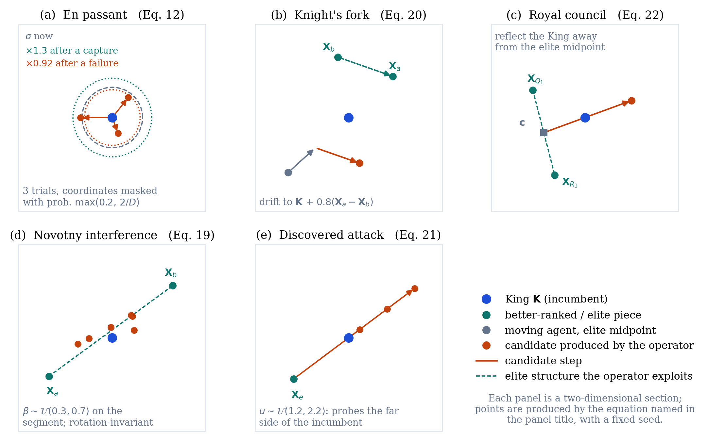{#fig-tactics fig-align="center" width="100%"}

The first is *Novotny interference*, played by Bishops. Named for the classical motif in which a piece is sacrificed on a square that blocks two enemy lines of defence at once, a Bishop is occasionally interposed on the segment between two distant, higher-ranked pieces rather than moving diagonally around the King:

$$
\mathbf{X}_i' = \beta\, \mathbf{X}_a + (1-\beta)\, \mathbf{X}_b + 0.02\, a(t)\, \mathbf{L} \circ \mathbf{z},
\qquad \beta \sim \mathcal{U}(0.3, 0.7),\quad \mathbf{z} \sim \mathcal{N}(\mathbf{0}, \mathbf{I}),
$$ {#eq-interference}

with $a$ and $b$ drawn without replacement from the fitter half of the population, at probability $p_{\text{intf}}$ from @tbl-phase-schedule. Being a convex recombination of two arbitrary population members rather than a step along a coordinate axis, it is rotation-invariant, and it is the mechanism most directly responsible for CA's gains on the CEC-2017 hybrid and composition functions (@sec-cec2017).

The second is the *knight's fork*. With probability $0.5$, a Knight that does not take its exploratory leap instead plays

$$
\mathbf{X}_i' = \mathbf{X}_i + \mathbf{r} \circ (\mathbf{K} - \mathbf{X}_i) + 0.8\,(\mathbf{X}_a - \mathbf{X}_b), \qquad a, b \sim \mathcal{U}\{1,\dots,i-1\},\ \ \mathbf{r}\sim\mathcal{U}(0,1)^D,
$$ {#eq-fork}

drifting toward the King while inheriting the differential structure of two better-ranked peers at once, which is to say attacking two targets simultaneously, in the spirit of the tactic that gives the move its name.

The third is the *discovered attack*. An early version applied the geometry below to every Rook as a population move, and tuning showed that to be tactically unsound at that scale, since the candidate is accepted by the ordinary improvement rule almost every time it is tried, collapsing the Rook sub-population onto the King-elite line within a handful of iterations. Restricted instead to a single, strictly elitist probe competing for one of the King's own en-passant trials, and active only in the Closed and Endgame phases,

$$
\mathbf{Y}_{\text{DA}} = \mathbf{X}_e + u\,(\mathbf{K} - \mathbf{X}_e), \qquad u \sim \mathcal{U}(1.2, 2.2),\quad e \sim \mathcal{U}\{1,2,3\},
$$ {#eq-discovered}

it recovers the intended effect, probing the far side of the incumbent along an elite-King line, without the pathology. The finding generalizes: a tactic that is sound for a single elite piece can destabilize an entire role class, much as a discovered attack that wins material for one player becomes self-defeating if every piece on the board plays it at once.

The fourth is the *royal council*, which competes with the discovered attack for the same probe slot, the two being mutually exclusive and selected by relative probability:

$$
\mathbf{Y}_{\text{council}} = \mathbf{K} + 1.5\,u\,(\mathbf{K} - \mathbf{c}), \qquad \mathbf{c} = \tfrac{1}{2}(\mathbf{X}_{\text{Q}_1} + \mathbf{X}_{\text{R}_1}),\quad u \sim \mathcal{U}(0,1),
$$ {#eq-council}

reflecting the King away from the midpoint of the best Queen and the best Rook. Where isotropic Gaussian probes are blind to the shape of the elite, this reflection is population-shaped: when the elite lies strung along a narrow curved valley, which is the typical geometry along an active inequality constraint in the engineering problems of @sec-engineering, it points down the valley rather than across it. This single mechanism closed most of the welded-beam gap observed in early prototypes.

The fifth is the *windmill*. In the Endgame phase only, a successful en-passant or council capture with displacement $\boldsymbol{\delta}=\mathbf{K}^{(t)}-\mathbf{K}^{(t)}_{\text{pre}}$ is extended,

$$
\mathbf{K} \leftarrow \mathbf{K} + \boldsymbol{\delta} \quad \text{while } f(\mathbf{K}+\boldsymbol{\delta}) < f(\mathbf{K}),\quad \text{up to 3 repetitions,}
$$ {#eq-windmill}

echoing the chess windmill's repeating sequence of discovered checks, each one harvesting material.

**Overprotection archive.** Aron Nimzowitsch's overprotection principle counsels defending a valuable point with more force than strictly necessary, so that pieces freed from other duties have a strong square to retreat to. CA archives up to five mutually distant past King positions,

$$
\text{admit } \mathbf{K}^{(t)} \iff f(\mathbf{K}^{(t)}) < f(\mathbf{K}^{(t-1)}) \ \wedge\ \min_{\mathbf{a}\in\mathcal{A}} \frac{\lVert \mathbf{K}^{(t)}-\mathbf{a}\rVert}{\mathrm{Lspan}\sqrt{D}} > 0.15,
$$ {#eq-archive}

evicting the worst by fitness on overflow. These strongpoints are the fallback used by the blockade response.

**Blockade: pawn break, King's march, and speculative sacrifice.** When the fifty-move counter reaches $s(t) \ge 25$ in @eq-fifty-move, three mechanisms fire together. All Pawns are re-deployed uniformly at random, a *pawn break* that opens lines in a closed position. The King probes six long-radius candidates at three scales,

$$
\mathbf{Y}_m = \mathbf{K} + \rho_m\, \mathbf{L}\circ\mathbf{z}_m, \qquad \rho_m \in \{0.1,0.1,0.2,0.2,0.4,0.4\},\quad \mathbf{z}_m \sim \mathcal{N}(\mathbf{0},\mathbf{I}),
$$ {#eq-march}

then *consolidates* the best candidate with an eight-step greedy local refinement of shrinking radius before comparing it against the incumbent King. The order is deliberate: refining before comparing lets the march accept a basin whose raw landing point is worse than the incumbent but whose refined optimum is better, while the final elitist comparison still guarantees that the King's fitness sequence never worsens. At the same time the sacrifice budget of @eq-sacrifice is reheated tenfold for the next ten iterations, modelled on Mikhail Tal's willingness to give up material for an unquantifiable positional initiative rather than keep playing conservative moves that have stopped producing progress, and, if the archive of @eq-archive is non-empty, the worst-ranked Queen is replaced by a random archived strongpoint, which gives the population a proven foothold rather than a blind restart.

**Opening principle: opposition-based initialization.** The initial population is evaluated together with its reflection through the board's centre, $\mathbf{X}^{(0)}_{\text{mirror}}=\mathbf{l}+\mathbf{u}-\mathbf{X}^{(0)}$, and the fitter half of the combined $2N$ candidates is kept. Isolating this mechanism during tuning revealed a *mixed* effect, better on two of four micro-benchmark problems tested and worse on the other two, rather than a consistent gain. It is kept by default because it never produced a large regression and costs only one extra population evaluation, paid once; its dedicated ablation is reported in @sec-ablation.

## Parameter summary and pseudocode

@tbl-params collects the base parameters and the single configuration used everywhere in this paper. Several of them, including the pinning probability and the knight-leap rate, are further modulated by the phase-conditioned schedule of @tbl-phase-schedule once the adaptive control layer is active, while CA-static uses the values below unmodulated throughout. No per-problem tuning was done, for CA, for CA-static, or for any competitor, and every result in this paper comes from this one configuration. How much that costs is measured in @sec-sensitivity: of the parameters below, only the role fractions change performance significantly at the granularity tested.

| Parameter | Symbol | Value |
|---|:---:|---:|
| Role fractions (Queen / Rook / Bishop / Knight) | $\rho_q,\rho_r,\rho_b,\rho_n$ | $0.10 / 0.15 / 0.15 / 0.20$ |
| Development schedule | $a(t)$ | $2(1 - t/T)$ |
| Pinning probability / cap | $p_{\text{pin}}(t)$ | $0.5\,t/T$, at most $30\%$ of coordinates |
| Sacrifice constant | $\theta_0$ | $0.1$ |
| Castling period | $c$ | $10$ iterations |
| En-passant probes per iteration | — | $3$ |
| En-passant adaptation (success / failure / reset) | — | $\times 1.3$ / $\times 0.92$ / after $50$ failures |
| Knight exploratory-leap distribution | — | uniform (Lévy, $\beta_\ell = 1.5$, optional) |

: CA parameters and the fixed configuration used in all experiments. {#tbl-params}

The complete step is given below. Lines 4 and 5 are the controller strand of @fig-architecture, lines 6 to 10 the population strand, and lines 11 to 16 the King's own local search.

::: {.content-visible when-format="pdf"}
```{=latex}
\Needspace{27\baselineskip}
```
:::

```
Algorithm 1: Chess Algorithm (CA)
Input:  f, bounds [l, u], dimension D, population N, iterations T
Output: King K

 1  X <- init(N, l, u) and mirror l+u-X; evaluate; keep fitter N (Eq. 2)
 2  sort X; K <- X(1); sigma <- 0.1 L; archive <- {}
 3  for t = 0 to T-1 do
 4     a <- 2(1 - t/T); update d, alpha, epsilon, s      (Eqs. 13-16)
 5     select the phase and read its rates         (Eq. 17, Table 2)
 6     assign roles by rank: King, Queens, Rooks, Bishops,
          Knights, Pawns                                   (Eq. 3)
 7     move every piece by its role operator            (Eqs. 5-10)
 8     apply the phase tactics: fork, interference, leap (Eqs. 19-20)
 9     pin coordinates to K with prob. p_pin; clip; evaluate
10     accept improvements; keep a worse Knight or Pawn with
          probability e^(-delta/theta)                     (Eq. 11)
11     en passant: 3 masked trials around K; adapt sigma   (Eq. 12)
12     add one council or discovered-attack probe    (Eqs. 21-22)
13     if Endgame and a probe succeeded then extend it     (Eq. 23)
14     if t mod c = 0 then castle: swap a block K <-> best Rook
15     re-deploy agents identical to K; update K and archive (Eq. 24)
16     if s >= 25 then blockade: pawn break, King's march,
          reheat theta                                     (Eq. 25)
17  end for
18  return K
```

## Relation to established operator families {#sec-operator-families}

The criticism of metaphor-driven algorithm design articulated by Sörensen [@sorensen2015metaphor] deserves a direct answer rather than a defensive one. A vocabulary borrowed from a game can obscure the fact that the underlying operators are established ones, it can impede comparison with prior work, and it can inflate claims of novelty. What we owe the reader is a precise statement of what each mechanism is mathematically and where it sits in the existing taxonomy. @tbl-operator-families provides that statement for every CA mechanism.

| CA mechanism | Operator family | Canonical reference |
|---|---|---|
| Role-based moves (Queen, Rook, Bishop, Knight, Pawn) | Elite-guided stochastic perturbation, heterogeneous step geometry | [@kennedy1995pso; @mirjalili2014gwo] |
| Development schedule $a(t)$ | Time-decreasing step-size scheduling | [@mirjalili2014gwo] |
| Sacrifice (@eq-sacrifice) | Metropolis acceptance with population-scaled temperature | [@kirkpatrick1983sa] |
| En passant $\boldsymbol{\sigma}$ rule (@eq-enpassant) | Success-rule step-size adaptation, $(1{+}\lambda)$-ES | [@beyer2002es; @hansen2001cmaes] |
| Knight's fork (@eq-fork) | Differential mutation (current-to-best with difference vector) | [@storn1997de] |
| Novotny interference (@eq-interference) | Arithmetic (convex) recombination | [@goldberg1989genetic] |
| Royal council (@eq-council) | Simplex-type reflection away from an elite centroid | [@nelder1965simplex] |
| Discovered attack (@eq-discovered) | Line extrapolation through the incumbent | [@nelder1965simplex] |
| Windmill (@eq-windmill) | Success-directed displacement repetition | [@beyer2002es] |
| Pinning | Block-coordinate fixation (axis-aligned subspace exploitation) | — |
| Castling | Segment (block) crossover with elitist acceptance | [@holland1975adaptation] |
| Threefold repetition | Diversity maintenance by re-initialization | [@goldberg1989genetic] |
| Blockade response (@eq-march) | Partial restart with temperature reheating | [@kirkpatrick1983sa] |
| Phase state machine; zugzwang (@eq-phase) | Adaptive parameter control | [@eiben1999parameter] |
| Opposition-based initialization | Opposition-based learning | [@tizhoosh2005opposition] |

: Every CA mechanism, its established operator family, and the canonical reference for that family. {#tbl-operator-families}

Stated in these terms, CA is a composition of operators from the evolutionary-computation, swarm and trajectory traditions, coordinated by an adaptive control layer and organized around a heterogeneous-role architecture. The chess vocabulary contributes no operator that the table cannot name. What it contributes is a compact and internally consistent language for a particular *composition*, that is which operators are present, at what rates, and under which population states, and that composition, not any single operator, is the algorithmic claim of this paper. Two consequences follow. First, every mechanism named in @tbl-mapping is defined mathematically in this section and measured in isolation in @sec-ablation, so the metaphor never substitutes for specification or for evidence. Second, the mapping generates a falsifiable expectation: if CA's performance rests principally on a small subset of these operator families, then specialized algorithms built purely on those families should match or exceed CA wherever their assumptions hold. The roster of @sec-cec2017 through @sec-mealpy includes L-SHADE [@tanabe2014lshade] and CMA-ES [@hansen2001cmaes], the competition-refined embodiments of the differential-mutation and step-size-adaptation families respectively, precisely to test that expectation, and @sec-ablation returns to it quantitatively.

## Computational and memory complexity {#sec-complexity}

The cost of CA is dominated by four operations per iteration. Sorting the population to assign roles costs $\mathcal{O}(N \log N)$ comparisons. Moving every agent under its role operator, applying the pin mask, and clipping to the bounds are all elementwise over the $N \times D$ population, hence $\mathcal{O}(ND)$. Evaluating the moved population costs $N$ objective calls. The King's local search adds a constant number of calls per iteration: three en-passant probes, one council or discovered-attack probe, at most three windmill extensions in the Endgame phase, one castling probe every $c$ iterations, and fourteen further calls on the rare iterations when the blockade of @eq-march fires. The controller itself is cheap, since the divergence of @eq-divergence costs $\mathcal{O}(ND)$ and the three remaining statistics $\mathcal{O}(N)$, while the archive admission test of @eq-archive costs $\mathcal{O}(|\mathcal{A}|D)$ with $|\mathcal{A}| \le 5$.

Writing $C_f$ for the cost of one objective evaluation, the total time complexity over the whole run is therefore

$$
\mathcal{O}\Big( T \big( ND + N \log N + (N + \kappa)\, C_f \big) \Big), \qquad \kappa \le 8,
$$ {#eq-time-complexity}

where $\kappa$ collects the King's per-iteration probes, that is three en-passant trials, one council or discovered-attack probe, up to three windmill extensions and the amortized castling probe; the fourteen blockade calls sit outside $\kappa$ because they fire on a small fraction of iterations. Since $C_f$ dominates the arithmetic on any objective of practical interest, the operative figure is the evaluation count, $T(N+\kappa)$, and the measured overhead of the $\kappa$ term is $12.4\%$ of the core budget $NT$ (@sec-cost). The arithmetic term $\mathcal{O}(TND)$ is identical to that of GA, PSO, GWO and WOA, none of which sorts, and the $\mathcal{O}(TN\log N)$ sort that CA adds is negligible beside it whenever $D > \log N$, which holds in every experiment reported here.

Memory is likewise linear in the size of the population. CA stores the population and the candidate population, $2ND$ reals; the fitness vector and the candidate fitness vector, $2N$ reals; the per-agent pin mask, $ND$ booleans; the adaptive radius $\boldsymbol{\sigma}$, $D$ reals; and the overprotection archive, at most $5D$ reals with its five fitness values. The convergence history adds $T$ reals. The peak occurs once, at initialization, where the opposition step of @sec-adaptive holds $2N$ candidates at the same time. The total is

$$
\mathcal{O}(ND + T),
$$ {#eq-memory-complexity}

with no dependence on the number of strategic mechanisms, since every mechanism operates in place on the arrays already listed. For reference, PSO stores position, velocity and personal best, which is $3ND$ reals, and GWO stores the population plus three leaders, so CA's footprint is of the same order and of comparable constant. Neither the time nor the memory cost of CA, in other words, is where its twelve mechanisms show up; they show up in the evaluation count, and that is measured exactly in @sec-cost.

# Benchmark Experiments {#sec-benchmarks}

## Experimental protocol

CA is compared against its own non-adaptive ablation CA-static (@sec-adaptive) and four established metaheuristics: a real-coded GA with tournament selection, BLX-$\alpha$ crossover, Gaussian mutation and elitism [@holland1975adaptation; @goldberg1989genetic]; PSO with linearly decreasing inertia [@kennedy1995pso]; SA [@kirkpatrick1983sa], granted a population-equivalent evaluation budget so that the comparison stays fair; and GWO [@mirjalili2014gwo].

The suite consists of six standard functions covering unimodal, ill-conditioned and highly multimodal terrain (@tbl-suite):

| Function | Type | Search domain | $f^{*}$ |
|---|---|---|---:|
| F1 Sphere | Unimodal | $[-100, 100]^{30}$ | 0 |
| F2 Rosenbrock | Unimodal, ill-conditioned valley | $[-30, 30]^{30}$ | 0 |
| F3 Rastrigin | Multimodal | $[-5.12, 5.12]^{30}$ | 0 |
| F4 Griewank | Multimodal | $[-600, 600]^{30}$ | 0 |
| F5 Ackley | Multimodal | $[-32, 32]^{30}$ | 0 |
| F6 Schwefel 2.22 | Unimodal, non-separable norm | $[-10, 10]^{30}$ | 0 |

: Benchmark functions ($D = 30$). {#tbl-suite}

Every algorithm runs with a population of $N = 30$ for $T = 500$ iterations, a shared core budget of $15{,}000$ population evaluations per run. CA additionally spends three en-passant probes per iteration, one castling probe every ten iterations, and occasional windmill and blockade probes (@sec-ca), and its measured consumption is $12.4\%$ above the core budget, with the exact accounting given in @sec-cost. The gaps reported below span orders of magnitude, so that overhead cannot be what drives them, and GWO beats CA in spite of it. Each algorithm-function pair is repeated over $30$ independent runs, and all algorithms share the same seed at a given run index, so every method faces the same initial conditions. No parameters were tuned per problem for any method.

Statistics follow the recommendations of Derrac et al. [@derrac2011nonparametric]: one-way ANOVA to establish that the algorithm factor matters at all, then pairwise two-sided Wilcoxon rank-sum tests of CA against each competitor at $\alpha = 0.05$, which make no normality assumption about the final-error distributions.

## Results

@tbl-stats reports the mean and standard deviation of the final objective value for every algorithm-function pair, with the algorithms as rows and the test functions as columns. The best and worst individual runs, which do not fit that orientation, are reported for every cell in @tbl-app-classical.



: Final objective value over 30 runs on the six classical benchmarks ($D=30$), mean $\pm$ standard deviation. Best mean per function in bold. Best and worst runs are in @tbl-app-classical. {#tbl-stats tbl-colwidths="[13,15,14,14,14,15,15]"}

@fig-convergence shows the median best-so-far curves, and three patterns are apparent in them. On F1, F4 and F6, CA keeps improving throughout the run, because the en-passant success rule continues to find improvements deep into the later iterations, whereas GA and PSO stagnate hundreds of iterations earlier. On the ill-conditioned Rosenbrock valley (F2), convergence slows substantially for every population method, with CA and GA tracking each other closely throughout. CA and CA-static track each other almost exactly on every function, which confirms visually the near-total absence of a significant difference between them on this suite. GWO shows its well-documented strength on this classical suite, converging fastest and to the lowest values throughout. The distributions of final values underlying these curves are shown in @fig-boxplots.

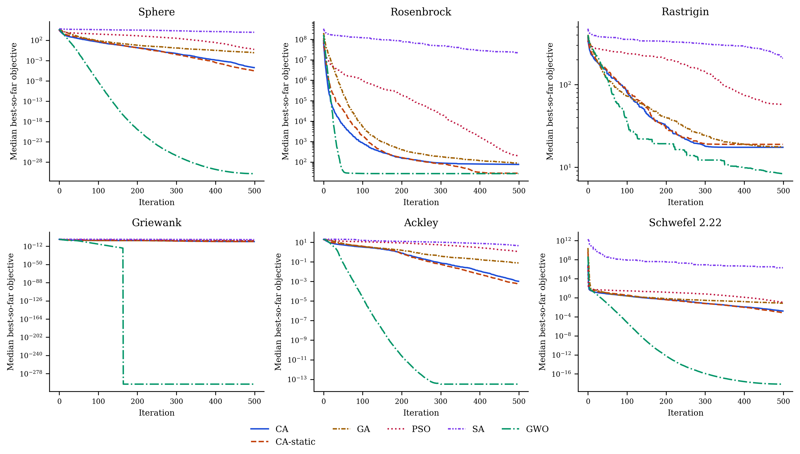{#fig-convergence fig-align="center" width="100%"}

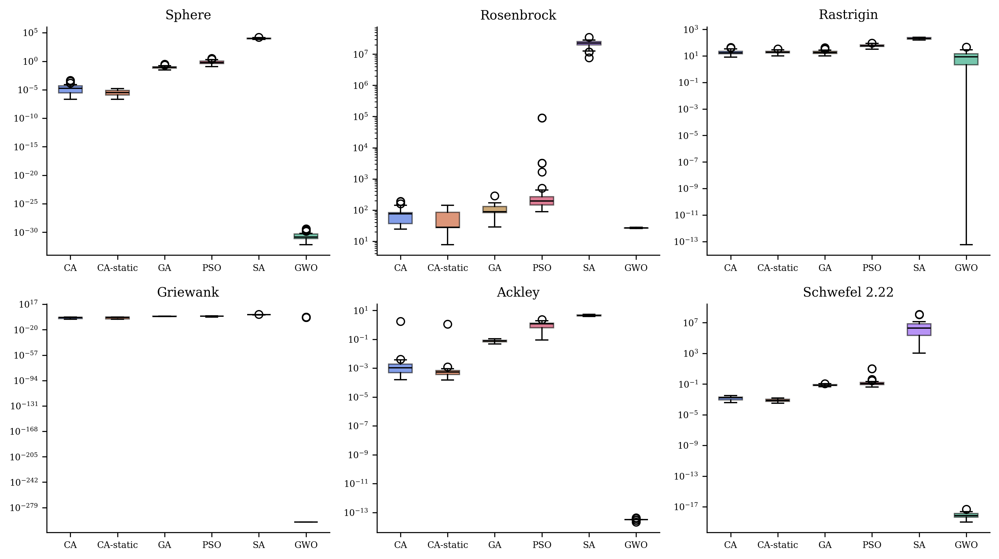{#fig-boxplots fig-align="center" width="100%"}

One-way ANOVA confirms that the algorithm factor is highly significant on every function (@tbl-anova), and the pairwise Wilcoxon tests of @tbl-wilcoxon give the sharper picture.



: One-way ANOVA over the six algorithms, per function. {#tbl-anova}



: Wilcoxon rank-sum tests, CA versus each competitor, $p$-value per function ($\alpha = 0.05$). $(+)$: CA significantly better; $(-)$: CA significantly worse; $(=)$: not significant. {#tbl-wilcoxon tbl-colwidths="[16,14,14,14,14,14,14]"}

## Discussion

Taken together, the tables support a differentiated conclusion rather than a single summary statement. Against PSO and SA, CA is significantly better on all six functions. Against GA it wins five of six, on Sphere, Rosenbrock, Griewank, Ackley and Schwefel 2.22, while Rastrigin ends in a statistical tie. Against GWO the outcome is reversed: GWO is significantly better on all six, consistent with the aggressive exploitation it is known for on exactly this suite [@mirjalili2014gwo]. We state that limitation plainly. On standard unconstrained test functions with central global optima, CA does not surpass GWO.

The comparison against CA-static deserves particular attention, because it contradicts the expectation that motivated the adaptive layer in the first place. On this classical, low-structure suite, disabling the layer never hurts and sometimes helps: CA-static is significantly better than CA on Sphere, Ackley and Schwefel 2.22 and statistically tied on the other three, and there is not a single function on which the adaptive layer wins outright. We read this as an informative negative result. The phase-reading machinery is built to recognize open, closed and endgame *structure*, and a smooth unimodal or mildly multimodal function in a fixed box offers it little of that structure to exploit, so the state machine spends its overhead reading a position that barely changes. The CEC-2017 and engineering-design landscapes of @sec-cec2017 and @sec-engineering are exactly where that overhead should start paying for itself, and whether it does is the empirical question those sections answer.

The practical implication is that these rankings are problem-dependent, which is precisely the situation the No-Free-Lunch theorem predicts [@wolpert1997nfl]. The relevant question is therefore not whether CA outperforms its competitors on the Sphere function, but whether it holds up on a harder standardized synthetic suite and on structured engineering problems. That is where we go next. @sec-cec2017 extends the comparison to the full CEC-2017 suite, @sec-engineering turns to constrained engineering design, and @sec-transport returns to the transportation motivation that opened the paper. The ranking does change.

# The Full CEC-2017 Benchmark Suite {#sec-cec2017}

## Motivation and roster

The six-function suite of @sec-benchmarks is standard but narrow, and current practice in this literature, including the practice established by our own baseline GWO [@mirjalili2014gwo], requires that a claim of competitiveness be validated on a larger, harder, independently curated suite. CEC-2017 meets that requirement. It comprises 29 usable functions, shifted, rotated, and in many cases built by hybridizing or composing several base functions, so that no algorithm can exploit coordinate-axis alignment or a single basin shape.[^cec-numbering]

[^cec-numbering]: The official suite defines thirty functions, of which F2 (Shifted and Rotated Sum of Different Power) was withdrawn from the competition owing to numerical instability [@awad2017cec]. The `opfunu` library renumbers the remaining twenty-nine consecutively, and this paper's labels follow that numbering, so label $\mathrm{F}n$ corresponds to the official function $\mathrm{F}(n{+}1)$ for $n \ge 2$. The distinction matters for the cross-library audit of @sec-opfunu-audit, whose second implementation retains the official numbering.

We evaluate CA (@sec-adaptive) and its non-adaptive ablation CA-static against six competitors: GWO, PSO, and GA, our own implementations from @sec-benchmarks; WOA [@mirjalili2016whale], third-party, at `mealpy` defaults, as in @sec-mealpy; and two competition-grade adaptive optimizers included in answer to the legitimate criticism that new metaheuristics are too often benchmarked only against classical or metaphor-derived baselines [@sorensen2015metaphor]. These are L-SHADE [@tanabe2014lshade], the success-history adaptive differential-evolution lineage that has defined the state of the art on CEC suites since 2014, via the `niapy` implementation [@vrbancic2018niapy], and CMA-ES [@hansen2001cmaes], the canonical covariance-matrix-adaptation evolution strategy, via Hansen's reference implementation `pycma` [@hansen2019pycma]. All algorithms run at $D=30$ with population $30$, $500$ iterations, and $30$ independent runs per algorithm-function pair, run $r$ of every algorithm sharing seed $\text{SEED}_0+r$ on the unit hypercube, with real bounds folded into the decoder as throughout this paper. Budget parity for the two additions is handled explicitly. CMA-ES runs $\lambda=30$ for $500$ generations, which is exactly the $15{,}000$-evaluation core budget. L-SHADE, whose linear population-size reduction is intrinsic to the algorithm and shrinks the population from $30$ toward $4$ as the budget is consumed, is capped at $15{,}500$ evaluations, within the measured consumption of CA itself (@sec-cost). Neither addition therefore holds a budget advantage over any incumbent.

## Data integrity: auditing the reference implementation {#sec-opfunu-audit}

CEC-2017 was accessed through `opfunu` v1.0.1, a third-party Python port of the official suite, and two independent checks were applied before any result was trusted. First, every candidate function was evaluated at the library's own reported global optimizer $\mathbf{x}^{*}$, requiring $|f(\mathbf{x}^{*})-f^{*}| \le 10^{-6}\max(1,|f^{*}|)$. This check is necessary but not sufficient, since it verifies the function at one point and says nothing about the rest of the domain. Second, we required the landscape to be discriminative: F5 (Shifted-and-Rotated Schaffer F7) passed the first check exactly, with $f(\mathbf{x}^{*})=f^{*}=500.0$, yet random samples spanning the entire search box returned values between $500.15$ and $500.55$, a surface so nearly flat that no optimizer, ours or any competitor's, could extract a meaningful gradient from it.

A function can pass both checks and still be broken elsewhere in the domain. Five further functions were caught only empirically, during optimization itself, because at least one algorithm in the roster, and in the worst cases nearly every algorithm including the weakest, returned a best-of-30-runs value that is impossible by definition under a correct $f^{*}$. Four surfaced in the original six-algorithm runs. A fifth, F16, surfaced only once the stronger eight-algorithm roster was added, with CMA-ES locating points $78$ units below the claimed optimum, which illustrates why stronger baselines also strengthen data auditing. @tbl-opfunu-audit collects the evidence for all six defective labels; the defective raw numbers are retained in the underlying results (`results/cec2017_opfunu_defect_evidence.csv`) rather than quietly dropped, and will be released with the rest of the codebase upon acceptance.



: Integrity audit of the `opfunu` CEC-2017 port: the six labels excluded, with the observed evidence of an implementation defect in each case. {#tbl-opfunu-audit}

Excluding defective implementations is only half of a defensible procedure. The other half is establishing whether the *functions themselves* can be evaluated correctly from an independent source. Each excluded label was therefore cross-validated against a second, independent Python implementation, `cec2017-py` [@tilley2020cec2017], which is adapted directly from the official C implementation and its reference data files and retains the official numbering, so that paper label $\mathrm{F}n$ is audited against official $\mathrm{F}(n{+}1)$. Each official counterpart was subjected to the full three-part audit: the one-point preflight, a landscape-discriminativeness check, and a ten-run below-optimum probe under the suite protocol. All six pass all three checks, F5 included, whose official Schaffer F7 landscape is entirely discriminative, with a random-sample standard deviation of $40$ against $0.1$ in the `opfunu` port, and F9, whose official Schwefel landscape shows no below-optimum behaviour at all. @tbl-cec2017-restoration reports the audit in full.



: Restoration audit of the six excluded labels against the independent official-data implementation: one-point preflight error, random-sample spread, and the worst deviation below the official optimum across ten CA probe runs. {#tbl-cec2017-restoration}

The six labels were consequently restored using the independent implementation, under the identical protocol and seeds, and the analysis below covers all **29 validated functions**, 23 sourced from `opfunu` and 6 from the official-data port. Two conclusions from this audit generalize beyond this paper. Every defect traced to the `opfunu` port rather than to the suite itself, and the pattern of the defects, formulas paired with mismatched shift data, is consistent with a bookkeeping misalignment introduced by the post-withdrawal renumbering. And an audit of this kind is not optional overhead: five of the six defects would silently corrupt any benchmark study that trusted the port, and one of them was detectable only because the roster contained algorithms strong enough to expose it.

## Results

@tbl-cec2017-summary gives the standing of the whole roster in one place: the mean Friedman rank of each algorithm across the 29 validated functions, its rank position, the number of functions on which it holds the best mean, and its win/tie/loss record against CA under a two-sided Wilcoxon rank-sum test at $\alpha=0.05$.



: CEC-2017 standing over the 29 validated functions (Friedman $\chi^2=150.08$, $p=3.9\times10^{-29}$; lower rank is better). The last column reads as CA's wins / ties / losses against the algorithm in that row, Wilcoxon rank-sum at $\alpha=0.05$. {#tbl-cec2017-summary}

The per-function evidence behind that summary is reported one table per official category of the suite, with the algorithms as rows and the functions as columns: @tbl-cec2017-unimodal (unimodal), @tbl-cec2017-multimodal (simple multimodal), @tbl-cec2017-hybrid-a and @tbl-cec2017-hybrid-b (the ten hybrid functions), and @tbl-cec2017-composition-a and @tbl-cec2017-composition-b (the ten composition functions). The two larger categories are split in half so that no table exceeds six function columns; best and worst runs for every cell are in @tbl-app-cec2017.



: CEC-2017, unimodal functions: final error $f-f^{*}$ over 30 runs, mean $\pm$ standard deviation, best mean per function in bold. {#tbl-cec2017-unimodal tbl-colwidths="[20,40,40]"}



: CEC-2017, simple multimodal functions: final error $f-f^{*}$ over 30 runs, mean $\pm$ standard deviation, best mean per function in bold. {#tbl-cec2017-multimodal tbl-colwidths="[13,12.4,12.4,12.4,12.4,12.4,12.4,12.6]"}



: CEC-2017, hybrid functions F10-F14: final error $f-f^{*}$ over 30 runs, mean $\pm$ standard deviation, best mean per function in bold. {#tbl-cec2017-hybrid-a tbl-colwidths="[16,16.8,16.8,16.8,16.8,16.8]"}



: CEC-2017, hybrid functions F15-F19: final error $f-f^{*}$ over 30 runs, mean $\pm$ standard deviation, best mean per function in bold. {#tbl-cec2017-hybrid-b tbl-colwidths="[16,16.8,16.8,16.8,16.8,16.8]"}



: CEC-2017, composition functions F20-F24: final error $f-f^{*}$ over 30 runs, mean $\pm$ standard deviation, best mean per function in bold. {#tbl-cec2017-composition-a tbl-colwidths="[16,16.8,16.8,16.8,16.8,16.8]"}



: CEC-2017, composition functions F25-F29: final error $f-f^{*}$ over 30 runs, mean $\pm$ standard deviation, best mean per function in bold. {#tbl-cec2017-composition-b tbl-colwidths="[16,16.8,16.8,16.8,16.8,16.8]"}

@fig-cec2017 shows median convergence on six representative functions and @fig-cec2017-dist the distribution of final errors on the same six. The six span the four official categories, one unimodal, one multimodal, two hybrid and two composition, and they are not chosen to favour CA: they include F4 and F22, on which both competition-grade methods beat it.

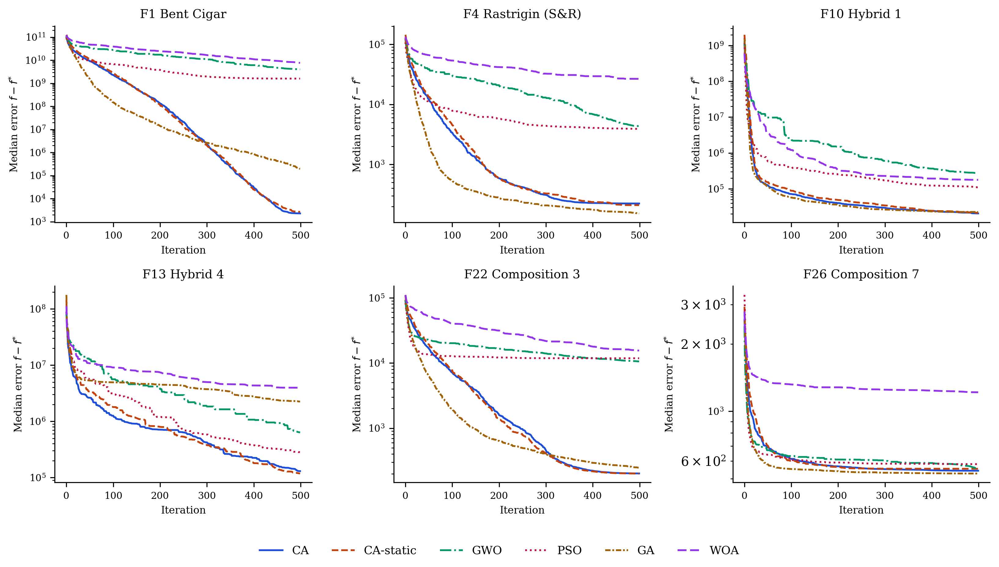{#fig-cec2017 fig-align="center" width="100%"}

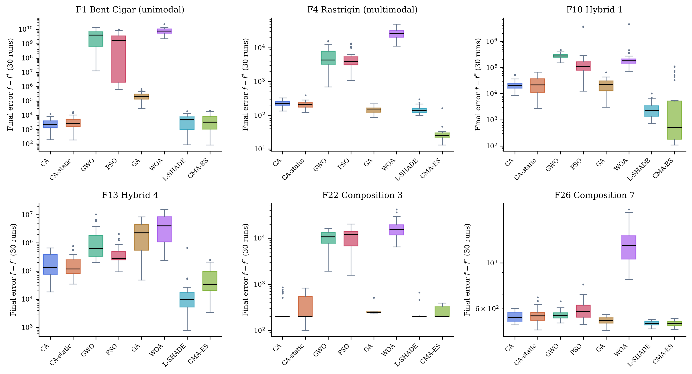{#fig-cec2017-dist fig-align="center" width="100%"}

The distributions answer a question the means alone cannot, namely whether a ranking is carried by typical runs or by a few outliers, and the picture is not uniform. On F1 the distributions of CA, CA-static, L-SHADE and CMA-ES overlap almost entirely; CA holds the lowest mean of the roster on that function, and its comparisons against both competition-grade methods are statistical ties at $p=0.21$ each. On F4, F10 and F13 the two specialized methods sit roughly an order of magnitude below CA, with tighter distributions, and beat it significantly. On the two composition functions the absolute gaps are small but consistent across runs, and CA loses to both methods there as well.

## Discussion

The two competition-grade methods lead decisively. L-SHADE takes the best mean Friedman rank at $1.76$ and CMA-ES the second at $2.28$, each beating CA on roughly ninety percent of functions, $26/29$ and $20/29$ losses for CA respectively, with only $1$ and $6$ wins. We report this as the central result of the suite, not as a caveat to it, and @sec-ablation explains it mechanistically. Among the remaining six algorithms, CA takes the best mean Friedman rank at $3.62$, narrowly ahead of CA-static at $3.90$ and GA at $4.14$, and well ahead of PSO at $6.03$, GWO at $6.41$, and WOA at $7.86$. Against GWO, PSO, and WOA, CA wins nearly all comparisons, $27/29$, $22/29$, and $29/29$ respectively, with a single loss to each of GWO and PSO, both on F5, the restored Schaffer F7 function, and none to WOA. Against its own non-adaptive ablation, the adaptive machinery of @sec-adaptive wins $5$ and loses $1$ of $29$, with $23$ ties, which is a real but modest net gain, about what one should expect from a well-tuned control layer applied to an already competitive base algorithm.

The comparison least favourable to CA among the classical roster is against GA, where the near-tied mean rank conceals a record of $10$ wins, $9$ ties and $10$ losses function by function. The ten losses are not scattered at random. They are F4, F5, F11, F12, F20, F22, F24, F25, F26, and F27, all Rastrigin-family, hybrid, and composition landscapes whose basins lie as far apart as the search domain is wide. The BLX-$\alpha$ crossover of GA routinely proposes offspring *outside* the interval spanned by two parents, an operator that can relocate a candidate across the entire domain in a single step. Every CA operator introduced in @sec-adaptive, by contrast, is anchored to the King, to an elite peer, or to a bounded local neighbourhood, and even the Knight's exploratory leap resamples only two of thirty coordinates. We read this as an illustration of the No-Free-Lunch theorem [@wolpert1997nfl] rather than as a deficiency to be minimized: CA was tuned against constrained engineering geometry and smooth hybrid and composition exploitation (@sec-adaptive), and that specialization has a measurable opportunity cost on landscapes whose defining difficulty is long-range, unstructured basin-hopping. We return to the trade-off, and to a concrete proposal for closing it, in @sec-conclusions.

# The CEC-2022 Benchmark Suite {#sec-cec2022}

CEC-2017 is the more extensive suite, but it is no longer the most recent, and a reviewer is entitled to ask whether the picture it paints survives on the current generation of benchmark design. CEC-2022 [@kumar2022cec] comprises twelve functions, namely Zakharov, Rosenbrock, expanded Schaffer F7, non-continuous Rastrigin, and Lévy under shift and rotation, plus three hybrid functions and four composition functions, defined at two official dimensionalities, $D=10$ and $D=20$, both of which are evaluated here. The roster is the full eight-algorithm set of @sec-cec2017: CA, CA-static, GWO, PSO, GA, WOA, L-SHADE, and CMA-ES. The protocol is likewise identical, with population 30, 500 iterations, 30 independent runs, shared seed $\text{SEED}_0+r$ at run index $r$, and unit-hypercube search with bounds folded into the decoder. One departure from the official competition setup is disclosed rather than hidden. The CEC-2022 termination criteria specify budgets of $200{,}000$ evaluations at $D=10$ and $1{,}000{,}000$ at $D=20$, whereas this study retains its paper-wide core budget of $15{,}000$ so that results remain comparable across every section. The findings below therefore characterize behaviour under a modest, practice-oriented budget rather than at the official competition horizon.

## Data integrity

The same two-stage audit as @sec-opfunu-audit was applied to the CEC-2022 port of `opfunu`. Unlike the CEC-2017 port, the preflight check passes for all twelve functions at both dimensionalities. The post-hoc below-optimum audit, applied after the full runs with the same tolerance, nonetheless excluded six (function, dimension) cells in which at least one algorithm's best run fell decisively below the library's claimed optimum: F7 and F8 at $D=20$, F10 at both dimensionalities, and F11 and F12 at $D=10$, with observed dips ranging from $-41$ to $-4{,}588$. This is again an implementation defect rather than a property of any algorithm, since in the worst cases nearly every algorithm in the roster, including the weakest, crossed the claimed optimum. In addition, F3 (expanded Schaffer F7, the same function family whose near-flat CEC-2017 port motivated the flatness rule in @sec-opfunu-audit) proved non-discriminative at both dimensionalities under this budget: the *worst-performing* algorithm's median final error is $0$ at $D=10$ and $0.066$ at $D=20$, so every method essentially solves it and it contributes no ranking information. @tbl-cec2022-audit summarizes the exclusions. Sixteen validated cells remain, eight per dimensionality, and the full pre-audit numbers are retained in the underlying results (`results/cec2022_stats_raw_unaudited.csv`), to be released with the rest of the codebase upon acceptance.



: CEC-2022 data-integrity audit: excluded (function, dimension) cells and the reason for each exclusion. {#tbl-cec2022-audit}

## Results and discussion

@tbl-cec2022-summary gives the standing of the roster across the sixteen validated cells, in the same layout as @tbl-cec2017-summary. The per-cell results follow in @tbl-cec2022-d10 and @tbl-cec2022-d20, one table per official dimensionality; best and worst runs are in @tbl-app-cec2022, and the excluded cells remain listed with their reasons in @tbl-cec2022-audit.



: CEC-2022 standing over the 16 validated (function, dimension) cells (Friedman $\chi^2=81.69$, $p=6.2\times10^{-15}$; lower rank is better). The last column reads as CA's wins / ties / losses against the algorithm in that row. {#tbl-cec2022-summary}



: CEC-2022 at $D=10$: final error $f-f^{*}$ over 30 runs on the eight validated functions, mean $\pm$ standard deviation, best mean per function in bold. {#tbl-cec2022-d10 tbl-colwidths="[12,11,11,11,11,11,11,11,11]"}



: CEC-2022 at $D=20$: final error $f-f^{*}$ over 30 runs on the eight validated functions, mean $\pm$ standard deviation, best mean per function in bold. {#tbl-cec2022-d20 tbl-colwidths="[12,11,11,11,11,11,11,11,11]"}

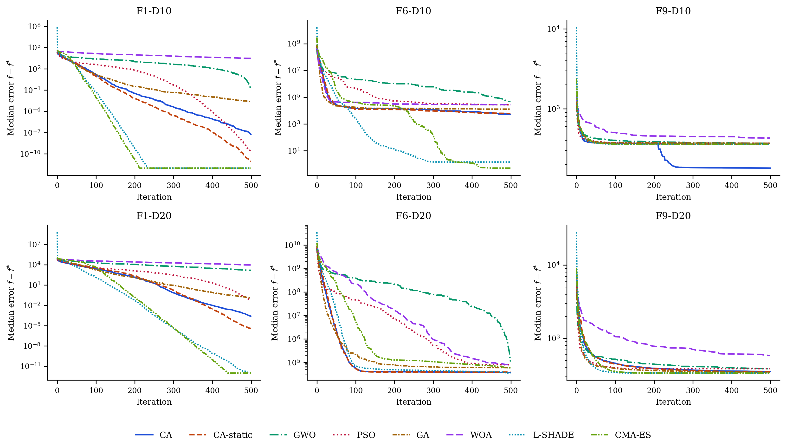{#fig-cec2022 fig-align="center" width="100%"}

@fig-cec2022 shows median convergence on three representative cells per dimensionality: F1 (Zakharov), F6 (Hybrid 1) and F9 (Composition 1), which span the basic, hybrid and composition classes of the suite. They are not selected for CA's advantage. On F9, CA holds the best mean at $D=10$ and ties both competition-grade methods there, but loses to both significantly at $D=20$.

The ordering at the top of @tbl-cec2022-summary is unambiguous and consistent with @sec-cec2017: the two competition-grade methods lead, with L-SHADE at $1.88$ and CMA-ES at $2.06$, followed by CA at $3.63$ and CA-static at $3.75$ as the best-ranked of the remaining six, then GA at $4.75$, PSO at $5.63$, GWO at $6.44$, and WOA at $7.88$. The pattern is stable across dimensionalities. Restricting the Friedman analysis to the eight $D=10$ cells gives L-SHADE first and CMA-ES second ($\chi^2=39.3$, $p=1.7\times10^{-6}$), and restricting it to the eight $D=20$ cells gives CMA-ES first and L-SHADE second ($\chi^2=44.1$, $p=2.0\times10^{-7}$), with CA third at $D=20$ and effectively tied with CA-static for third at $D=10$.

The pairwise records make both directions of the comparison explicit. Against the classical roster, CA wins 12 of 16 cells against GWO and PSO, 10 against GA, and all 16 against WOA, with at most 2 losses to any of them. Against L-SHADE it loses 11 of 16 with a single win, F11, the second composition function, at $D=20$; against CMA-ES it loses 12 with two wins, F7 at $D=10$ and F6 at $D=20$, both hybrid functions. These losses are the central fact of this section rather than a footnote to it: under this budget, the specialized adaptive machinery of L-SHADE and CMA-ES is decisively stronger on shifted and rotated synthetic landscapes than CA's chess-derived composition, at both dimensionalities. The No-Free-Lunch reading of such reversals, developed for the GA trade-off in @sec-cec2017, applies here in the same form and is not repeated. What is specific to this suite is that the GA trade-off itself does not reappear: CA beats GA 10-4-2 on CEC-2022, against a losing record on CEC-2017, which indicates that GA's long-range crossover advantage belongs to the 30-dimensional CEC-2017 hybrid and composition geometry rather than being a general property. @sec-ablation accounts for *why* the two specialized methods lead, which is more useful than the observation on its own.

# Constrained Engineering Design Benchmarks {#sec-engineering}

Alongside standardized synthetic suites, it is common practice in this literature to validate a new metaheuristic on the small set of constrained engineering design problems that recur across published comparisons, because a shared, literature-anchored problem allows direct comparison against independently produced results. We use seven such problems in their commonly published formulations: welded beam design, tension/compression spring design, pressure vessel design, speed reducer design, three-bar truss design, gear train design, and cantilever beam design. Constraints are handled by the same static-penalty approach used elsewhere in this paper (@sec-mealpy), $f_{\text{pen}}(\mathbf{x}) = f(\mathbf{x}) + 10^{6}\sum_i \max(0, g_i(\mathbf{x}))^2$. Roster and protocol are identical to @sec-cec2017, with all eight algorithms, population 30, 500 iterations and 30 runs.

## Results and discussion

@tbl-engineering-summary gives the standing of the roster across the seven problems and @tbl-engineering-stats the per-problem results, with the algorithms as rows and the design problems as columns; best and worst runs are in @tbl-app-engineering. @fig-engineering shows median convergence on all seven.



: Engineering design standing over the 7 problems (Friedman $\chi^2=33.87$, $p=1.8\times10^{-5}$; lower rank is better). The last column reads as CA's wins / ties / losses against the algorithm in that row. {#tbl-engineering-summary}



: Objective value over 30 runs on the seven constrained engineering design problems, mean $\pm$ standard deviation, best mean per problem in bold. Best and worst runs are in @tbl-app-engineering. {#tbl-engineering-stats tbl-colwidths="[13,12.4,12.4,12.4,12.4,12.4,12.4,12.6]"}

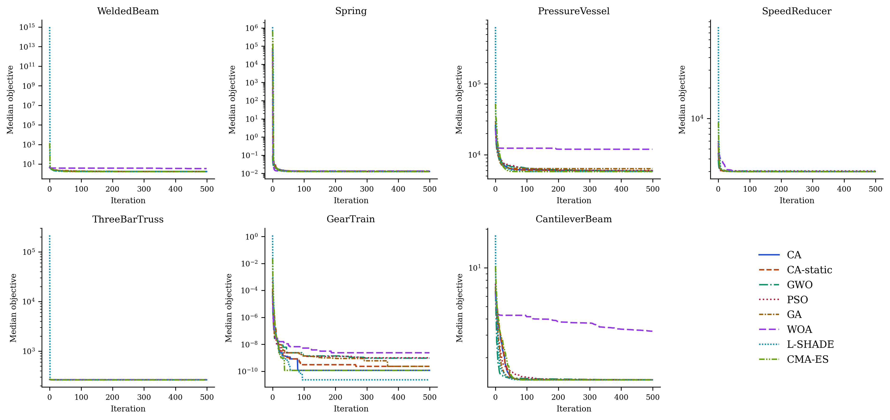{#fig-engineering fig-align="center" width="100%"}

The two competition-grade methods lead this suite as they do the synthetic ones. L-SHADE takes the best mean Friedman rank at $1.57$, beating CA significantly on all seven problems, and CMA-ES is second at $2.14$, beating CA on six with one statistical tie on the gear train, where CA's mean is in fact fractionally lower. The terminal precision these two reach is instructive. L-SHADE attains the welded-beam literature optimum of $1.72485$ with a run-to-run standard deviation below $10^{-15}$, and reproduces the best-known speed-reducer, three-bar-truss and cantilever-beam values with essentially zero variance across all thirty runs. On this problem class, success-history parameter adaptation behaves as a reliable constrained refinement engine, and that level of terminal accuracy is one CA's fixed-rate probes do not reach. On the pressure vessel, both methods also descend below the literature reference value, which is admissible: the commonly cited $5{,}885.33$ applies to the mixed-integer formulation in which two thicknesses are multiples of $0.0625$ in, whereas the continuous relaxation solved here, by every algorithm in the roster identically, admits lower objectives.

Among the remaining six algorithms, CA is the best ranked at $3.71$, ahead of CA-static at $4.14$, GWO at $5.00$, PSO at $5.71$, GA at $6.14$, and WOA at $7.57$. Against that classical roster CA loses exactly once across $35$ pairwise comparisons, to PSO on the welded-beam problem, where PSO's near-zero run-to-run variance around the known optimum, $1.7251 \pm 0.0010$, is difficult for any method that retains meaningful exploration to match on a low-dimensional, well-conditioned landscape. One further observation deserves note. WOA under the default hyperparameters of `mealpy` is dramatically unstable on several of these constrained problems: its mean objective on welded beam is $172.6$, two orders of magnitude above the optimum of $1.725$, driven by a small number of catastrophically infeasible runs (top-left panel of @fig-engineering). Default hyperparameters tuned for unconstrained synthetic benchmarks do not automatically transfer to constrained, penalty-shaped landscapes.

# Component, Parameter, and Cost Analysis {#sec-analysis}

The preceding sections treat CA as a unit. This one takes it apart and asks which of its mechanisms carry the performance (@sec-ablation), how sensitive that performance is to the parameter configuration of @tbl-params (@sec-sensitivity), and what the algorithm actually costs in evaluations and wall-clock time (@sec-cost). An algorithm with twelve named mechanisms invites the objection that most of them are ornamental. The measurements below answer that objection directly, and several of the answers are unflattering to individual components, which is what makes the remaining ones worth believing.

## Granular ablation {#sec-ablation}

Each of the twelve strategic mechanisms of @sec-ca is disabled one at a time, with all other mechanisms held at their published defaults, and each single-mechanism-off variant is compared against full CA over 30 runs on six problems spanning the paper: CEC-2017 F1 (Bent Cigar), F4 (Rastrigin), F13 (Hybrid 4), and F22 (Composition 3) at $D=30$ under the suite protocol and seeds of @sec-cec2017, the welded-beam problem under the protocol of @sec-engineering, and the berth allocation problem P2 under the protocol of @sec-mealpy. @tbl-ablation reports, for each mechanism, the ratio of the ablated variant's mean final error to full CA's, averaged over the six problems, together with the number of problems on which the difference is statistically significant. The per-problem breakdown is @tbl-app-ablation.



: Granular ablation: each mechanism disabled in isolation, mean final-error ratio relative to full CA averaged over six problems (ratios above 1 indicate the mechanism helps), with Wilcoxon significance counts at $\alpha=0.05$. {#tbl-ablation}

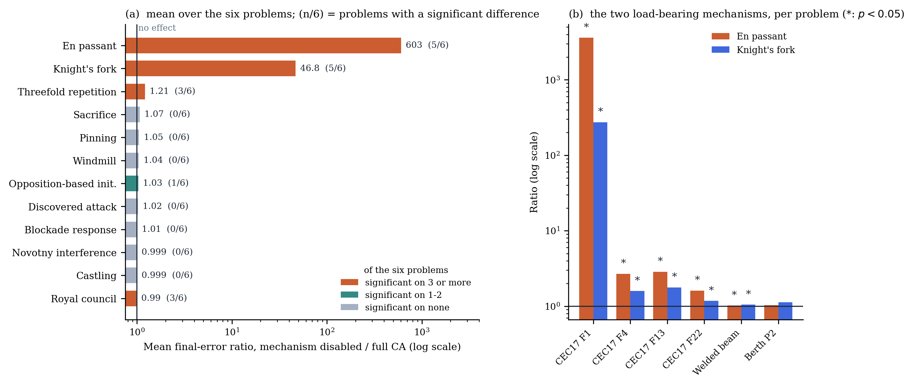{#fig-ablation fig-align="center" width="100%"}

Two mechanisms carry most of the load, and they are not of equal kind. Disabling the en-passant capture, the success-rule local refinement of @eq-enpassant, degrades the mean error by a factor of roughly $600$ averaged over the six problems, dominated by a factor of $3.6\times10^{3}$ on Bent Cigar, and the degradation is significant on five of six problems including the welded beam ($+1.9\%$, $p=0.003$). CA's terminal accuracy on smooth or locally smooth landscapes rests essentially on this one mechanism. Disabling the knight's fork, the differential move of @eq-fork, costs a factor of $47$ on the same average and a factor of $274$ on Bent Cigar, significant on the same five problems; the fork is CA's principal rotation-invariant recombination device.

The remaining ten mechanisms measure small individually. Threefold repetition averages a ratio of $1.21$, significant on three problems but with mixed sign, protective on Bent Cigar and Rastrigin and marginally harmful on the composition function. The royal council is significantly *helpful* only on the welded beam, where removing it costs $2.9\%$, while being significantly harmful to retain on two synthetic functions, which is consistent with its design purpose, the constraint-valley geometry of @eq-council, and suggests constraint-conditional gating as a refinement. The other eight (sacrifice, pinning, windmill, opposition initialization, discovered attack, blockade, interference, castling) sit between $0.99$ and $1.07$ with at most one significant problem each. One caveat applies to all these small ratios: a one-at-a-time ablation measures each mechanism's marginal contribution in the presence of all the others, so mechanisms with overlapping function can each look dispensable even when they are not collectively so. The CA-static configuration, which disables the adaptive gating of every mechanism at once and is carried through every experiment in this paper, supplies the complementary joint measurement.

Beyond the numbers themselves, the identity of the two load-bearing mechanisms is the most consequential finding in this evaluation, because it ties @tbl-operator-families to the benchmark tables. En passant belongs to the success-rule step-size family of Evolution Strategies; the fork belongs to the differential-mutation family of Differential Evolution. The two algorithms that dominate every comparison in @sec-cec2017, @sec-cec2022, and @sec-engineering, CMA-ES and L-SHADE, are precisely the competition-refined members of those same two families, equipped with full adaptive machinery, covariance adaptation in one case and success-history adaptation with population reduction in the other, where CA fires fixed-rate, fixed-shape versions embedded in its role architecture. The expectation formulated at the end of @sec-operator-families is therefore confirmed, not just illustrated. CA's measured performance rests chiefly on its ES-like and DE-like components, and the specialized algorithms built purely on those components, with adaptation in place of fixed rates, outperform the composition that borrows them. This is at once an honest account of why CA does not beat the modern state of the art and a mechanism-level demonstration that the architecture's active ingredients are real, identifiable, and correctly attributed.

## Parameter sensitivity {#sec-sensitivity}

A one-at-a-time sensitivity analysis perturbs each parameter group of @tbl-params around the published default configuration, with role fractions bracketed low and high, $\theta_0 \in \{0.05, 0.2\}$, castling period $c \in \{5, 20\}$, blockade threshold in $\{15, 40\}$, and pinning cap in $\{0.15, 0.50\}$, on the same six problems and run protocol as @sec-ablation. @tbl-sensitivity reports each variant's mean-error ratio relative to the default configuration, and @fig-sensitivity shows the same quantity with its per-problem range. The phase thresholds $\delta_{\text{open}}$ and $\delta_{\text{end}}$ of @eq-phase are not re-swept here; the four-combination check reported in @sec-adaptive stands.



: One-at-a-time parameter sensitivity: mean final-error ratio of each perturbed configuration relative to the default, averaged over six problems, with the number of problems deviating by more than twenty percent and the number of statistically significant deviations. {#tbl-sensitivity}

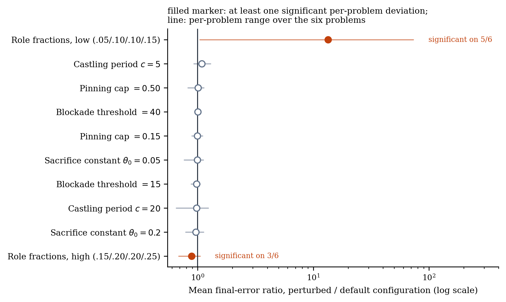{#fig-sensitivity fig-align="center" width="90%"}

The pattern is sharp. Of sixty tested (variant, problem) cells, all eight statistically significant deviations belong to the role-fraction rows, and no other parameter produces a significant change on any problem, with mean ratios within ten percent of unity throughout. At the granularity tested, CA is robust to its sacrifice constant, castling period, blockade threshold, and pinning cap, so a practitioner does not need to tune them, while the division of the population among piece roles is the one structural choice that matters. Its direction is informative in both senses. Shrinking the elite roles, which means more pawns, is harmful, catastrophically so on Bent Cigar with a factor of $73$, where the elite ranks supply nearly all the useful moves. Enlarging them is *beneficial* on several problems, with a mean ratio of $0.89$ and a significant improvement on three. The published default of @tbl-params, fixed in advance and used unchanged for every result in this paper, is therefore demonstrably not optimal everywhere. We report that headroom rather than exploit it: no result elsewhere in the paper uses the improved fractions.

Because the design is one-at-a-time, these are local sensitivities around a single configuration and not a global sensitivity analysis, so interactions between parameters remain unmeasured.

## Computational cost {#sec-cost}

Cost here is measured rather than estimated. An exact counting wrapper intercepts every objective call, and wall-clock time is taken with a monotonic timer over ten runs per cell on an otherwise idle machine, for all eight algorithms on six problems spanning the paper: CEC-2017 F1, F13 and F22 at $D=30$, CEC-2022 F8 at $D=20$, the welded beam, and signal timing P1 at its own $T=300$ protocol. @tbl-timing reports mean seconds per run for each algorithm on each problem, together with the mean ratio of evaluations consumed to the $N \times T$ core budget and the mean time relative to GA. The per-problem evaluation counts behind those two averages are in @tbl-app-timing.



: Measured wall-clock time (mean seconds per run, ten runs per cell on an idle machine), with two summary columns averaged over the six timed problems. "Evals / core budget" is the ratio of consumed evaluations to $N \times T$, counted exactly by a wrapper intercepting every objective call. {#tbl-timing}

Three facts summarize the table. The first is CA's evaluation overhead, that is the en-passant probes, castling probes, windmill extensions and blockade responses documented throughout @sec-ca, which measures $12.4\%$ over the core budget on average, ranging from $11.4$ to $13.4\%$ across the six problems, with CA-static at $11.6\%$. That measured figure replaces the "ten to fifteen percent" estimate quoted in earlier drafts. The second is that the budget asymmetry runs *against* the two strongest competitors: L-SHADE is capped at $3.3\%$ over core, and CMA-ES consumes at most exactly the core budget, stopping at sixty percent of it on the welded beam once its stagnation tests reach the numerical-precision floor. The results of @sec-cec2017 through @sec-engineering therefore cannot be attributed to an evaluation-budget advantage held by the winners; the only algorithm holding such an advantage in those tables is CA itself, and it is disclosed and measured. The third concerns wall-clock time, which depends on what dominates the run. On the cheapest objective CA costs about $2.2\times$ GA's time per run, reflecting the per-iteration bookkeeping of the control layer, whereas on the most expensive objective tested, CEC-2022 F8 at $D=20$, where a single evaluation costs roughly forty times more than on Bent Cigar, all eight algorithms fall within about fifteen percent of one another. For expensive objectives, which are the practically interesting case, the choice among these algorithms is a choice about evaluations, not about control-layer arithmetic.

## Where CA stands {#sec-standing}

The three suites of @sec-cec2017, @sec-cec2022, and @sec-engineering were run under one roster and one protocol, so their Friedman ranks can be read side by side. @fig-standing does that, and it is the compact form of this paper's central empirical claim. The ordering is the same on all three suites and admits no qualification: L-SHADE and CMA-ES lead, CA follows as the best of the remaining six, and CA-static sits just behind it. CA's position is therefore neither a sweep nor a failure, and the ablation of @sec-ablation explains why it is where it is, since CA's two load-bearing operators are fixed-rate members of exactly the two families those two methods specialize in and adapt fully.

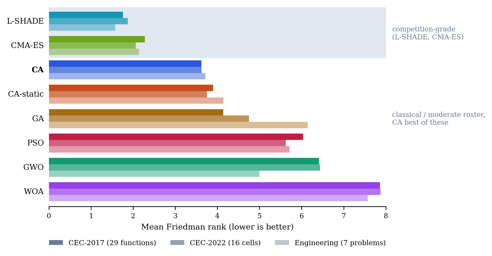{#fig-standing fig-align="center" width="94%"}

Two qualifications belong with the figure. It compares mean ranks, which compress the per-function records of @tbl-cec2017-summary, @tbl-cec2022-summary, and @tbl-engineering-summary, so that CA's ten losses to GA on CEC-2017 are invisible in a mean rank that GA nonetheless trails. And a rank is relative to the roster: adding or removing an algorithm changes every rank in the figure, which is why the pairwise Wilcoxon records are reported alongside it throughout the paper rather than in place of it. The classical six-function suite of @sec-benchmarks is absent from the figure because it was run under a different roster, including SA and excluding WOA, L-SHADE, and CMA-ES.

# Transportation Application: Arterial Signal Coordination {#sec-transport}

## Problem statement and model

Coordinated fixed-time signal timing along an urban arterial is a classic of transportation network optimization, and a deceptive one. The objective surface is multimodal, because different offset combinations produce different locally good green waves. The variables are of mixed kinds: a common cycle, per-intersection splits and offsets. The delay model is nonlinear and, in practice, non-differentiable [@ceylan2004traffic; @roess2019traffic]. It is therefore a natural first engineering test for CA.

Our test bed is an eight-intersection arterial with spacings of $450, 380, 520, 300, 610, 420,$ and $350$ m, a progression speed of $50$ km/h, near-saturation two-way traffic with eastbound approach demands between roughly $1{,}240$ and $1{,}400$ veh/h, and conflicting cross-street demands at every junction (@fig-network). Each intersection runs a two-phase plan.

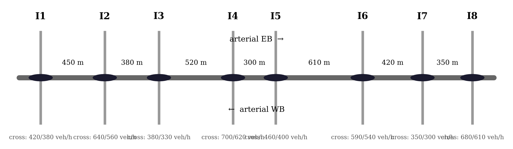{#fig-network fig-align="center" width="100%"}

The decision vector is

$$
\mathbf{z} = \big(C,\ g_1, \dots, g_8,\ o_2, \dots, o_8\big) \in \mathbb{R}^{16},
$$ {#eq-decision}

with a common cycle length $C \in [60, 140]$ s, arterial green splits $g_i \in [0.30, 0.75]$, and offsets $o_i$ expressed as fractions of the cycle, intersection 1 serving as reference. @fig-signal-model shows which physical object each of the sixteen variables controls. Panel (a) locates the variables on the arterial; panel (b) shows how the offsets displace each local green window in time, so that a platoon leaving one window arrives at the next either inside its green or after it. Because the arterial carries platoons in both directions, offsets that perfect one direction damage the other, and that is where the multimodality of coordination problems comes from. The objective is total network delay in veh·h/h, built from three ingredients.

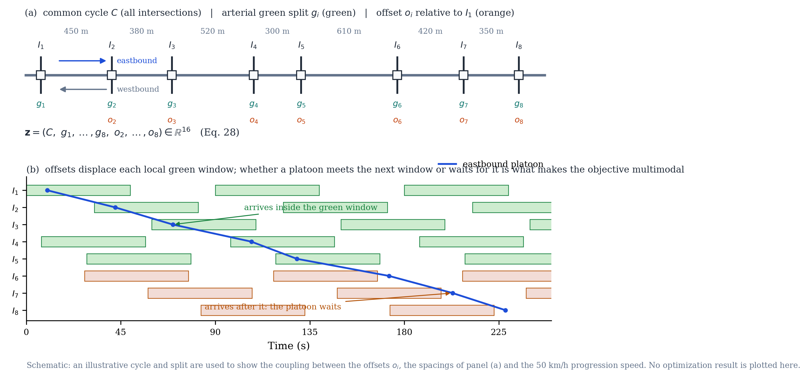{#fig-signal-model fig-align="center" width="100%"}

The first is uniform delay per approach, Webster's first term [@webster1958traffic]:

$$
d_1 = \frac{C\,(1 - g)^2}{2\,\big(1 - \min(1, x)\, g\big)},
$$ {#eq-webster}

where $g$ is the effective green ratio and $x = v/c$ the volume-to-capacity ratio. The second is overflow delay from the HCM time-dependent formulation [@roess2019traffic]:

$$
d_2 = 900\,T_a \left[ (x - 1) + \sqrt{(x-1)^2 + \frac{8\,k\,I\,x}{c\,T_a}} \right],
$$ {#eq-hcm}

with analysis period $T_a = 0.25$ h, incremental delay factor $k = 0.5$, and upstream filtering factor $I = 1$. The third is a progression adjustment: platoons arriving from upstream are shifted by the offset difference minus the travel time, and the mismatch between platoon arrival and the local green window scales the uniform delay up or down, per direction.

Cross-street phases receive $1 - g_i$, less $4$ s lost time per phase, and contribute their own delay, so greedy arterial splits are punished through cross-street oversaturation. All terms are summed over the sixteen arterial approaches and the eight cross-street approaches.

## Results

CA, CA-static (@sec-adaptive), GA, PSO, and GWO run with $N = 30$, $T = 300$ iterations, that is $9{,}000$ core evaluations, and $30$ independent runs each, again without tuning. These are the three strongest baselines of @sec-benchmarks together with CA and its ablation; SA is dropped here given its uncompetitive showing in @sec-benchmarks. @tbl-traffic summarizes the final delays together with the pairwise tests, and @fig-traffic-conv and @fig-traffic-box show the convergence behaviour and the spread across runs.



: Final total delay over 30 runs on the arterial signal timing problem, with the two-sided Wilcoxon rank-sum test of each algorithm against CA ($\alpha=0.05$). Best mean in bold. Because this section evaluates a single problem instance, the algorithms are already the rows and the statistics are the columns. {#tbl-traffic}

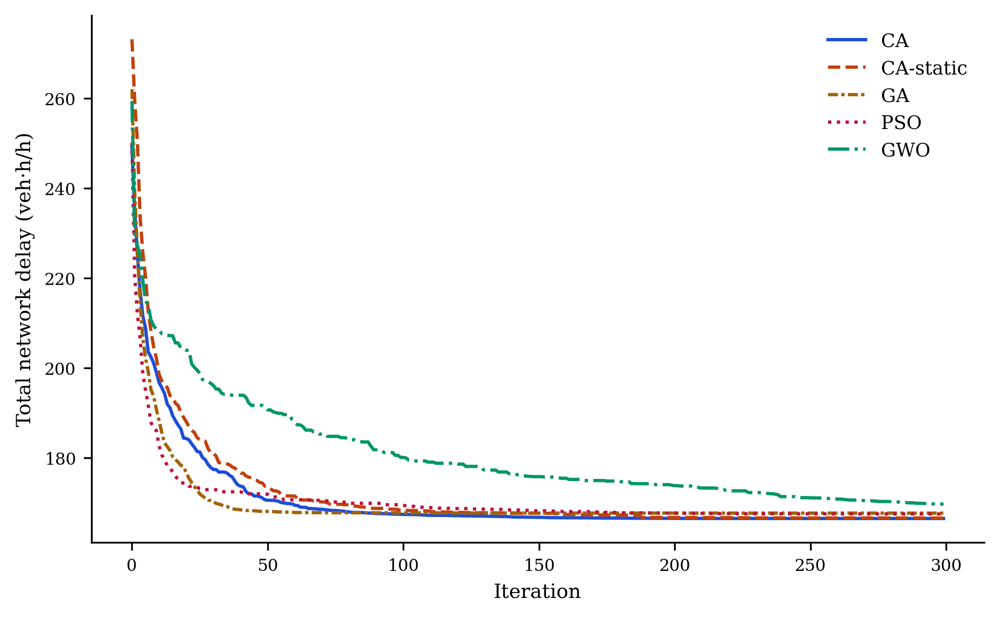{#fig-traffic-conv fig-align="center" width="90%"}

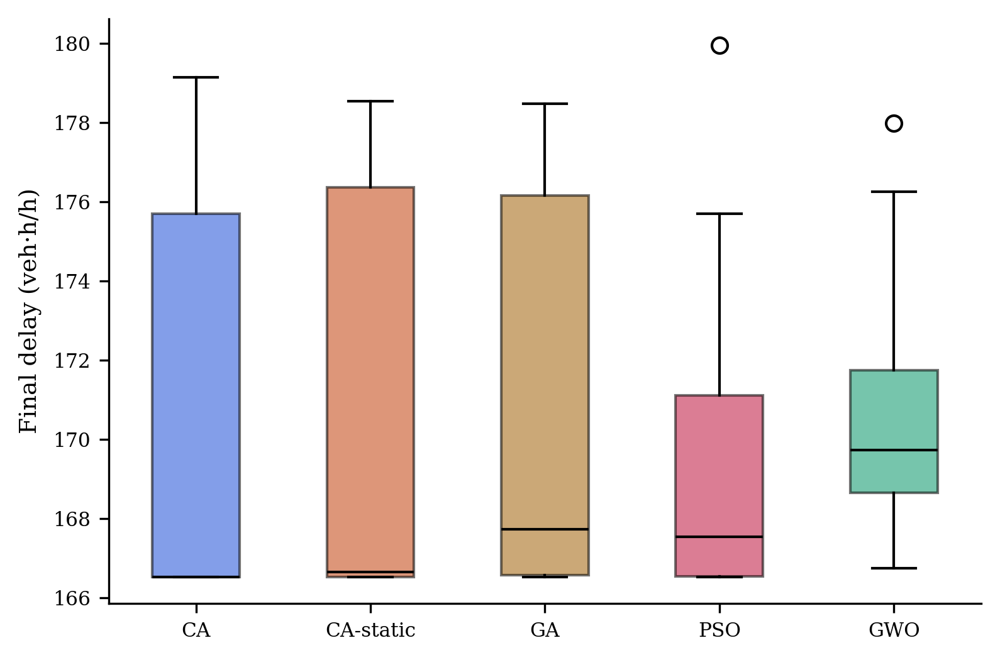{#fig-traffic-box fig-align="center" width="80%"}

All five configurations land within about one percent of each other in mean delay, between $169.5$ and $171.2$ veh·h/h, yet at this scale most of the differences are still resolvable. CA is significantly better than GA ($p=0.002$) and GWO ($p=0.015$), statistically tied with its own ablation CA-static ($p=0.062$), and significantly *worse* than PSO ($p=0.031$), whose mean delay of $169.491$ is the lowest in the table. That last comparison is the one result of this section unfavourable to CA, and we report it as such.

On the best-solution metric the ranking reverses. CA and CA-static both reach $166.5254$ veh·h/h, the lowest value found by any method, fractionally ahead of the best runs of GA and PSO at $166.526$ and clearly ahead of GWO's $166.739$. CA's operators are therefore fully capable of locating the same high-quality coordination plan as the strongest baselines, even where its mean is higher than PSO's.

The most instructive pattern, though, is that the classical-suite ranking of @sec-benchmarks does not carry over here at all. GWO, which dominated that suite, is the worst mean performer of the five on this problem. This is a clean within-paper illustration of the No-Free-Lunch theorem [@wolpert1997nfl], and it is the reason we resist describing any of these results as a sweep.

::: {.content-visible when-format="pdf"}
```{=latex}
\clearpage
```
:::

The best plan discovered, found by CA, selects the minimum cycle $C = 60$ s, which is a sensible choice under Webster's guidance whenever splits can be kept efficient, with the timings of @tbl-plan drawn as a time-space diagram in @fig-plan.



: Best signal timing plan found (CA). {#tbl-plan}

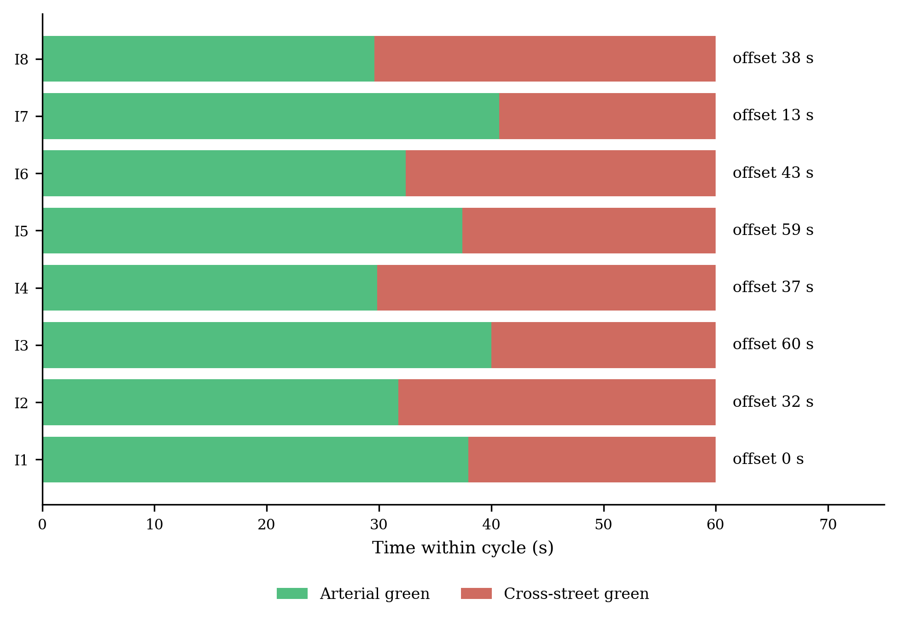{#fig-plan fig-align="center" width="78%"}

The offsets form a coherent progression pattern in which consecutive intersections alternate between favouring the eastbound and the westbound platoon, which is the compromise structure one expects on a heavily loaded two-way arterial.

## Practical remarks

For a transportation agency, the practical implication is that CA can be applied to signal-coordination studies with the same confidence as GA, PSO, or GWO, and that it offers two features of practical relevance. The sacrifice mechanism gives a principled way of escaping a poor offset basin without restarting the search, and the en-passant refinement improves the precision of splits and offsets late in the run without a separate local-search stage. Extension to cycle-by-cycle stochastic simulation objectives, with VISSIM or SUMO in the loop, is straightforward, since CA requires only function values. The comparison against PSO deserves explicit attention: on this particular sixteen-variable periodic-offset landscape, the velocity-based search of PSO holds a genuine if small advantage in mean delay, and an agency choosing between the two on this problem class alone should not assume that CA will win by default. The case for CA rests on the broader evidence of @sec-cec2017 and @sec-engineering rather than on this single instance.

# Extended Comparison on Independent Implementations {#sec-mealpy}

Every baseline in @sec-benchmarks and @sec-transport was implemented by the present authors, in the same code style and the same array-vectorized idiom as CA itself. That is ordinary practice, but it leaves open the question of whether CA stays competitive against code written by somebody else. We therefore repeat the transportation comparison using `mealpy` [@vanthieu2023mealpy], a large and actively maintained third-party Python library that ships several hundred metaheuristic variants behind a common `solve(problem, seed=...)` interface. Six well-known algorithms were run exactly as `mealpy` ships them, with default hyperparameters and no modification, on two transportation problems, the second of which has a global optimum known in closed form.

The six competitors are the Whale Optimization Algorithm (WOA) [@mirjalili2016whale], the Sine Cosine Algorithm (SCA) [@mirjalili2016sca], the Ant Lion Optimizer (ALO) [@mirjalili2015alo], Moth-Flame Optimization (MFO) [@mirjalili2015mfo], Harris Hawks Optimization (HHO) [@heidari2019hho], and Differential Evolution (DE) [@storn1997de]. The two competition-grade baselines of @sec-cec2017, L-SHADE via `niapy` [@vrbancic2018niapy] and CMA-ES via `pycma` [@hansen2019pycma], are carried into both problems as well, so the transportation instances face the same strongest competitors as the synthetic suites. All methods search the identical unit hypercube, with problem-specific bounds folded into the decoding step rather than passed to the optimizers, so no algorithm gets an easier space than another. Every algorithm runs with population 30 for 300 iterations across 30 independent runs, run $r$ of every algorithm seeded identically at $\text{SEED}_0 + r$; the evaluation-budget accounting of @sec-cost applies here in the same proportions, with 9,000 core evaluations and L-SHADE capped at 9,500.

## Problem P1: the arterial signal timing instance

This is the same sixteen-variable coordination problem as in @sec-transport. @tbl-mealpy-signal reports the summary statistics and the left panel of @fig-mealpy-convergence the median convergence.



: CA versus six mealpy algorithms and the two competition-grade baselines on the arterial signal timing problem (P1). {#tbl-mealpy-signal}

CA is significantly better than every one of the six `mealpy` competitors, including SCA and ALO, its closest rivals in that group, at $p = 0.003$ and $p = 0.001$ respectively. WOA, HHO, and DE perform substantially worse and vary far more from run to run, with standard deviations of 11 to 21 veh·h/h against 4.9 for CA, which suggests that they find it harder than CA does to re-locate a good coordination plan reliably in the sixteen-dimensional periodic offset space. The two competition-grade baselines invert the comparison, as they do everywhere in this paper: L-SHADE at $167.80$ and CMA-ES at $167.15$ both hold significantly better mean delays than CA at $169.96$, by margins of 1.3 to 1.7 percent, and all three methods reach the same best-of-thirty plan at $166.525$ veh·h/h. The scope of this result is worth stating precisely. GA and PSO, our own implementations from @sec-transport, perform comparably to CA on this problem (@tbl-traffic), so the conclusion is not that CA is uniquely strong on signal timing, but that its standing among widely used algorithms survives a change of author, while the specialized adaptive methods keep a small and statistically resolvable advantage in mean delay.

## Problem P2: continuous berth allocation with a known optimum

Independent implementations address one concern; a problem with a *known* optimal value addresses another, namely whether an algorithm's apparent superiority is an artifact of comparing relative suboptimality on a problem that none of the competitors can solve. We borrow Example 1.9 of Teodorović and Janić [@teodorovic2020quantitative]: fifteen ships of known length, arrival time, and required service time must be assigned mooring times and berth positions along a continuous 1,000 m quay within a 1,920-minute horizon, so as to minimize total time spent in port. With unit weights, the mixed-integer formulation in the source has a trivial global optimum, since every ship can moor the instant it arrives and wait for nothing:

$$
F^{*} = \sum_{i=1}^{15} p_i = 4{,}860 \text{ min}.
$$

Reaching that bound requires the ship-pair schedule to be conflict-free along the time axis and the quay-position axis at once, which is a combinatorial matching problem embedded in a continuous one, and that is what makes the instance a substantive test for a population-based search. We encode each ship's mooring time $u_i \in [a_i,\ T - p_i]$ and berth position $v_i \in [0,\ S - s_i]$ as decision variables and penalize, rather than hard-constrain, the pairwise rectangle overlap in the time-space diagram, so that the search can pass through momentarily infeasible plans on its way to a good one. This is the same soft-constraint treatment already used for cross-street oversaturation in @sec-transport.



: CA versus six mealpy algorithms and the two competition-grade baselines on the continuous berth allocation problem (P2), objective in minutes. {#tbl-mealpy-berth}

@tbl-mealpy-berth reports the results. Against the `mealpy` group CA's advantage grows considerably on this problem: its mean objective is roughly a sixth of WOA's or HHO's, and it is significantly better than all six, ALO included at $p = 2.3\times10^{-4}$, which is otherwise its nearest rival in that group by a wide margin. The right panel of @fig-mealpy-convergence shows why. Among the seven methods plotted, CA and ALO are the only two that keep making progress past iteration 50, while WOA, SCA, MFO, HHO, and DE largely plateau within the first fifty. The two competition-grade baselines again lead: the means of L-SHADE at $6{,}269$ and CMA-ES at $6{,}522$ are both significantly better than CA's $7{,}934$, this time by the widest relative margins observed anywhere in this paper outside the synthetic suites, 18 to 21 percent in mean objective.

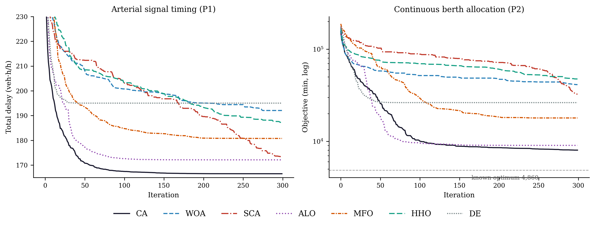{#fig-mealpy-convergence fig-align="center" width="100%"}

The distance of even the best runs from $F^{*} = 4{,}860$ should be stated explicitly. @tbl-berth-gap gives the optimality gap of each algorithm's best run together with the residual overlap of its decoded plan.



: Optimality gap and feasibility of the best plan found by each algorithm on P2. {#tbl-berth-gap}

CA's best run sits 29% above the true optimum, which is a substantial gap and we state it without obfuscation. Three aspects of the table deserve separate comment. The smallest gaps belong to the competition-grade methods: L-SHADE reaches 8.7%, with a numerically negligible residual overlap of $0.5$ min·m in its best plan, and CMA-ES 11.6% on a fully feasible plan. These are the closest any general-purpose method in this study comes to the combinatorial optimum, and they show that the instance rewards stronger adaptive machinery rather than being uniformly hard. Among the seven remaining methods, CA's gap is the smallest by a considerable margin, 22 to 266 percentage points closer to $F^{*}$ than the six `mealpy` competitors and 22 points ahead of ALO, its nearest rival there. The overlap column shows that CA's best plan is fully feasible, so ships do not actually collide in the time-space diagram, which is not true of WOA, SCA, MFO, or HHO, whose reported objectives still carry unresolved penalty mass; ALO and DE also land on feasible plans, but at much larger gaps. @fig-berth-plan shows CA's best schedule. Every ship occupies its own rectangle with no overlap, but several ships wait appreciably longer than their arrival time, and that waiting time is the whole of the remaining 29% gap.

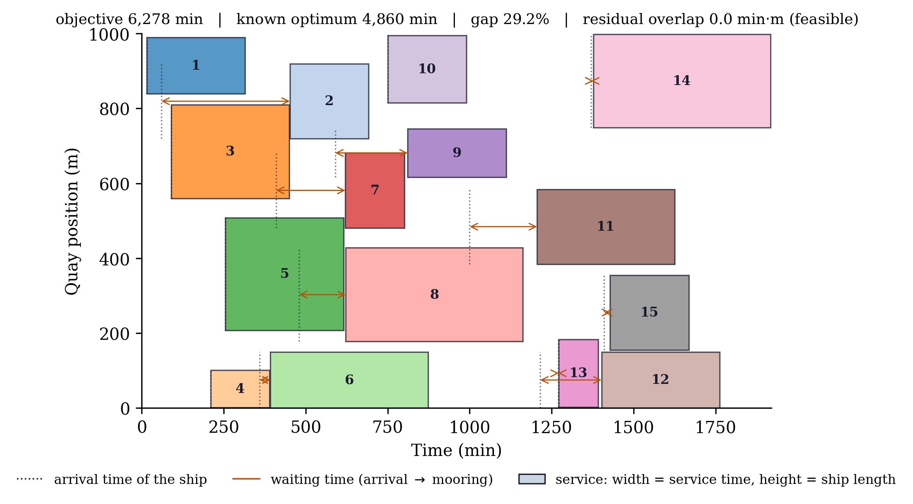{#fig-berth-plan fig-align="center" width="92%"}

Two conclusions follow, and they mirror the rest of the paper. Among the seven widely used general-purpose metaheuristics run with default settings, CA reaches the best and most consistently feasible solutions on both transportation instances. L-SHADE and CMA-ES outperform CA on both, narrowly on signal timing and decisively on berth allocation. What this section does not show is that CA is close to solving berth allocation to global optimality; a 29% gap remains, against 9 to 12% for the two specialized methods, and the problem plainly deserves algorithms tuned to its combinatorial structure rather than any general-purpose search evaluated here.

# Conclusion {#sec-conclusions}

This paper proposed the Chess Algorithm, a population-based metaheuristic built around a deliberately heterogeneous population. Agents are ranked at every iteration and play as Queens, Rooks, Bishops, Knights and Pawns around an elite King, each role moving under its own geometry, while strategic mechanisms taken from chess theory (development, sacrifice, pinning, castling, en passant and threefold repetition) govern the search throughout. A lightweight state machine reads the divergence, initiative and local-search success of the population at each iteration and decides which of a richer tactical set applies at that moment. Every mechanism is specified mathematically in @sec-ca, and @tbl-operator-families names the established operator family to which each belongs, so that the chess vocabulary describes the composition without standing in for it. A non-adaptive configuration, CA-static, was carried through every experiment as a control.

The experimental picture is consistent across five problem families. On six classical 30-dimensional functions, CA is significantly better than PSO and SA on all of them and better than GA on five of six, while GWO keeps its established advantage on that suite. On the 29 validated CEC-2017 functions, on the 16 validated CEC-2022 cells and on seven constrained engineering design problems, CA obtains the best mean Friedman rank among the classical and widely used baselines, losing one comparison in 29 to each of GWO and PSO on CEC-2017 and exactly one of 35 comparisons on the engineering problems. On the arterial signal timing problem it is significantly better than GA and GWO and reaches the lowest delay found by any method, and on berth allocation it is significantly better than all six independent `mealpy` implementations. In every one of these comparisons L-SHADE and CMA-ES rank ahead of CA, and that result is reported without qualification.

The ablation of @sec-ablation explains this ordering instead of just recording it. Of the twelve strategic mechanisms, two carry most of the measured performance: the en-passant capture, which is a success-rule step-size adaptation, and the knight's fork, which is a differential mutation. L-SHADE and CMA-ES are the competition-refined members of exactly those two families, with full adaptation where CA fires fixed rates. The algorithms that beat CA are therefore the specialists built on CA's own load-bearing components, which is a more useful finding than the ranking on its own.

The boundaries of the evidence deserve to be stated as plainly as the results. Dimensions above 30, or above 20 on CEC-2022, were not tested. CA consumes 12.4% more evaluations than the shared core budget (@sec-cost), a small but real cost that does not favour it against L-SHADE at 3.3% or against CMA-ES. The transportation studies use analytic delay and penalty models rather than microsimulation. The ablation and sensitivity analyses cover six representative problems, and the two phase thresholds were checked on two functions rather than swept exhaustively. Finally, CA loses ten of the 29 CEC-2017 functions to GA, and those ten cluster on landscapes whose basins lie as far apart as the search domain is wide, where the BLX-$\alpha$ crossover of GA can cross the whole domain in a single step and no CA operator can.

That last gap points to the most natural extension. A promotion operator, in which an agent that survives several blockade events without improving the King is granted a macro-crossover against a distant population member for one iteration, would give CA the long-range move it currently lacks, much as a pawn reaching the eighth rank does not improve gradually but changes in kind. A second and more direct line follows from the ablation: replacing the fixed adaptation rates of en passant and the knight's fork with success-history or covariance adaptation is now a specific and testable hypothesis about closing the gap to L-SHADE and CMA-ES rather than a speculative one. Binary, discrete and multi-objective variants of CA, a formal analysis of the en-passant rule as a $(1+\lambda)$ evolution strategy embedded in a population method, and simulation-based transportation objectives are further directions we intend to pursue.

# CRediT authorship contribution statement {.unnumbered}

**Seyedsaber Naseralavi:** Conceptualization, Methodology, Software, Validation, Formal analysis, Investigation, Data curation, Visualization, Writing -- original draft, Writing -- review & editing. **Seyedali Mirjalili:** Conceptualization, Methodology, Writing -- review & editing, Supervision.

# Declaration of competing interest {.unnumbered}

The authors declare that they have no known competing financial interests or personal relationships that could have appeared to influence the work reported in this paper.

# Declaration of generative AI and AI-assisted technologies in the writing process {.unnumbered}

During the preparation of this work the authors used a large language model assistant to support code review, manuscript copy-editing and the preparation of figures and tables from committed result files. The authors reviewed and edited the content as needed and take full responsibility for the content of the published article.

# Data and code availability {.unnumbered}

The complete implementation, every experiment script, and every raw result reported in this paper are maintained in a version-controlled repository engineered for exact reproducibility: random seeds are fixed throughout, and every number reported here corresponds to a committed output. The two data-integrity audits of @sec-opfunu-audit and @sec-cec2022 are reproducible rather than asserted, since the raw statistics behind each exclusion are committed alongside the validated results, so a reader will be able to re-run the same checks against a newer release of the underlying benchmark libraries rather than take our exclusion lists on faith. The repository, [github.com/sabernaseralavi-60/2026_Chess-Algorithm](https://github.com/sabernaseralavi-60/2026_Chess-Algorithm), together with a `README.md` documenting every script and the order in which it must be run to reproduce each table and figure in this paper, will be made publicly available upon acceptance of this manuscript.

# Appendix A: Supplementary tables {#sec-appendix .unnumbered}

The primary comparison tables of @sec-benchmarks through @sec-analysis report the mean and standard deviation of each algorithm–problem cell, in the orientation with algorithms as rows and test functions as columns. The best and worst individual runs, and the per-problem detail of the ablation and cost analyses, do not fit that orientation and are collected here rather than dropped. Every cell of a primary table has its counterpart in exactly one table below; the correspondence is checked numerically by `src/validate_presentation.py`, and both are generated from the same committed result files.



: Classical suite, full statistics: mean, standard deviation, best, and worst final objective over 30 runs, per function and algorithm (best mean per function in bold). The mean and standard deviation columns are those of @tbl-stats. {#tbl-app-classical}



: CEC-2017, full statistics on all 29 validated functions: mean, standard deviation, best, and worst final error $f-f^{*}$ over 30 runs (best mean per function in bold). The mean and standard deviation columns are those of @tbl-cec2017-unimodal through @tbl-cec2017-composition-b. {#tbl-app-cec2017}



: CEC-2022, full statistics on all 16 validated (function, dimension) cells: mean, standard deviation, best, and worst final error $f-f^{*}$ over 30 runs (best mean per cell in bold). {#tbl-app-cec2022}



: Engineering design, full statistics on all 7 problems: mean, standard deviation, best, and worst objective over 30 runs (best mean per problem in bold). {#tbl-app-engineering}



: Granular ablation, per problem: final-error ratio of each single-mechanism-off variant to full CA, with the Wilcoxon $p$-value and its significance at $\alpha=0.05$. The averages of these ratios are @tbl-ablation and @fig-ablation. {#tbl-app-ablation}



: Measured cost, per problem: mean wall-clock time, mean evaluations consumed, the ratio of evaluations to the core budget $N \times T$, and time relative to GA on the same problem, over ten runs per cell. The summary columns of @tbl-timing are the averages of these rows. {#tbl-app-timing}

# References {.unnumbered}

::: {#refs}
:::
